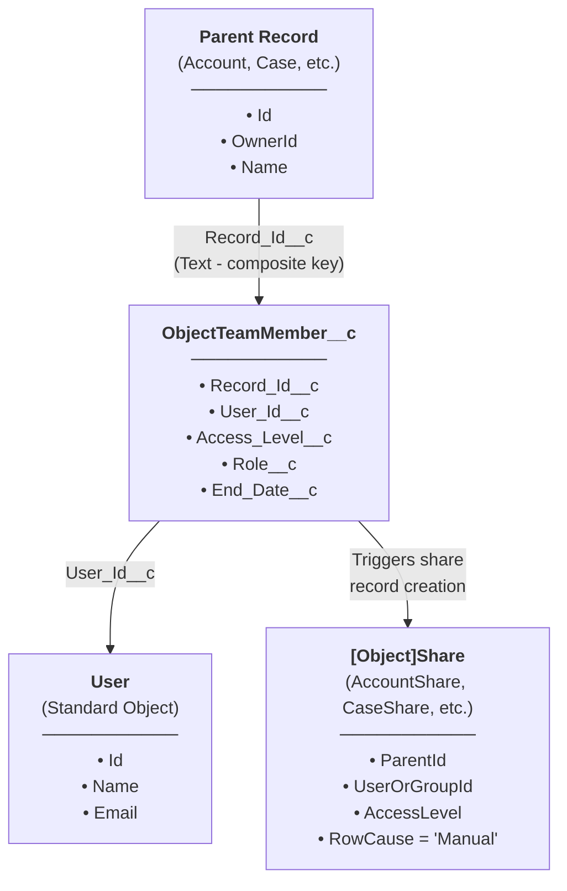
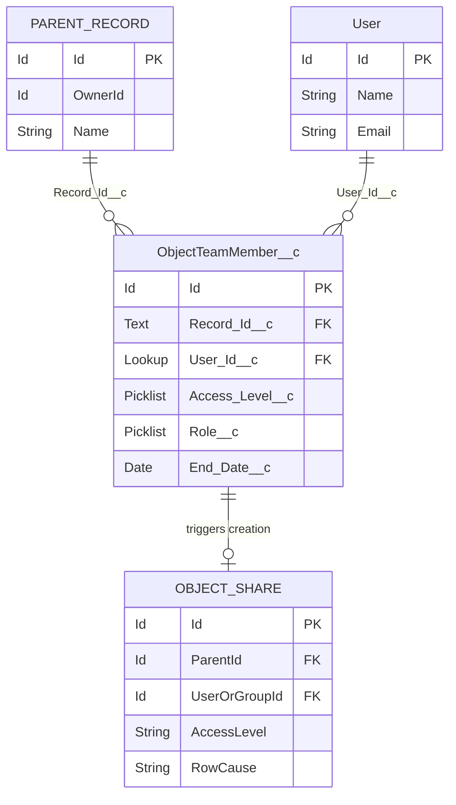
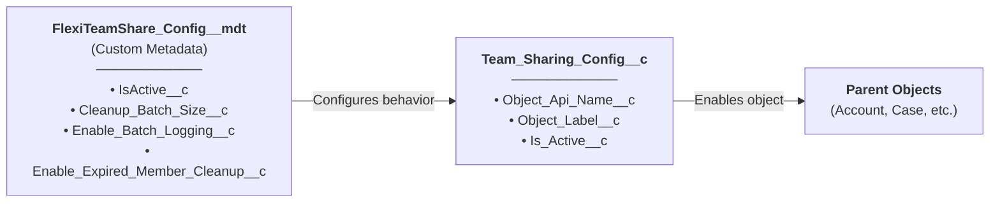
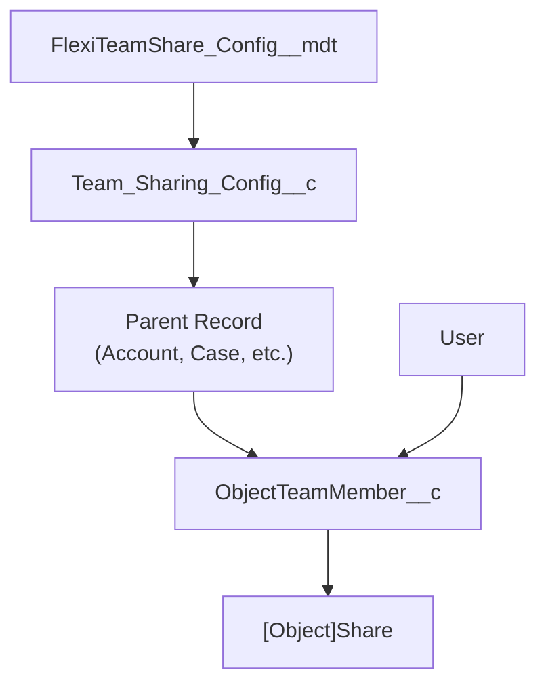

## Main Data Model

## Entity Relationship Diagram

## Custom Objects

### ObjectTeamMember\_\_c

Stores team member assignments linking a user to a parent record.

| Field | Type | Description |
|-------|------|-------------|
| `Record_Id__c` | Text | Composite key in format `ObjectName:RecordId` |
| `User_Id__c` | Lookup(User) | The team member user |
| `Access_Level__c` | Picklist | Read Only, Read/Write |
| `Role__c` | Picklist | Owner, Manager, User |
| `End_Date__c` | Date | Optional expiration date for temporary access |

### Team\_Sharing\_Config\_\_c

Per-object configuration for team sharing.

| Field | Type | Description |
|-------|------|-------------|
| `Object_Api_Name__c` | Text | API name of the configured object |
| `Object_Label__c` | Text | Display label for the object |
| `Is_Active__c` | Checkbox | Whether team sharing is active for this object |

### FlexiTeamShare\_Config\_\_mdt

App-level configuration stored as Custom Metadata.

| Field | Type | Description |
|-------|------|-------------|
| `IsActive__c` | Checkbox | Master toggle for the app |
| `Cleanup_Batch_Size__c` | Number | Batch size for cleanup jobs |
| `Enable_Batch_Logging__c` | Checkbox | Enable debug logging in batch jobs |
| `Enable_Expired_Member_Cleanup__c` | Checkbox | Enable automatic cleanup of expired members |

## Configuration Objects

## Complete Model Overview

