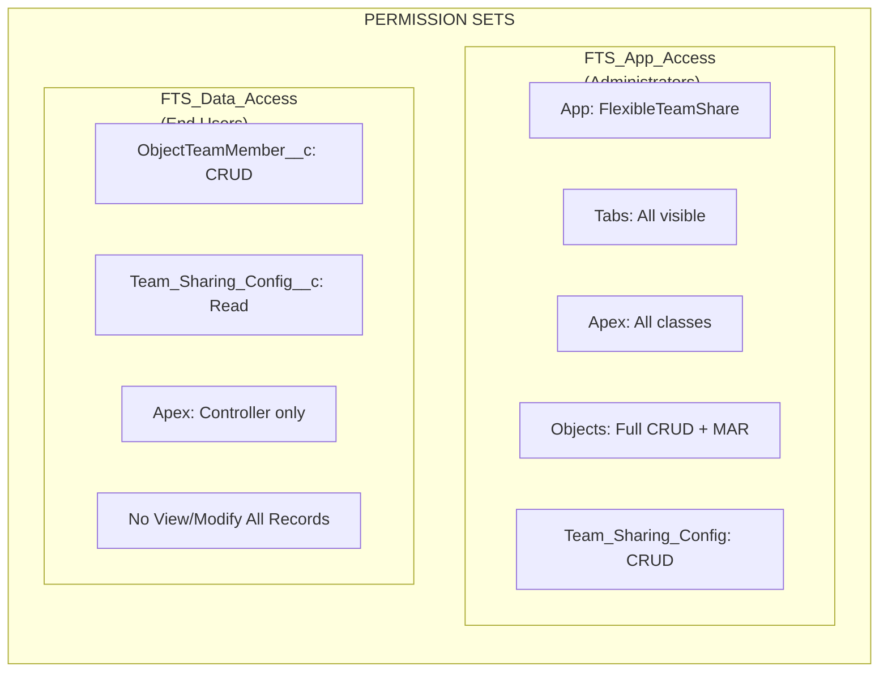
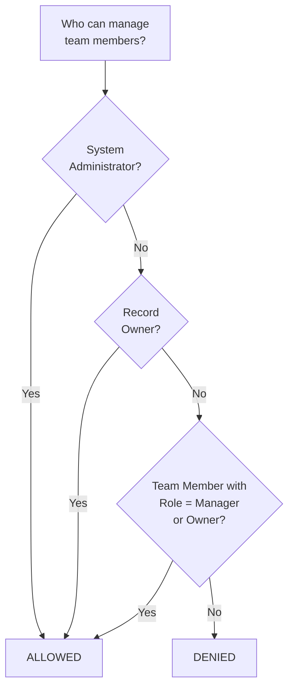
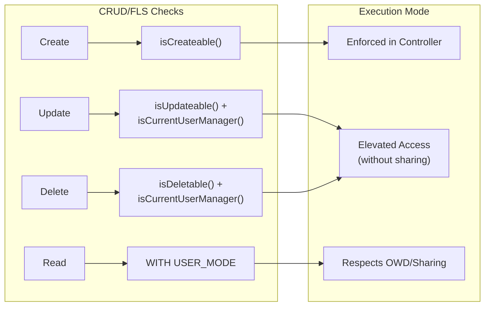
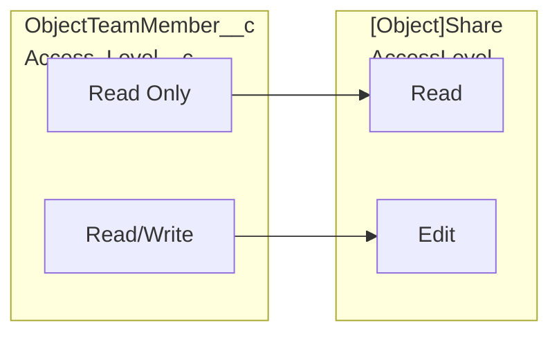
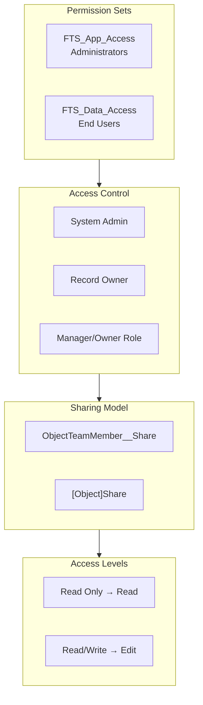

import { Aside } from '@astrojs/starlight/components';

## Permission Model

### Permission Sets

| Permission Set | Audience | Capabilities |
|---------------|----------|-------------|
| **FTS\_App\_Access** | Administrators | Full app access, all tabs, all Apex classes, full CRUD + Modify All Records on objects, Team\_Sharing\_Config CRUD |
| **FTS\_Data\_Access** | End Users | ObjectTeamMember\_\_c CRUD, Team\_Sharing\_Config\_\_c Read, controller Apex classes only, no View/Modify All Records |

## Access Control Logic

The `isCurrentUserManager()` method determines who can manage team members:

1. **System Administrators** — always allowed
2. **Record Owners** — always allowed
3. **Manager/Owner role team members** — allowed
4. **Everyone else** — denied

## CRUD/FLS Enforcement

| Operation | Security Check | Implementation |
|-----------|---------------|----------------|
| Create Team Member | `Schema.sObjectType.ObjectTeamMember__c.isCreateable()` | Enforced in controller |
| Update Team Member | `isUpdateable()` + `isCurrentUserManager()` | Elevated access (without sharing) after authorization |
| Delete Team Member | `isDeletable()` + `isCurrentUserManager()` | Elevated access (without sharing) after authorization |
| Read Team Members | `WITH USER_MODE` / sharing model | Respects OWD/sharing |

<Aside type="note">
  Update and Delete operations use elevated access (`without sharing`) to allow managers to modify any team member on the record, not just ones they created. Authorization is always checked first via `isCurrentUserManager()`.
</Aside>

## Input Validation

| Input | Validation | Location |
|-------|-----------|----------|
| `recordId` | Not blank, valid Salesforce ID format | Controller |
| `userId` | Not blank, valid User ID | Controller |
| `accessLevel` | Not blank, valid picklist value | Controller + Picklist |
| `role` | Not blank, valid picklist value | Controller + Picklist |
| `endDate` | Must be future date or null | Controller + Validation Rule |
| `objectApiName` | Derived from Salesforce ID (not user input) | Controller |

### Validation Rules

| Rule | Object | Description |
|------|--------|-------------|
| `End_Date_Cannot_Be_Past` | `ObjectTeamMember__c` | Prevents setting end date in the past |

## Access Level Mapping

## Complete Security Overview

## Security Best Practices Implemented

| Control | Status | Implementation |
|---------|--------|---------------|
| CRUD checks in controllers | Implemented | `isAccessible()`, `isCreateable()`, `isUpdateable()`, `isDeletable()` |
| FLS enforcement | Implemented | Permission Sets control field access |
| SOQL injection prevention | Implemented | Bind variables for user input, whitelist for object names |
| Sharing model | Implemented | `with sharing` on controllers, `without sharing` only where documented |
| Input validation | Implemented | Null checks, format validation, business rules |
| XSS prevention | Implemented | LWC framework handles output encoding |

## External Integration Security

| Check | Result |
|-------|--------|
| HTTP Callouts | None — package makes no external calls |
| Named Credentials | Not used |
| External Objects | Not used |
| Remote Site Settings | Not required |
| CSP Violations | Pass — no Content-Security-Policy violations |
