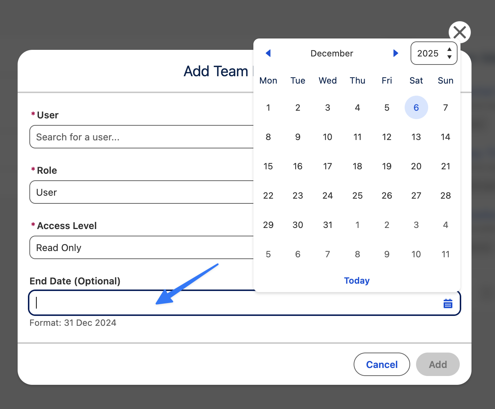
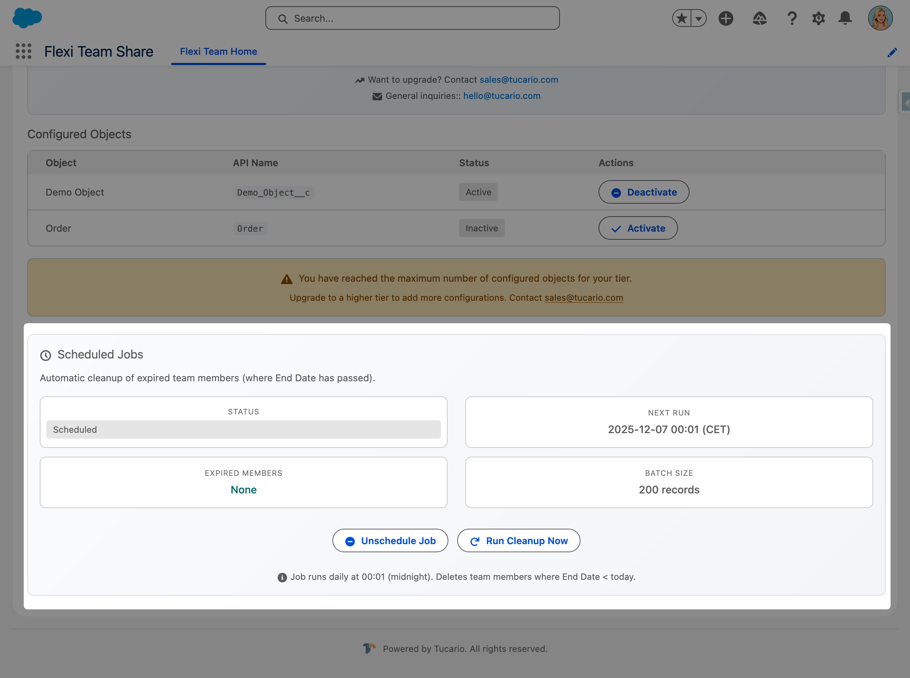

import { Aside, Steps } from '@astrojs/starlight/components';

## Component Configuration

The Object Team Member component can be configured directly in Lightning App Builder with the following properties:

| Property | Type | Default | Description |
|----------|------|---------|-------------|
| **Card Title** | String | Team Members | The title displayed on the component card |
| **Max Displayed Members** | Integer | 5 | Maximum number of team members shown before collapsing. Set to 0 to show all |

When the number of team members exceeds the configured limit, the list collapses and shows a **"Show all (X more)"** button. Clicking it expands the full list, with a **"Show less"** button to collapse it again. The record owner always appears first in the list, regardless of the display limit.


### Display Limit Behavior

| Setting | Behavior |
|---------|----------|
| Max Displayed Members = **5** (default) | Shows first 5 members, "Show X more" for the rest |
| Max Displayed Members = **0** | All team members visible, no collapse/expand |
| Max Displayed Members = **3** (custom) | Shows first 3 members, "Show X more" for the rest |

## Team Member Roles

When adding users to a team, you assign them one of the following roles:

| Role | Description | Capabilities |
|------|-------------|-------------|
| **Owner** | The record owner | Automatically assigned when a record is created. Cannot be manually assigned or removed. Has full access to manage team members. Deleted automatically when no other users in team. |
| **Manager** | Team administrator | Can add, edit, and remove team members. Use this role for users who need to manage the team composition. |
| **User** | Standard team member | Can view the list of team members but cannot modify it. Use this role for users who only need access to the record. |


<Aside type="note">
  * The **Owner** role is automatically created by the system and represents the current record owner
  * Both **Manager** and **User** roles receive record access based on their assigned Access Level (Read Only or Read/Write)
  * Only users with **Owner** or **Manager** roles can add, edit, or remove team members
</Aside>

## Owner Change Synchronization

When the record owner changes (e.g., an Account is reassigned to another sales rep), the Owner team member is **NOT automatically updated**. The system creates the Owner record when the first team member is added, but it does not track subsequent owner changes on the parent record.

To keep the team Owner synchronized with the record owner, you need to create a **Record-Triggered Flow**.

<Aside type="note" title="Why is this not automatic?">
  Salesforce managed packages cannot include triggers on standard objects like Account or Opportunity. Flexible Team Share provides an **Invocable Action** that you can call from a Flow to sync the owner when needed.
</Aside>

### Setup via Flow (Recommended)

<Steps>
  1. Go to **Setup** > **Flows**
  2. Click **New Flow** > **Record-Triggered Flow**
  3. Select the object (e.g., Account)
  4. Configure trigger: **"A record is updated"**
  5. Add Entry Condition: Formula > `ISCHANGED({!$Record.OwnerId})` evaluates to `true`
  6. Set **"When to Run the Flow"** to **"After the record is saved"**
  7. Add **Action** element
  8. Search for **"Sync Team Member Owner"**
  9. Set **"Record ID"** parameter to `{!$Record.Id}`
  10. Leave **"Object API Name"** empty (auto-derived from Record ID)
  11. Save and **Activate** the Flow
</Steps>


<Aside type="tip">
  Repeat these steps for each object where you want automatic owner synchronization (e.g., Account, Opportunity, Case, Lead).
</Aside>

### Setup via Apex Trigger

```apex
trigger AccountOwnerSync on Account(after update) {
  List<tucariofts.SyncOwnerInvocable.SyncOwnerRequest> requests =
    new List<tucariofts.SyncOwnerInvocable.SyncOwnerRequest>();

  for (Account acc : Trigger.new) {
    Account oldAcc = Trigger.oldMap.get(acc.Id);
    if (acc.OwnerId != oldAcc.OwnerId) {
      tucariofts.SyncOwnerInvocable.SyncOwnerRequest req =
        new tucariofts.SyncOwnerInvocable.SyncOwnerRequest();
      req.recordId = acc.Id;
      requests.add(req);
    }
  }

  if (!requests.isEmpty()) {
    tucariofts.SyncOwnerInvocable.syncOwners(requests);
  }
}
```

### Call from Apex Code (Single Record)

```apex
tucariofts.SyncOwnerInvocable.SyncOwnerRequest request =
    new tucariofts.SyncOwnerInvocable.SyncOwnerRequest();
request.recordId = accountId;

List<tucariofts.SyncOwnerInvocable.SyncOwnerResult> results =
    tucariofts.SyncOwnerInvocable.syncOwners(
        new List<tucariofts.SyncOwnerInvocable.SyncOwnerRequest>{ request }
    );

if (results[0].success) {
    System.debug('Owner synced: ' + results[0].oldOwnerId +
                 ' → ' + results[0].newOwnerId);
} else {
    System.debug('Sync failed: ' + results[0].message);
}
```

### Result Object

| Field | Type | Description |
|-------|------|-------------|
| `success` | Boolean | Whether sync succeeded |
| `message` | String | Result message or error details |
| `oldOwnerId` | Id | Previous owner User ID |
| `newOwnerId` | Id | New owner User ID |

### Error Scenarios

| Scenario | Result |
|----------|--------|
| No team members on record | `success = false`, "No Owner team member found" |
| Owner unchanged | `success = true`, "Owner unchanged, no update needed" |
| Record ID null | `success = false`, "Record ID is required" |
| Invalid record ID | `success = false`, error message |

### Important Limitations

**Queue Owners Not Supported** — Flexible Team Share does not support Queues as team owners. When a record is owned by a Queue:

* The system uses the **current user** (the person who first adds a team member) as the Owner in the team
* If you later change the record owner from a Queue to a User, run the Sync Owner action to update the team
* If you change the owner from a User to a Queue, the team Owner will remain as the previous user

**Flow Must Be Created Per Object** — You need to create a separate Flow for each object type where you want owner synchronization. The Invocable Action works with any object, but Salesforce requires separate Record-Triggered Flows per object.

## Temporary Access with End Date

When adding a team member, you can optionally set an **End Date** to grant temporary access to a record. This is useful for:

* Project-based collaborations with defined timelines
* Temporary consultants or contractors
* Vacation coverage or delegated responsibilities
* Audit or review periods

### How It Works

<Steps>
  1. When adding or editing a team member, set the **End Date** field to the last day they should have access
  2. The team member retains full access until the end of that day
  3. After the End Date passes, the scheduled cleanup job automatically removes the team member and revokes their access
</Steps>


### Automatic Cleanup Process

* A scheduled batch job runs daily (by default at 2:00 AM) to remove expired team members
* When a team member is removed, their sharing record is also deleted, revoking access to the record
* The cleanup job can be managed from the Configuration Wizard



## Scheduled Job

Flexible Team Share includes an automatic cleanup job that removes expired team members. This job is automatically scheduled during package installation.

### Verify the Job

<Steps>
  1. Go to **Setup** > **Scheduled Jobs**
  2. Look for **Flexible Team Share - Expired Member Cleanup**
  3. Verify the job is scheduled to run daily
</Steps>



### Manual Job Management

Administrators can manage the cleanup job from the Configuration Wizard:

* **Schedule Job** — Manually schedule if not running
* **Unschedule Job** — Stop the automatic cleanup
* **Run Now** — Execute cleanup immediately

## Troubleshooting

### "Configuration Not Found" Warning

**Symptom:** A warning modal appears stating that no configuration exists for this object.

**Cause:** The Team Member component was added to a record page before configuring the object in the Configuration Wizard.

**Solution:**

<Steps>
  1. Go to the Configuration Wizard (Flexible Team Share app > Configuration)
  2. Add and deploy a configuration for this object
  3. Return to the record page — the component should now work correctly
</Steps>


### "No Access" Error

**Symptom:** The component displays a "No Access" message with a lock icon instead of team members.

**Cause:** The current user does not have the required Permission Set Group assigned.

**Solution:**

<Steps>
  1. Go to **Setup** > **Permission Set Groups**
  2. Assign either **Admin** or **User** Permission Set Group to the affected users
  3. Users may need to log out and log back in for changes to take effect
</Steps>


### "Limit Reached" Warning

**Symptom:** The "Add Team Member" button is disabled and a message indicates the limit has been reached.

**Cause:** You have reached the maximum number of team members allowed.

**Solution:** Remove inactive or unnecessary team members to free up slots.

| Team Members Within The Limit | Team Members Beyond The Limit |
|:-----|:-----|
|  |  |


### Sharing Not Working

**Symptom:** Team members are added successfully but they cannot access the record.

**Cause:** The object's Organization-Wide Default (OWD) sharing setting is set to Public Read/Write.

**Solution:**

<Steps>
  1. Go to **Setup** > **Sharing Settings**
  2. Change the object's OWD to **Private** or **Public Read Only**
  3. Note: Changing OWD settings may affect other users' access — consult with your Salesforce administrator
</Steps>

## Support

For questions or issues, please contact [support@tucario.com](mailto\:support@tucario.com).
