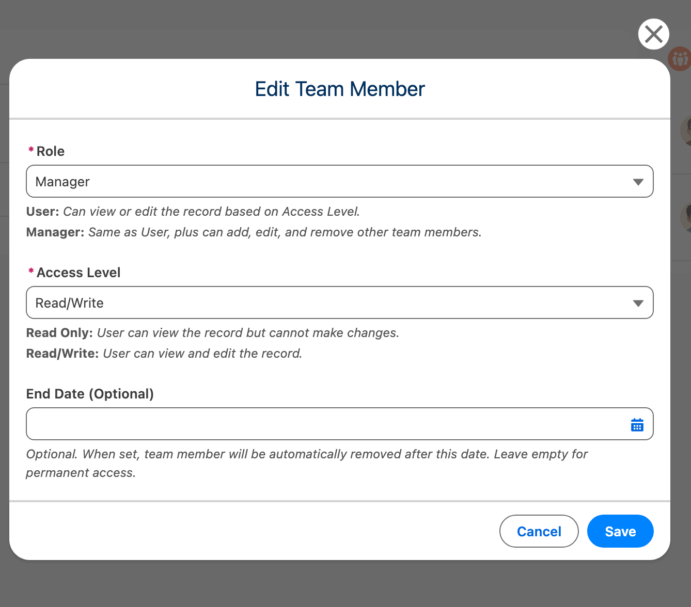
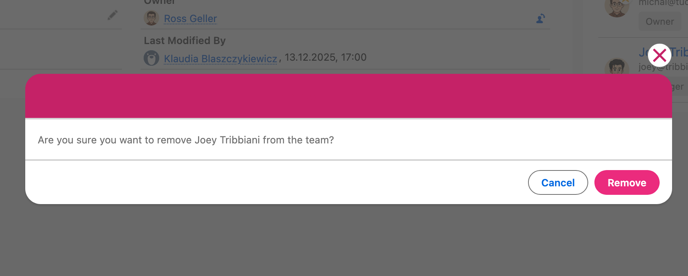
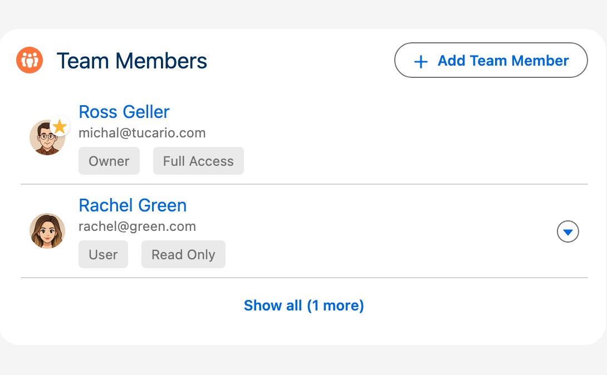
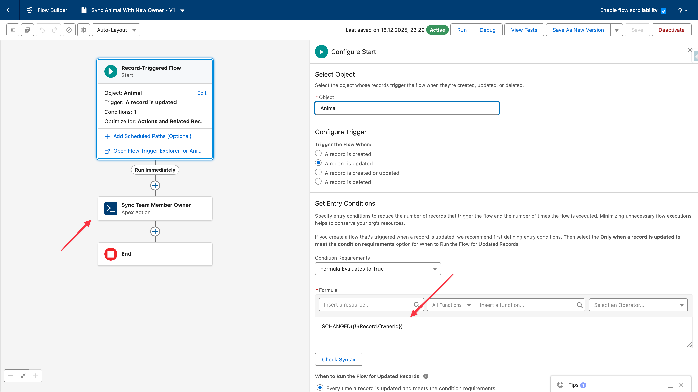

import { Aside } from '@astrojs/starlight/components';

## Use Case 2: Add Team Member to Record (Manager)

### Objective

Add a team member to a Case record with Read/Write access.

### Prerequisites

* User has FTS\_Data\_Access permission set
* Case object is configured for team sharing
* User is record owner OR has Manager role on the record

### Steps

| Step | Action | Expected Result |
|------|--------|----------------|
| 1 | Open a Case record | Case detail page loads |
| 2 | Locate "Object Team" component | Component shows "No team members" or existing list |
| 3 | Click "Add" button (+) | Add Team Member modal opens |
| 4 | Search for user "Test User" | User appears in lookup |
| 5 | Select user | User ID populated |
| 6 | Set Access Level to "Read/Write" | Access level selected |
| 7 | Set Role to "User" | Role selected |
| 8 | (Optional) Set End Date to future date | End date set |
| 9 | Click "Add" | Modal closes, user appears in team list |

### Validation Points

* \[ ] User lookup shows photo and email
* \[ ] Access level options: Read Only, Read/Write
* \[ ] Role options: Manager, User (Owner not selectable)
* \[ ] End date must be future (validation error if past)
* \[ ] Duplicate member shows error message
* \[ ] Share record created for Case (verify via Setup > Sharing)

***

## Use Case 3: Edit Team Member (Manager)

### Objective

Change a team member's access level from Read/Write to Read Only.

### Prerequisites

* Team member exists on record
* Current user has manager permissions

### Steps

| Step | Action | Expected Result |
|------|--------|----------------|
| 1 | Open record with team members | Team member list visible |
| 2 | Click menu icon (⋮) on team member row | Dropdown shows Edit/Delete options |
| 3 | Click "Edit" | Edit modal opens with current values |
| 4 | Change Access Level to "Read Only" | New value selected |
| 5 | Click "Save" | Modal closes, access level updated |

### Validation Points

* \[ ] Original values pre-populated in edit form
* \[ ] User cannot be changed (read-only)
* \[ ] Share record access level updated accordingly
* \[ ] Success toast message displayed

***

## Use Case 4: Remove Team Member (Manager)

### Objective

Remove a team member from a record.

### Prerequisites

* Team member exists on record
* Current user has manager permissions

### Steps

| Step | Action | Expected Result |
|------|--------|----------------|
| 1 | Open record with team members | Team member list visible |
| 2 | Click menu icon (⋮) on team member row | Dropdown shows Edit/Delete options |
| 3 | Click "Delete" | Confirmation modal opens |
| 4 | Click "Delete" to confirm | Modal closes, member removed from list |

### Validation Points

* \[ ] Confirmation shows member name
* \[ ] Share record deleted for parent object
* \[ ] Success toast message displayed
* \[ ] Member no longer appears in list

***

## Use Case 5: View Team (End User)

### Objective

View team members on a record where user is a team member.

### Prerequisites

* User has FTS\_Data\_Access permission set
* User is a team member on the record

### Steps

| Step | Action | Expected Result |
|------|--------|----------------|
| 1 | Open a record where user is team member | Record detail page loads |
| 2 | View "Object Team" component | Team member list visible |
| 3 | View own entry in list | Shows name, photo, role, access level |
| 4 | If more than 5 members, click "Show X more" | Full list expands |
| 5 | Click "Show less" | List collapses back to 5 members |

### Validation Points

* \[ ] User can see team members
* \[ ] Add/Edit/Delete buttons NOT visible (unless user is Manager)
* \[ ] Owner role member shown with badge
* \[ ] End date shown if set
* \[ ] If more than 5 members, list is collapsed with "Show X more" button
* \[ ] Clicking "Show X more" expands full list
* \[ ] Clicking "Show less" collapses list back
* \[ ] Record owner always appears first in the list

***

## Use Case 6: Temporary Team Assignment

### Objective

Add a team member with an expiration date for temporary access.

### Prerequisites

* Manager permissions on record
* Cleanup job scheduled (optional but recommended)

### Steps

| Step | Action | Expected Result |
|------|--------|----------------|
| 1 | Add team member (Use Case 2) | Modal open |
| 2 | Set End Date to 7 days from now | Date selected |
| 3 | Save | Member added with end date shown |
| 4 | Wait for end date to pass | — |
| 5 | Cleanup job runs (2:00 AM) | Member automatically removed |

### Validation Points

* \[ ] End date displayed in team member list
* \[ ] Past end date not allowed (validation error)
* \[ ] Expired members cleaned up by batch job
* \[ ] Share records removed when member deleted

***

## Use Case 10: Owner Change Synchronization

### Objective

Automatically update the team Owner when the parent record's owner changes.

### Background

When a record's `OwnerId` field changes (e.g., Account reassigned to another sales rep), the `ObjectTeamMember__c` record with `Role__c = 'Owner'` must be updated to reflect the new owner. This is not automatic — it requires a Flow or Apex trigger.

### Prerequisites

* Team sharing configured for the object
* Team members exist on records (Owner role created automatically)
* Admin access to create Flows

### Setup via Flow (Recommended)

See the [Configuration guide](/1.0/getting-started/configuration/#owner-change-synchronization) for detailed setup instructions.

### Validation Points

* \[ ] Flow triggers only when OwnerId changes
* \[ ] ObjectTeamMember\_\_c with Role='Owner' updated to new owner
* \[ ] Old owner's share record removed (if not still a team member)
* \[ ] New owner's share record created
* \[ ] Queue owners handled (uses running user)
* \[ ] Bulk operations supported (multiple records at once)

### Supported Objects

* Account, Opportunity, Case, Lead, Campaign, Order
* Any custom object with team sharing enabled
