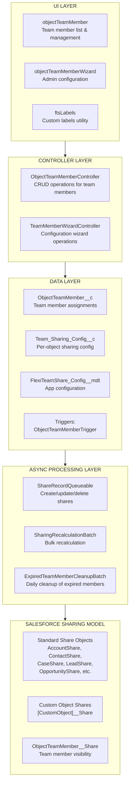
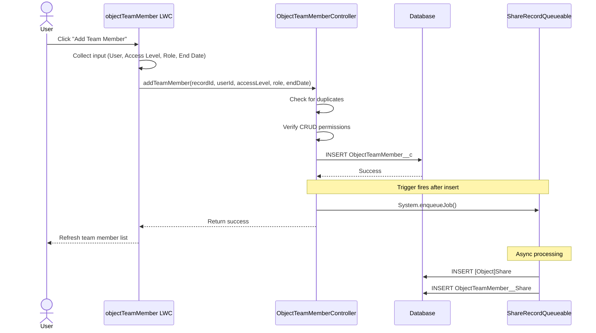
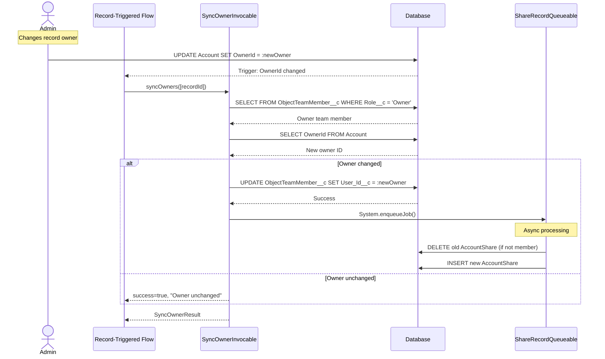
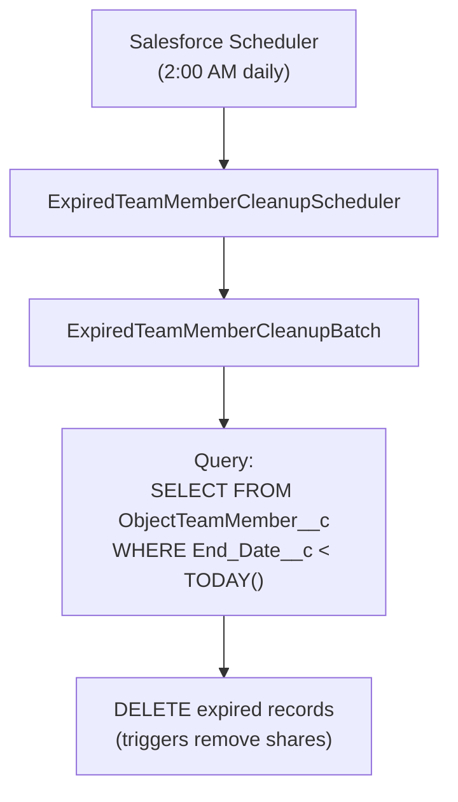

import { Aside } from '@astrojs/starlight/components';

يوفر هذا المستند وصفًا تقنيًا مفصلاً لحل Flexible Team Share، بما في ذلك بنية النظام، تدفق البيانات، وطبقات المعالجة.

## بنية النظام

## الطبقات

### طبقة واجهة المستخدم

ثلاثة Lightning Web Components:

| المكون | الغرض |
|-----------|---------|
| **objectTeamMember** | يعرض أعضاء الفريق على صفحات السجلات. يدعم الإضافة/التحرير/الحذف، قائمة قابلة للطي، وحد عرض قابل للتكوين. |
| **objectTeamMemberWizard** | واجهة المسؤول لتكوين الكائنات، إدارة الإعدادات، وجدولة المهام. |
| **ftsLabels** | مكون أداة يوفر Custom Labels لدعم i18n (35 لغة). |

### طبقة التحكم

| وحدة التحكم | الطرق |
|-----------|---------|
| **ObjectTeamMemberController** | `getTeamMembers()`، `addTeamMember()`، `updateTeamMember()`، `removeTeamMember()`، `isCurrentUserManager()`، `isSharingConfigured()`، `getAccessLevelOptions()` |
| **TeamMemberWizardController** | `getExistingConfigs()`، `getAvailableObjects()`، `createConfig()`، `toggleConfigStatus()`، `deleteConfig()`، `getScheduledJobInfo()`، `scheduleCleanupJob()` |
| **SyncOwnerInvocable** | `syncOwners()` — Invocable Action لمزامنة عضو فريق Owner عند تغيير المالك الأصلي. قابل للاستدعاء من Flow أو Apex، مجمّع بالكامل. |

### طبقة البيانات

كائنات مخصصة و trigger يعمل عند تغيير أعضاء الفريق:

- **ObjectTeamMember__c** — يخزن تعيينات أعضاء الفريق
- **Team_Sharing_Config__c** — تكوين المشاركة لكل كائن
- **FlexiTeamShare_Config__mdt** — تكوين على مستوى التطبيق (Custom Metadata)
- **ObjectTeamMemberTrigger** → **ObjectTeamMemberTriggerHandler** — يعالج Before Insert، Before Update، Before Delete

### طبقة المعالجة غير المتزامنة

| المكون | النوع | الغرض |
|-----------|------|---------|
| **ShareRecordQueueable** | Queueable | ينشئ ويحدث ويحذف سجلات المشاركة للكائنات الأصلية وأعضاء الفريق |
| **SharingRecalculationBatch** | Batchable | إعادة حساب جميع المشاركات بشكل جماعي عند تغيير التكوين |
| **ExpiredTeamMemberCleanupBatch** | Batchable | يحذف أعضاء الفريق منتهي الصلاحية (مهمة مجدولة يوميًا) |
| **ExpiredTeamMemberCleanupScheduler** | Schedulable | يجدول batch التنظيف (يعمل في الساعة 2:00 صباحًا يوميًا) |

## تدفق البيانات: إضافة عضو فريق

## تدفق البيانات: مزامنة تغيير المالك

## تدفق البيانات: تنظيف الأعضاء منتهي الصلاحية

## معالجة الأخطاء

### طبقة التحكم

- جميع الطرق العامة ملفوفة في try-catch
- رسائل خطأ سهلة الاستخدام عبر Custom Labels
- `AuraHandledException` لعرض الأخطاء في LWC

### المعالجة غير المتزامنة

- `Database.insert/update/delete(records, false)` — نجاح جزئي
- يتم تسجيل الأخطاء الفردية، ولا تفشل الدفعة بأكملها
- يتم تتبع إحصائيات الأخطاء في مهام batch

### طبقة Trigger

- نمط معالج trigger يمنع التكرار
- تظهر الأخطاء للمستدعي لعملية DML

## اعتبارات الأداء

### المعالجة غير المتزامنة

- تستخدم عمليات سجل المشاركة Queueable (غير محظورة)
- تستخدم العمليات الجماعية Batchable مع حجم batch قابل للتكوين
- لا توجد DML متزامنة على سجلات المشاركة في triggers

### تحسين الاستعلامات

- يتم استخدام الحقول المفهرسة في جمل WHERE
- تنسيق `Record_Id__c` يمكّن استعلامات LIKE فعالة
- مجموعات نتائج محدودة مع جمل LIMIT

### التخزين المؤقت

- `@AuraEnabled(cacheable=true)` لعمليات القراءة
- يتم تخزين تكوين التطبيق مؤقتًا في المعاملة

## بنية التكامل

**لا توجد تكاملات خارجية** — هذه الحزمة تعمل بالكامل داخل Salesforce:

- لا توجد استدعاءات HTTP
- لا توجد واجهات برمجة تطبيقات خارجية
- لا توجد Named Credentials
- لا توجد External Objects
- لا توجد Connected Apps

### تبعيات المنصة

| المكون | الاستخدام |
|-----------|-------|
| Apex Sharing | ينشئ/يدير سجلات المشاركة |
| Queueable Apex | عمليات سجل المشاركة غير المتزامنة |
| Batchable Apex | إعادة حساب المشاركة الجماعية، التنظيف |
| Schedulable Apex | مهمة التنظيف اليومية |
| Custom Metadata | تكوين التطبيق |
| Lightning Web Components | واجهة المستخدم |
| Custom Labels | الترجمة الدولية |
