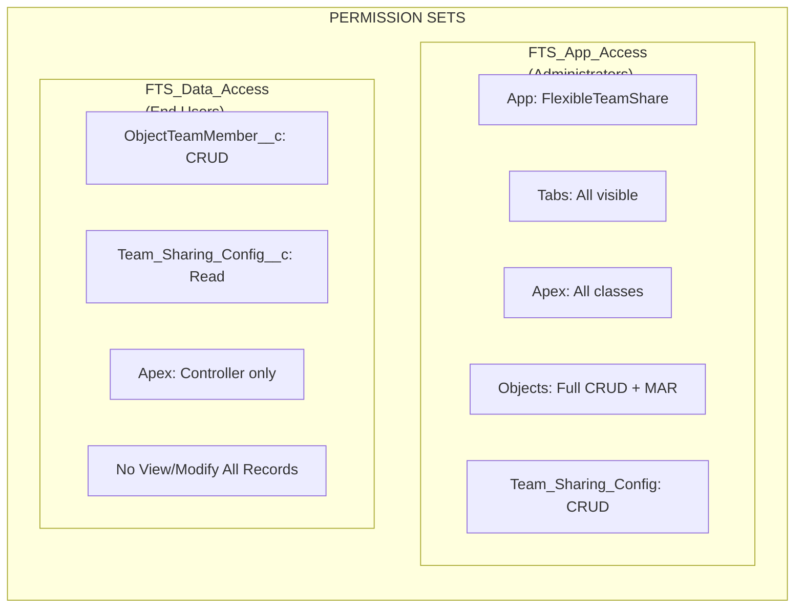
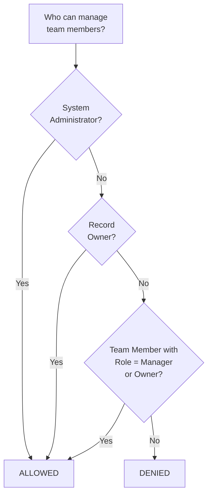
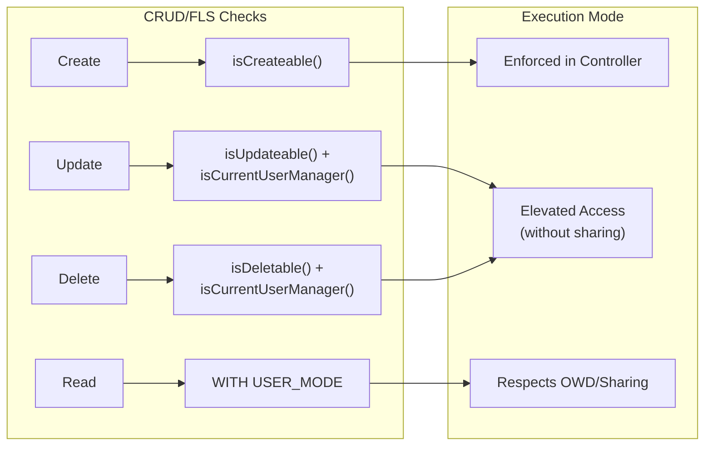
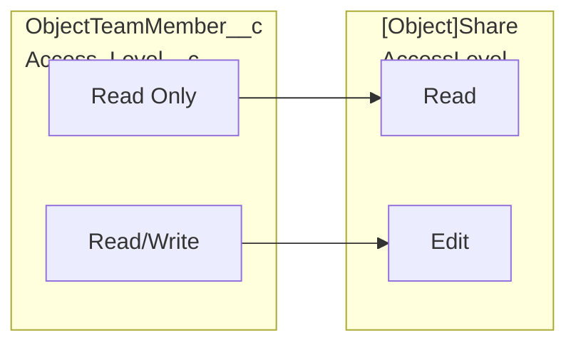
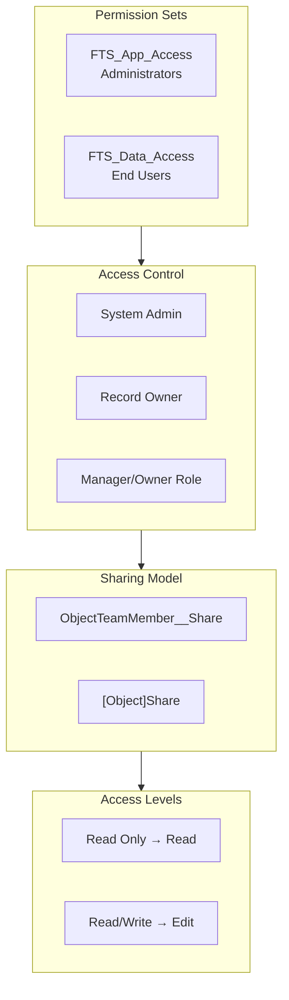

import { Aside } from '@astrojs/starlight/components';

## نموذج الأذونات

### Permission Sets

| Permission Set | الجمهور | القدرات |
|---------------|----------|-------------|
| **FTS_App_Access** | المسؤولون | وصول كامل للتطبيق، جميع علامات التبويب، جميع فئات Apex، CRUD كامل + Modify All Records على الكائنات، CRUD على Team_Sharing_Config |
| **FTS_Data_Access** | المستخدمون النهائيون | CRUD على ObjectTeamMember__c، قراءة Team_Sharing_Config__c، فئات Apex للتحكم فقط، بدون View/Modify All Records |

## منطق التحكم بالوصول

تحدد طريقة `isCurrentUserManager()` من يمكنه إدارة أعضاء الفريق:

1. **مسؤولو النظام** — مسموح دائمًا
2. **مالكو السجلات** — مسموح دائمًا
3. **أعضاء فريق بدور Manager/Owner** — مسموح
4. **الجميع الآخرون** — ممنوع

## تطبيق CRUD/FLS

| العملية | فحص الأمان | التنفيذ |
|-----------|---------------|----------------|
| إنشاء عضو فريق | `Schema.sObjectType.ObjectTeamMember__c.isCreateable()` | تطبيق في وحدة التحكم |
| تحديث عضو فريق | `isUpdateable()` + `isCurrentUserManager()` | وصول مرتفع (without sharing) بعد التفويض |
| حذف عضو فريق | `isDeletable()` + `isCurrentUserManager()` | وصول مرتفع (without sharing) بعد التفويض |
| قراءة أعضاء الفريق | `WITH USER_MODE` / sharing model | يحترم OWD/المشاركة |

<Aside type="note">
تستخدم عمليات التحديث والحذف وصولاً مرتفعًا (`without sharing`) للسماح للمديرين بتعديل أي عضو فريق على السجل، وليس فقط من أنشأوه. يتم دائمًا التحقق من التفويض أولاً عبر `isCurrentUserManager()`.
</Aside>

## التحقق من المدخلات

| المدخل | التحقق | الموقع |
|-------|-----------|----------|
| `recordId` | ليس فارغًا، تنسيق معرف Salesforce صالح | وحدة التحكم |
| `userId` | ليس فارغًا، معرف مستخدم صالح | وحدة التحكم |
| `accessLevel` | ليس فارغًا، قيمة قائمة منسدلة صالحة | وحدة التحكم + Picklist |
| `role` | ليس فارغًا، قيمة قائمة منسدلة صالحة | وحدة التحكم + Picklist |
| `endDate` | يجب أن يكون تاريخًا مستقبليًا أو null | وحدة التحكم + Validation Rule |
| `objectApiName` | مشتق من معرف Salesforce (ليس مدخل مستخدم) | وحدة التحكم |

### Validation Rules

| القاعدة | الكائن | الوصف |
|------|--------|-------------|
| `End_Date_Cannot_Be_Past` | `ObjectTeamMember__c` | يمنع تعيين تاريخ انتهاء في الماضي |

## تعيين مستوى الوصول

## نظرة عامة كاملة على الأمان

## أفضل ممارسات الأمان المطبقة

| الضبط | الحالة | التنفيذ |
|---------|--------|---------------|
| فحوصات CRUD في وحدات التحكم | مطبق | `isAccessible()`، `isCreateable()`، `isUpdateable()`، `isDeletable()` |
| تطبيق FLS | مطبق | Permission Sets تتحكم في الوصول للحقول |
| منع حقن SOQL | مطبق | متغيرات ربط لمدخلات المستخدم، قائمة بيضاء لأسماء الكائنات |
| نموذج المشاركة | مطبق | `with sharing` على وحدات التحكم، `without sharing` فقط حيث موثق |
| التحقق من المدخلات | مطبق | فحوصات null، التحقق من التنسيق، قواعد العمل |
| منع XSS | مطبق | إطار عمل LWC يتعامل مع ترميز المخرجات |

## أمان التكامل الخارجي

| الفحص | النتيجة |
|-------|--------|
| استدعاءات HTTP | لا شيء — الحزمة لا تقوم باستدعاءات خارجية |
| Named Credentials | غير مستخدم |
| External Objects | غير مستخدم |
| Remote Site Settings | غير مطلوب |
| انتهاكات CSP | نجح — لا توجد انتهاكات Content-Security-Policy |
