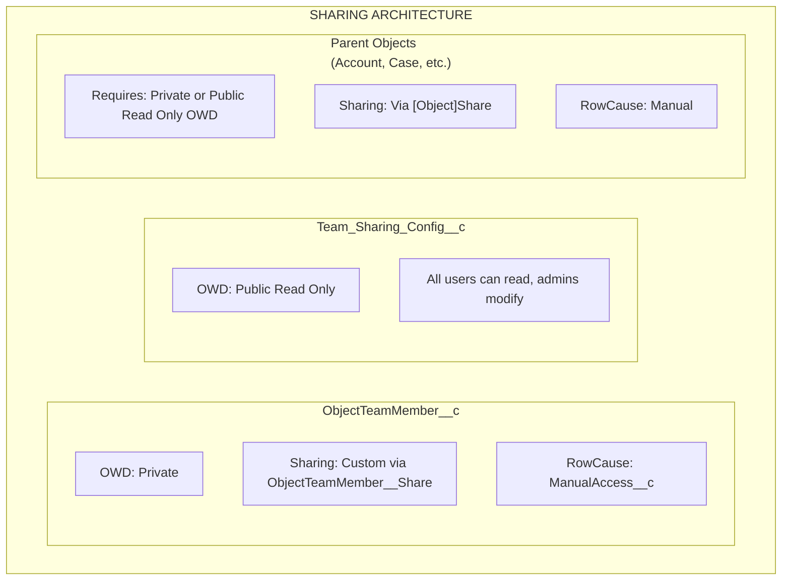

import { Aside } from '@astrojs/starlight/components';

## بنية المشاركة

## كيف تعمل المشاركة

### ObjectTeamMember__c

- **OWD**: Private
- **آلية المشاركة**: مشاركة مخصصة عبر `ObjectTeamMember__Share`
- **RowCause**: `ManualAccess__c`

عند إضافة عضو فريق، ينشئ النظام سجل `ObjectTeamMember__Share` بحيث يمكن لعضو الفريق رؤية سجل عضوية فريقه الخاص.

### Team_Sharing_Config__c

- **OWD**: Public Read Only
- يمكن لجميع المستخدمين قراءة التكوين (مطلوب لعرض المكون)
- يمكن للمسؤولين فقط تعديل التكوينات

### الكائنات الأصلية

- **المتطلب**: يجب أن يكون للكائنات **Private** أو **Public Read Only** OWD
- **آلية المشاركة**: عبر جداول `[Object]Share` القياسية (مثل `AccountShare`، `CaseShare`)
- **RowCause**: Manual

<Aside type="caution">
إذا تم تعيين OWD للكائن الأصلي على **Public Read/Write**، فلن تتمكن سجلات المشاركة من منح وصول إضافي لأن المستخدمين لديهم بالفعل وصول كامل. يتطلب Flexible Team Share OWD من نوع Private أو Public Read Only ليعمل بشكل صحيح.
</Aside>

## تعيين مستوى الوصول

عند إضافة عضو فريق بمستوى وصول، يتم تعيينه لوصول سجل مشاركة Salesforce:

| ObjectTeamMember__c Access_Level__c | [Object]Share AccessLevel | الوصف |
|-------------------------------------|--------------------------|-------------|
| **Read Only** | `Read` | يمكن لعضو الفريق عرض السجل |
| **Read/Write** | `Edit` | يمكن لعضو الفريق عرض وتحرير السجل |

## دورة حياة سجل المشاركة

### إنشاء المشاركات

عند إضافة عضو فريق:

1. يتم إدراج سجل `ObjectTeamMember__c`
2. يعمل Trigger ويضع `ShareRecordQueueable` في قائمة الانتظار
3. ينشئ Queueable سجلي مشاركة:
   - **مشاركة أصلية**: سجل `[Object]Share` يمنح المستخدم وصولاً للسجل الأصلي
   - **مشاركة عضو فريق**: سجل `ObjectTeamMember__Share` يمنح المستخدم رؤية لعضوية فريقه

### تحديث المشاركات

عند تغيير مستوى وصول عضو فريق:

1. يتم تحديث سجل `ObjectTeamMember__c`
2. يعمل Trigger ويضع `ShareRecordQueueable` في قائمة الانتظار
3. يحذف Queueable المشاركة القديمة وينشئ واحدة جديدة بمستوى الوصول المحدث

### حذف المشاركات

عند إزالة عضو فريق:

1. يتم حذف سجل `ObjectTeamMember__c`
2. يعمل Trigger ويضع `ShareRecordQueueable` في قائمة الانتظار
3. يحذف Queueable سجلي المشاركة (الأصلي وعضو الفريق)

### إعادة الحساب الجماعي

عند تبديل تكوين المشاركة:

- **معطل**: يزيل `SharingRecalculationBatch` جميع سجلات المشاركة لذلك الكائن
- **معاد تنشيطه**: يعيد `SharingRecalculationBatch` إنشاء سجلات المشاركة لجميع أعضاء الفريق الموجودين

## كائنات المشاركة المدعومة

### الكائنات القياسية

| الكائن | جدول المشاركة |
|--------|------------|
| Account | `AccountShare` |
| Contact | `ContactShare` |
| Case | `CaseShare` |
| Lead | `LeadShare` |
| Opportunity | `OpportunityShare` |
| Campaign | `CampaignShare` |
| Order | `OrderShare` |

### الكائنات المخصصة

تتبع الكائنات المخصصة النمط: `ObjectName__c` → `ObjectName__Share`

يستخدم النظام قائمة بيضاء مشفرة للكائنات القياسية ويشتق اسم جدول المشاركة للكائنات المخصصة تلقائيًا.

## متطلبات النشر

### متطلبات المؤسسة

- Salesforce **Enterprise Edition** أو أعلى (لدعم نموذج المشاركة)
- يجب أن يكون للكائنات **Private** أو **Public Read Only** OWD للاستفادة من المشاركة

### متطلبات المستخدم

- يحتاج المستخدمون لتعيين Permission Set المناسب
- يحتاج المستخدمون لوصول أساسي للكائن (مثل وصول قراءة Account لاستخدام فرق Account)
