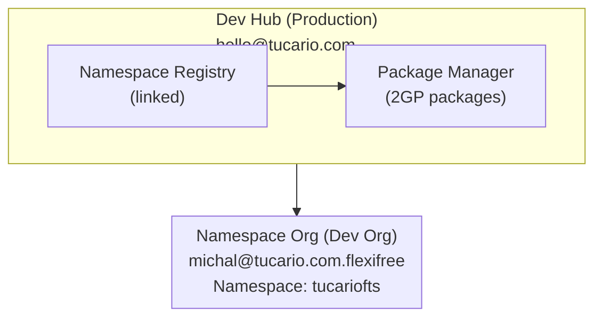

import { Aside } from '@astrojs/starlight/components';

## البنية



## المتطلبات الأساسية

### 1. Dev Hub (Production)

- Dev Hub ممكّن: Setup > Dev Hub > Enable
- Namespace متصل: App Launcher > Namespace Registries > Link Namespace

### 2. Namespace Org (Partner Developer Org)

- Namespace مسجل (مرة واحدة، لا يمكن الرجوع عنه)
- Setup > Package Manager > Edit > Namespace Prefix

### 3. البيئة المحلية

- تثبيت Salesforce CLI
- التفويض لكلا المؤسستين

## مرجع سريع (نسخ-لصق)

```bash
# 1. التحقق من المؤسسات
sf org list

# 2. التحقق من الحزم
sf package list --target-dev-hub DevHub

# 3. التحقق من الإصدارات
sf package version list --packages FlexibleTeamShare --target-dev-hub DevHub

# 4. إنشاء إصدار جديد (BETA)
sf package version create --package FlexibleTeamShare --installation-key-bypass --wait 20 --code-coverage --target-dev-hub DevHub --definition-file config/package-scratch-def.json

# 5. اختبار التثبيت (استبدل ID واسم المؤسسة المستعار)
sf package install --package 04tXXXXXXXXXXXXXXX --target-org TestOrg --wait 10

# 6. الترويج إلى RELEASED (لا يمكن الرجوع عنه!)
sf package version promote --package 04tXXXXXXXXXXXXXXX --target-dev-hub DevHub
```

## الأوامر

### تفويض المؤسسة

```bash
# Dev Hub (production)
sf org login web --alias DevHub --set-default-dev-hub

# Namespace Org (dev org with namespace)
sf org login web --alias FlexiFREE
```

### التحقق من المؤسسات المتصلة

```bash
sf org list
```

### التحقق من الحزم الموجودة

```bash
sf package list --target-dev-hub DevHub
```

### التحقق من إصدارات الحزمة

```bash
sf package version list --packages FlexibleTeamShare --target-dev-hub DevHub
```

## إنشاء إصدار حزمة جديد

### 1. تحديث الإصدار في sfdx-project.json (اختياري)

```json
{
  "packageDirectories": [
    {
      "versionName": "ver 0.2",
      "versionNumber": "0.2.0.NEXT",
      "path": "force-app",
      "default": true,
      "package": "FlexibleTeamShare"
    }
  ],
  "namespace": "tucariofts"
}
```

### 2. إنشاء إصدار حزمة (beta)

```bash
sf package version create \
  --package FlexibleTeamShare \
  --installation-key-bypass \
  --wait 20 \
  --code-coverage \
  --target-dev-hub DevHub \
  --definition-file config/package-scratch-def.json
```

<Aside type="caution">
معامل `--definition-file` مطلوب لدعم الترجمة! يحتوي الملف `config/package-scratch-def.json` على `enableTranslationWorkbench: true`.
</Aside>

### 3. اختبار التثبيت

```bash
sf package install \
  --package 04tXXXXXXXXXXXXXXX \
  --target-org TestOrg \
  --wait 10
```

### 4. الترويج إلى Released (Production)

```bash
sf package version promote \
  --package 04tXXXXXXXXXXXXXXX \
  --target-dev-hub DevHub
```

<Aside type="caution">
بعد الترويج، يكون الإصدار **لا يمكن الرجوع عنه** صادر وجاهز لـ AppExchange!
</Aside>

## النشر على AppExchange

1. سجل الدخول إلى [Partner Community](https://partners.salesforce.com)
2. Publishing > Listings > New Listing
3. أضف إصدار الحزمة المروّج
4. املأ تفاصيل القائمة
5. قدّم للمراجعة

## استكشاف الأخطاء وإصلاحها

### "Not available for deploy for this organization" (Translations)

مؤسسة Scratch ليس لديها Translation Workbench ممكّن.

**الحل:** استخدم `--definition-file config/package-scratch-def.json` الذي يتضمن:

```json
{
  "orgName": "Package Build Org",
  "edition": "Enterprise",
  "settings": {
    "languageSettings": {
      "enableTranslationWorkbench": true,
      "enableEndUserLanguages": true,
      "enablePlatformLanguages": true
    }
  }
}
```

### "No such column" (FLS errors)

استخدم `WITH SYSTEM_MODE` بدلاً من `WITH USER_MODE` في استعلامات SOQL.

### "You cannot deploy to a required field"

قم بإزالة الحقول المطلوبة من Permission Sets (الحقول المطلوبة لا تحتاج FLS).
