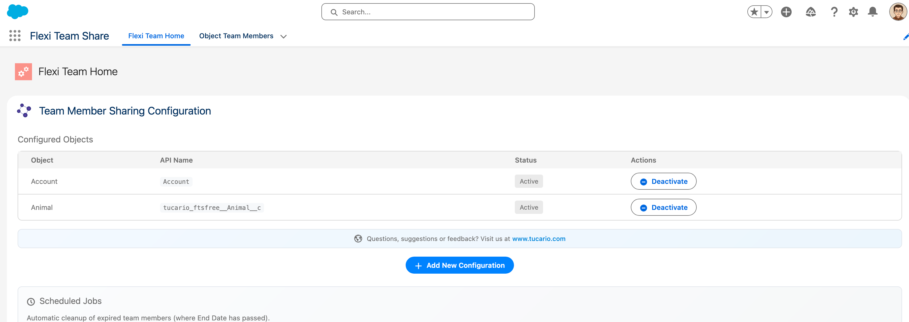
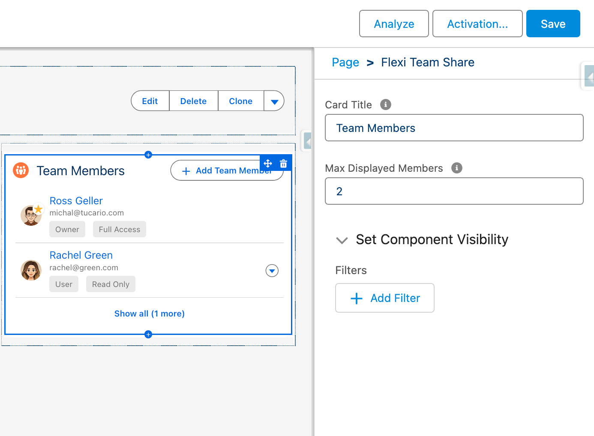

import { Aside, Steps } from '@astrojs/starlight/components';

## حالة الاستخدام 1: الإعداد الأولي (المسؤول)

### الهدف

تكوين Flexible Team Share للاستخدام الأول في المؤسسة.

### المتطلبات الأساسية

- ملف System Administrator الشخصي
- تعيين Permission Set FTS_App_Access

### الخطوات

| الخطوة | الإجراء | النتيجة المتوقعة |
|------|--------|----------------|
| 1 | انتقل إلى App Launcher | يعرض البحث تطبيق "FlexiTeam" |
| 2 | افتح تطبيق FlexiTeam | تحميل صفحة FlexiTeam Home |
| 3 | انقر على علامة تبويب "Configuration Wizard" | يعرض المعالج مع قسمين |
| 4 | في "Object Configuration"، انقر على "Add Object" | فتح نافذة منبثقة مع الكائنات المتاحة |
| 5 | حدد "Case" من القائمة المنسدلة | تحديد كائن Case |
| 6 | انقر على "Save" | حفظ التكوين، يظهر Case في القائمة كـ Active |
| 7 | (اختياري) جدولة مهمة التنظيف | جدولة المهمة، عرض وقت التشغيل التالي |

### نقاط التحقق

- [ ] تظهر فقط الكائنات مع Private/Public Read Only OWD في القائمة المنسدلة
- [ ] الكائنات المكوّنة بالفعل لا تظهر في القائمة المنسدلة
- [ ] يعمل مفتاح التبديل Active بشكل صحيح
- [ ] يمكن جدولة/إلغاء جدولة مهمة التنظيف

---

## حالة الاستخدام 7: إلغاء تنشيط تكوين الكائن (المسؤول)

### الهدف

تعطيل مشاركة الفريق لكائن وإزالة المشاركات الموجودة.

### المتطلبات الأساسية

- الكائن مكوّن ونشط بالفعل
- توجد أعضاء فريق لهذا الكائن

### الخطوات

| الخطوة | الإجراء | النتيجة المتوقعة |
|------|--------|----------------|
| 1 | افتح معالج التكوين | قائمة التكوين مرئية |
| 2 | أوقف مفتاح "Active" لـ Case | مربع حوار تأكيد |
| 3 | أكد إلغاء التنشيط | تغيير الحالة إلى غير نشط |
| 4 | تحقق من فرق Case الموجودة | تبقى أعضاء الفريق لكن تتم إزالة المشاركات |

### نقاط التحقق

- [ ] تعمل مهمة batch لحذف سجلات المشاركة
- [ ] الحفاظ على سجلات أعضاء الفريق
- [ ] يمكن إعادة التنشيط لاحقًا (إعادة إنشاء المشاركات)
- [ ] عرض تحذير حول إزالة المشاركة

---

## حالة الاستخدام 9: تنفيذ التنظيف اليدوي (المسؤول)

### الهدف

تشغيل التنظيف يدويًا لأعضاء الفريق منتهي الصلاحية.

### المتطلبات الأساسية

- وصول المسؤول
- توجد أعضاء فريق منتهي الصلاحية (End_Date__c في الماضي)

### الخطوات

| الخطوة | الإجراء | النتيجة المتوقعة |
|------|--------|----------------|
| 1 | افتح معالج التكوين | قسم Scheduled Jobs مرئي |
| 2 | عرض عدد "Expired Members" | يعرض عدد السجلات منتهية الصلاحية |
| 3 | انقر على "Run Cleanup Now" | تبدأ مهمة batch |
| 4 | حدث الصفحة | انخفاض عدد منتهي الصلاحية إلى 0 |

### نقاط التحقق

- [ ] عدد منتهي الصلاحية دقيق
- [ ] اكتمال مهمة batch بنجاح
- [ ] حذف الأعضاء منتهي الصلاحية
- [ ] إزالة سجلات المشاركة المرتبطة

---

## حالة الاستخدام 11: تكوين عرض المكون (المسؤول)

### الهدف

تخصيص مظهر مكون Object Team Member: تغيير عنوان البطاقة وتعيين الحد الأقصى لعدد أعضاء الفريق المعروضين.

### المتطلبات الأساسية

- ملف System Administrator الشخصي
- الوصول إلى Lightning App Builder

### الخطوات

| الخطوة | الإجراء | النتيجة المتوقعة |
|------|--------|----------------|
| 1 | افتح صفحة السجل في Lightning App Builder | تحميل محرر الصفحة |
| 2 | انقر على مكون "Team Members" | فتح لوحة خصائص المكون على اليمين |
| 3 | غيّر "Card Title" إلى قيمة مخصصة | تحديث معاينة العنوان |
| 4 | اضبط "Max Displayed Members" على العدد المطلوب | تكوين حد العرض |
| 5 | احفظ وفعّل الصفحة | تطبيق التغييرات |
| 6 | افتح سجلًا مع أعضاء فريق | يعرض المكون العنوان المكوّن ويحترم حد العرض |

### خيارات التكوين

| الإعداد | القيم | السلوك |
|---------|--------|----------|
| Max Displayed Members = 5 | افتراضي | يعرض أول 5 أعضاء، "Show X more" للباقي |
| Max Displayed Members = 0 | إظهار الجميع | جميع أعضاء الفريق مرئيون، بدون طي/توسيع |
| Max Displayed Members = 3 | حد مخصص | يعرض أول 3 أعضاء، "Show X more" للباقي |

### نقاط التحقق

- [ ] تنعكس تغييرات عنوان البطاقة على صفحة السجل
- [ ] احترام حد العرض (العدد الصحيح من الأعضاء المعروضين)
- [ ] يظهر زر "Show X more" عندما يتجاوز الأعضاء الحد
- [ ] تعيين الحد على 0 يعرض جميع الأعضاء بدون زر طي
- [ ] يظهر مالك السجل دائمًا أولاً بغض النظر عن الحد
- [ ] زر "Show less" يطوي القائمة للحد المكوّن
- [ ] استمرار التغييرات بعد إعادة تحميل الصفحة
