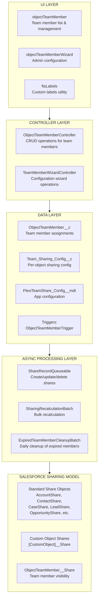
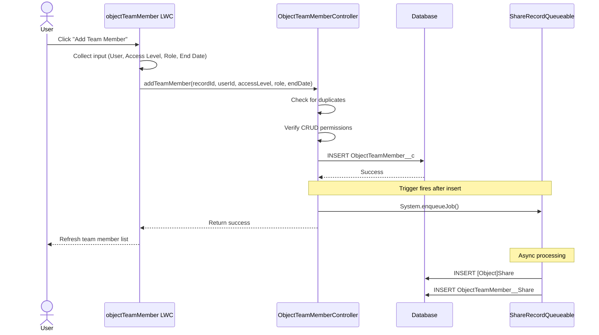
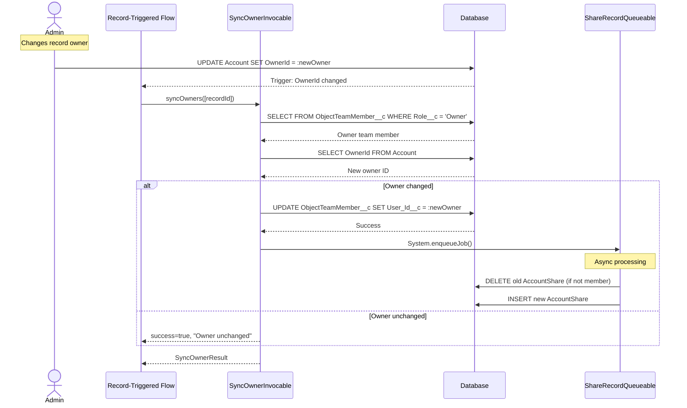
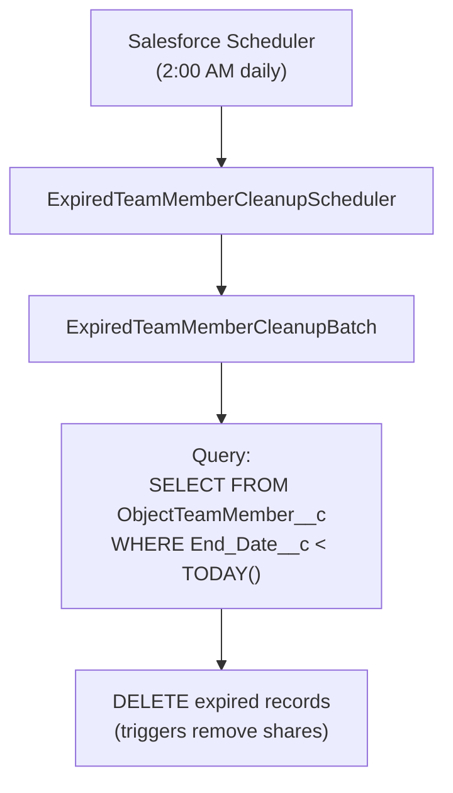

import { Aside } from '@astrojs/starlight/components';

This document provides a detailed technical description of the Flexible Team Share solution, including system architecture, data flow, and processing layers.

## System Architecture

## Layers

### UI Layer

Three Lightning Web Components:

| Component | Purpose |
|-----------|---------|
| **objectTeamMember** | Displays team members on record pages. Supports add/edit/delete, collapsible list, and configurable display limit. |
| **objectTeamMemberWizard** | Admin interface for configuring objects, managing settings, and scheduling jobs. |
| **ftsLabels** | Utility component providing custom labels for i18n support (35 languages). |

### Controller Layer

| Controller | Methods |
|-----------|---------|
| **ObjectTeamMemberController** | `getTeamMembers()`, `addTeamMember()`, `updateTeamMember()`, `removeTeamMember()`, `isCurrentUserManager()`, `isSharingConfigured()`, `getAccessLevelOptions()` |
| **TeamMemberWizardController** | `getExistingConfigs()`, `getAvailableObjects()`, `createConfig()`, `toggleConfigStatus()`, `deleteConfig()`, `getScheduledJobInfo()`, `scheduleCleanupJob()` |
| **SyncOwnerInvocable** | `syncOwners()` — Invocable Action for syncing Owner team member when parent owner changes. Callable from Flow or Apex, fully bulkified. |

### Data Layer

Custom objects and a trigger that fires on team member changes:

- **ObjectTeamMember__c** — stores team member assignments
- **Team_Sharing_Config__c** — per-object sharing configuration
- **FlexiTeamShare_Config__mdt** — app-level configuration (Custom Metadata)
- **ObjectTeamMemberTrigger** → **ObjectTeamMemberTriggerHandler** — handles Before Insert, Before Update, Before Delete

### Async Processing Layer

| Component | Type | Purpose |
|-----------|------|---------|
| **ShareRecordQueueable** | Queueable | Creates, updates, and deletes share records for parent objects and team members |
| **SharingRecalculationBatch** | Batchable | Bulk recalculates all shares when configuration changes |
| **ExpiredTeamMemberCleanupBatch** | Batchable | Deletes expired team members (daily scheduled job) |
| **ExpiredTeamMemberCleanupScheduler** | Schedulable | Schedules the cleanup batch (runs at 2:00 AM daily) |

## Data Flow: Adding a Team Member

## Data Flow: Owner Change Synchronization

## Data Flow: Expired Member Cleanup

## Error Handling

### Controller Layer

- All public methods wrapped in try-catch
- User-friendly error messages via Custom Labels
- `AuraHandledException` for LWC error display

### Async Processing

- `Database.insert/update/delete(records, false)` — partial success
- Individual errors logged, don't fail entire batch
- Error statistics tracked in batch jobs

### Trigger Layer

- Trigger handler pattern prevents recursion
- Errors surface to DML operation caller

## Performance Considerations

### Async Processing

- Share record operations use Queueable (non-blocking)
- Bulk operations use Batchable with configurable batch size
- No synchronous DML on share records in triggers

### Query Optimization

- Indexed fields used in WHERE clauses
- `Record_Id__c` format enables efficient LIKE queries
- Limited result sets with LIMIT clauses

### Caching

- `@AuraEnabled(cacheable=true)` for read operations
- App config cached in transaction

## Integration Architecture

**No external integrations** — this package operates entirely within Salesforce:

- No HTTP callouts
- No external APIs
- No Named Credentials
- No External Objects
- No Connected Apps

### Platform Dependencies

| Component | Usage |
|-----------|-------|
| Apex Sharing | Creates/manages share records |
| Queueable Apex | Async share record operations |
| Batchable Apex | Bulk share recalculation, cleanup |
| Schedulable Apex | Daily cleanup job |
| Custom Metadata | App configuration |
| Lightning Web Components | User interface |
| Custom Labels | Internationalization |
