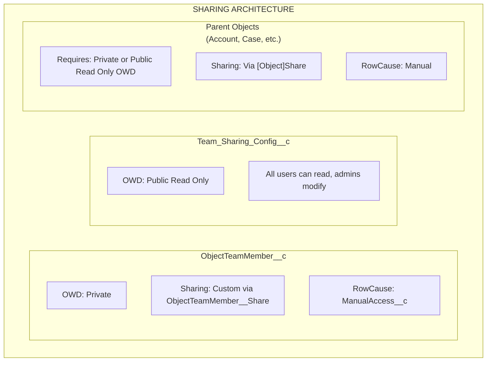

import { Aside } from '@astrojs/starlight/components';

## Sharing Architecture

## How Sharing Works

### ObjectTeamMember__c

- **OWD**: Private
- **Sharing mechanism**: Custom sharing via `ObjectTeamMember__Share`
- **RowCause**: `ManualAccess__c`

When a team member is added, the system creates an `ObjectTeamMember__Share` record so the team member can see their own team membership record.

### Team_Sharing_Config__c

- **OWD**: Public Read Only
- All users can read configuration (needed for component rendering)
- Only administrators can modify configurations

### Parent Objects

- **Requirement**: Objects must have **Private** or **Public Read Only** OWD
- **Sharing mechanism**: Via standard `[Object]Share` tables (e.g., `AccountShare`, `CaseShare`)
- **RowCause**: Manual

<Aside type="caution">
If the parent object's OWD is set to **Public Read/Write**, sharing records cannot grant additional access since users already have full access. Flexible Team Share requires Private or Public Read Only OWD to function properly.
</Aside>

## Access Level Mapping

When a team member is added with an access level, it maps to Salesforce share record access:

| ObjectTeamMember__c Access_Level__c | [Object]Share AccessLevel | Description |
|-------------------------------------|--------------------------|-------------|
| **Read Only** | `Read` | Team member can view the record |
| **Read/Write** | `Edit` | Team member can view and edit the record |

## Share Record Lifecycle

### Creating Shares

When a team member is added:

1. `ObjectTeamMember__c` record is inserted
2. Trigger fires and enqueues `ShareRecordQueueable`
3. Queueable creates two share records:
   - **Parent share**: `[Object]Share` record giving the user access to the parent record
   - **Team member share**: `ObjectTeamMember__Share` record giving the user visibility of their team membership

### Updating Shares

When a team member's access level changes:

1. `ObjectTeamMember__c` record is updated
2. Trigger fires and enqueues `ShareRecordQueueable`
3. Queueable deletes old share and creates new one with updated access level

### Deleting Shares

When a team member is removed:

1. `ObjectTeamMember__c` record is deleted
2. Trigger fires and enqueues `ShareRecordQueueable`
3. Queueable deletes both share records (parent and team member)

### Bulk Recalculation

When a sharing configuration is toggled:

- **Deactivated**: `SharingRecalculationBatch` removes all share records for that object
- **Reactivated**: `SharingRecalculationBatch` recreates share records for all existing team members

## Supported Share Objects

### Standard Objects

| Object | Share Table |
|--------|------------|
| Account | `AccountShare` |
| Contact | `ContactShare` |
| Case | `CaseShare` |
| Lead | `LeadShare` |
| Opportunity | `OpportunityShare` |
| Campaign | `CampaignShare` |
| Order | `OrderShare` |

### Custom Objects

Custom objects follow the pattern: `ObjectName__c` → `ObjectName__Share`

The system uses a hardcoded whitelist for standard objects and derives the share table name for custom objects automatically.

## Deployment Requirements

### Org Requirements

- Salesforce **Enterprise Edition** or higher (for sharing model support)
- Objects must have **Private** or **Public Read Only** OWD to benefit from sharing

### User Requirements

- Users need appropriate permission set assigned
- Users need base object access (e.g., Account read access to use Account teams)
