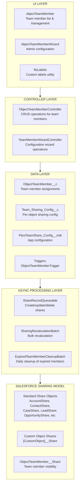
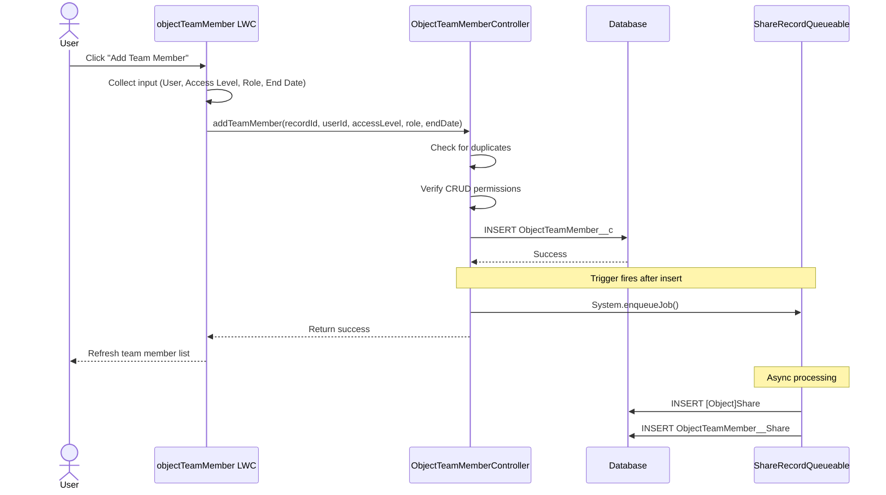
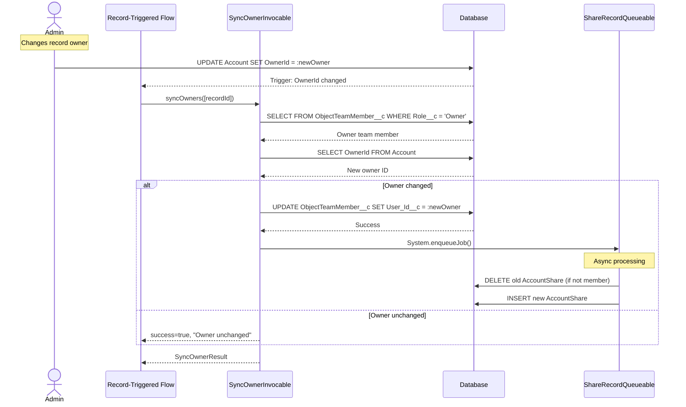
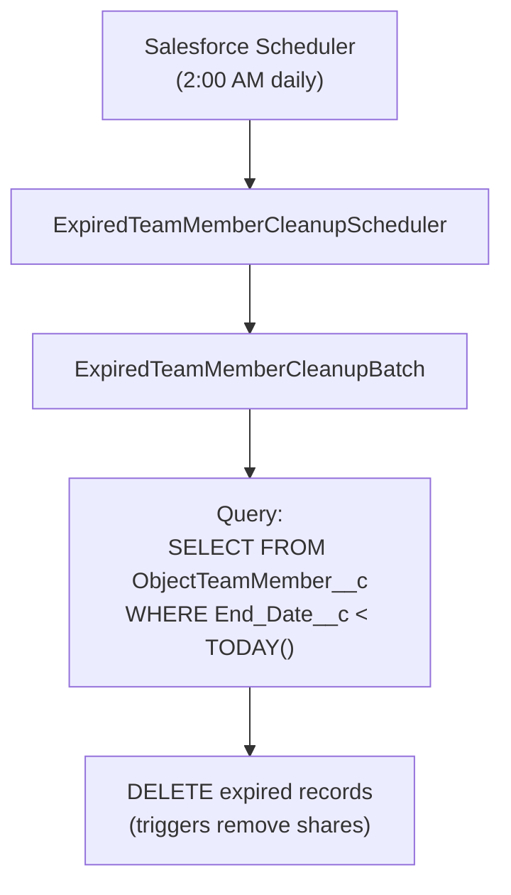

import { Aside } from '@astrojs/starlight/components';

Dieses Dokument bietet eine detaillierte technische Beschreibung der Flexible Team Share-Lösung, einschließlich Systemarchitektur, Datenfluss und Verarbeitungsebenen.

## Systemarchitektur

## Ebenen

### UI-Ebene

Drei Lightning Web Components:

| Komponente | Zweck |
|-----------|---------|
| **objectTeamMember** | Zeigt Teammitglieder auf Datensatzseiten an. Unterstützt Hinzufügen/Bearbeiten/Löschen, einklappbare Liste und konfigurierbares Anzeigelimit. |
| **objectTeamMemberWizard** | Admin-Schnittstelle zur Konfiguration von Objekten, Verwaltung von Einstellungen und Planung von Jobs. |
| **ftsLabels** | Utility-Komponente, die Custom Labels für i18n-Unterstützung bereitstellt (35 Sprachen). |

### Controller-Ebene

| Controller | Methoden |
|-----------|---------|
| **ObjectTeamMemberController** | `getTeamMembers()`, `addTeamMember()`, `updateTeamMember()`, `removeTeamMember()`, `isCurrentUserManager()`, `isSharingConfigured()`, `getAccessLevelOptions()` |
| **TeamMemberWizardController** | `getExistingConfigs()`, `getAvailableObjects()`, `createConfig()`, `toggleConfigStatus()`, `deleteConfig()`, `getScheduledJobInfo()`, `scheduleCleanupJob()` |
| **SyncOwnerInvocable** | `syncOwners()` — Invocable Action zur Synchronisierung des Owner-Teammitglieds, wenn sich der übergeordnete Owner ändert. Aufrufbar aus Flow oder Apex, vollständig bulkifiziert. |

### Datenebene

Benutzerdefinierte Objekte und ein Trigger, der bei Änderungen an Teammitgliedern ausgelöst wird:

- **ObjectTeamMember__c** — speichert Teammitgliederzuweisungen
- **Team_Sharing_Config__c** — Freigabekonfiguration pro Objekt
- **FlexiTeamShare_Config__mdt** — Konfiguration auf App-Ebene (Custom Metadata)
- **ObjectTeamMemberTrigger** → **ObjectTeamMemberTriggerHandler** — behandelt Before Insert, Before Update, Before Delete

### Asynchrone Verarbeitungsebene

| Komponente | Typ | Zweck |
|-----------|------|---------|
| **ShareRecordQueueable** | Queueable | Erstellt, aktualisiert und löscht Freigabedatensätze für übergeordnete Objekte und Teammitglieder |
| **SharingRecalculationBatch** | Batchable | Neuberechnung aller Freigaben bei Konfigurationsänderungen im Bulk-Modus |
| **ExpiredTeamMemberCleanupBatch** | Batchable | Löscht abgelaufene Teammitglieder (täglich geplanter Job) |
| **ExpiredTeamMemberCleanupScheduler** | Schedulable | Plant den Cleanup-Batch (läuft täglich um 2:00 Uhr) |

## Datenfluss: Teammitglied hinzufügen

## Datenfluss: Owner-Änderungs-Synchronisierung

## Datenfluss: Bereinigung abgelaufener Mitglieder

## Fehlerbehandlung

### Controller-Ebene

- Alle öffentlichen Methoden in try-catch verpackt
- Benutzerfreundliche Fehlermeldungen über Custom Labels
- `AuraHandledException` für LWC-Fehleranzeige

### Asynchrone Verarbeitung

- `Database.insert/update/delete(records, false)` — Teilerfolg
- Einzelne Fehler werden protokolliert, lassen nicht den gesamten Batch fehlschlagen
- Fehlerstatistiken werden in Batch-Jobs verfolgt

### Trigger-Ebene

- Trigger-Handler-Muster verhindert Rekursion
- Fehler werden an den Aufrufer der DML-Operation weitergegeben

## Leistungsaspekte

### Asynchrone Verarbeitung

- Freigabedatensatzoperationen verwenden Queueable (nicht blockierend)
- Bulk-Operationen verwenden Batchable mit konfigurierbarer Batch-Größe
- Keine synchronen DML-Operationen auf Freigabedatensätzen in Triggern

### Abfrageoptimierung

- Indizierte Felder in WHERE-Klauseln verwendet
- `Record_Id__c`-Format ermöglicht effiziente LIKE-Abfragen
- Begrenzte Ergebnismengen mit LIMIT-Klauseln

### Caching

- `@AuraEnabled(cacheable=true)` für Leseoperationen
- App-Konfiguration in der Transaktion gecacht

## Integrationsarchitektur

**Keine externen Integrationen** — dieses Paket arbeitet vollständig innerhalb von Salesforce:

- Keine HTTP-Callouts
- Keine externen APIs
- Keine Named Credentials
- Keine External Objects
- Keine Connected Apps

### Plattformabhängigkeiten

| Komponente | Verwendung |
|-----------|-------|
| Apex Sharing | Erstellt/verwaltet Freigabedatensätze |
| Queueable Apex | Asynchrone Freigabedatensatzoperationen |
| Batchable Apex | Bulk-Freigabeneuberechnung, Bereinigung |
| Schedulable Apex | Täglicher Bereinigungsjob |
| Custom Metadata | App-Konfiguration |
| Lightning Web Components | Benutzeroberfläche |
| Custom Labels | Internationalisierung |
