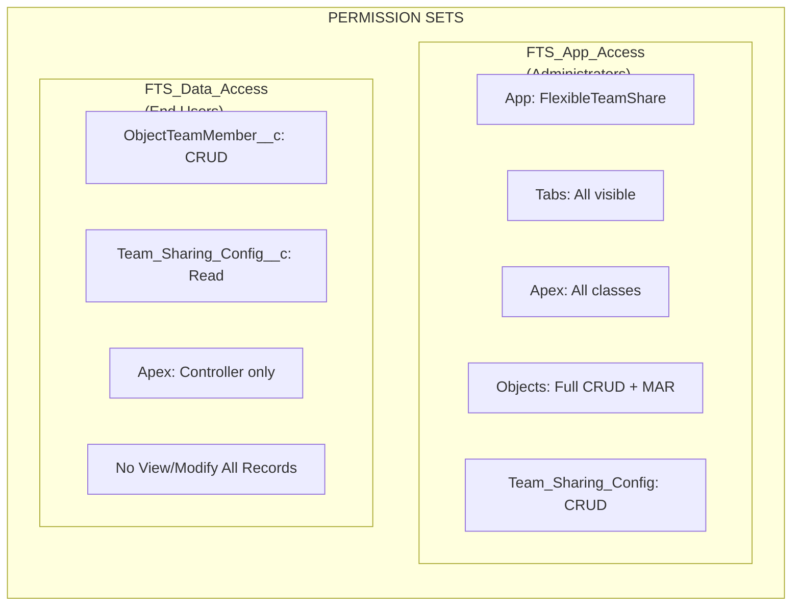
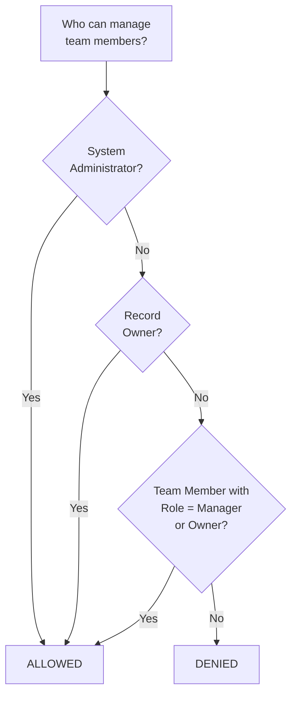
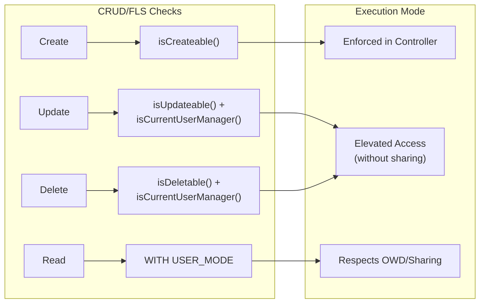
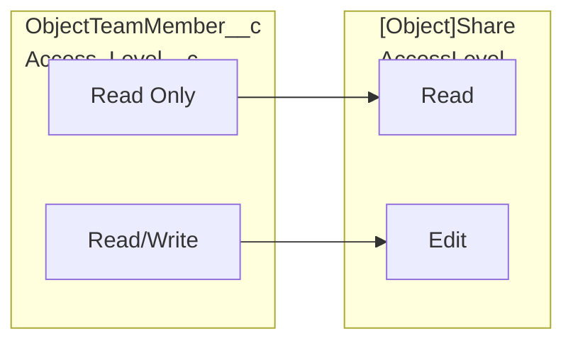
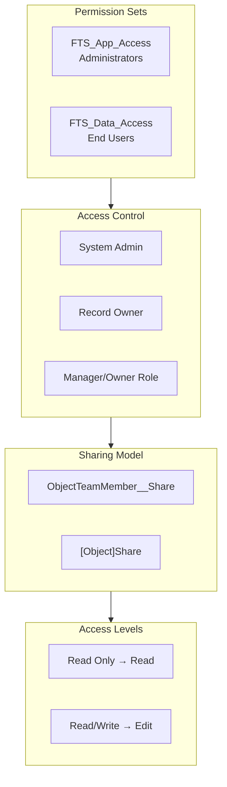

import { Aside } from '@astrojs/starlight/components';

## Berechtigungsmodell

### Permission Sets

| Permission Set | Zielgruppe | Fähigkeiten |
|---------------|----------|-------------|
| **FTS_App_Access** | Administratoren | Vollständiger App-Zugriff, alle Tabs, alle Apex-Klassen, vollständiges CRUD + Modify All Records auf Objekten, Team_Sharing_Config CRUD |
| **FTS_Data_Access** | Endbenutzer | ObjectTeamMember__c CRUD, Team_Sharing_Config__c Read, nur Controller-Apex-Klassen, kein View/Modify All Records |

## Zugriffskontrolllogik

Die Methode `isCurrentUserManager()` bestimmt, wer Teammitglieder verwalten kann:

1. **System Administrators** — immer erlaubt
2. **Record Owners** — immer erlaubt
3. **Teammitglieder mit Manager/Owner-Rolle** — erlaubt
4. **Alle anderen** — verweigert

## CRUD/FLS-Durchsetzung

| Operation | Sicherheitsprüfung | Implementierung |
|-----------|---------------|----------------|
| Create Team Member | `Schema.sObjectType.ObjectTeamMember__c.isCreateable()` | Im Controller durchgesetzt |
| Update Team Member | `isUpdateable()` + `isCurrentUserManager()` | Erhöhter Zugriff (without sharing) nach Autorisierung |
| Delete Team Member | `isDeletable()` + `isCurrentUserManager()` | Erhöhter Zugriff (without sharing) nach Autorisierung |
| Read Team Members | `WITH USER_MODE` / Freigabemodell | Respektiert OWD/Freigabe |

<Aside type="note">
Update- und Delete-Operationen verwenden erhöhten Zugriff (`without sharing`), damit Manager jedes Teammitglied im Datensatz ändern können, nicht nur die, die sie selbst erstellt haben. Die Autorisierung wird immer zuerst über `isCurrentUserManager()` geprüft.
</Aside>

## Eingabevalidierung

| Eingabe | Validierung | Ort |
|-------|-----------|----------|
| `recordId` | Nicht leer, gültiges Salesforce-ID-Format | Controller |
| `userId` | Nicht leer, gültige User-ID | Controller |
| `accessLevel` | Nicht leer, gültiger Picklist-Wert | Controller + Picklist |
| `role` | Nicht leer, gültiger Picklist-Wert | Controller + Picklist |
| `endDate` | Muss zukünftiges Datum oder null sein | Controller + Validation Rule |
| `objectApiName` | Abgeleitet von Salesforce-ID (keine Benutzereingabe) | Controller |

### Validation Rules

| Regel | Objekt | Beschreibung |
|------|--------|-------------|
| `End_Date_Cannot_Be_Past` | `ObjectTeamMember__c` | Verhindert Setzen des Enddatums in der Vergangenheit |

## Zugriffsebenenmapping

## Vollständige Sicherheitsübersicht

## Implementierte Sicherheits-Best-Practices

| Kontrolle | Status | Implementierung |
|---------|--------|---------------|
| CRUD-Prüfungen in Controllern | Implementiert | `isAccessible()`, `isCreateable()`, `isUpdateable()`, `isDeletable()` |
| FLS-Durchsetzung | Implementiert | Permission Sets steuern Feldzugriff |
| SOQL-Injection-Prävention | Implementiert | Bind-Variablen für Benutzereingaben, Whitelist für Objektnamen |
| Freigabemodell | Implementiert | `with sharing` auf Controllern, `without sharing` nur wo dokumentiert |
| Eingabevalidierung | Implementiert | Null-Prüfungen, Formatvalidierung, Geschäftsregeln |
| XSS-Prävention | Implementiert | LWC-Framework verarbeitet Output-Encoding |

## Sicherheit externer Integrationen

| Prüfung | Ergebnis |
|-------|--------|
| HTTP-Callouts | Keine — Paket führt keine externen Aufrufe durch |
| Named Credentials | Nicht verwendet |
| External Objects | Nicht verwendet |
| Remote Site Settings | Nicht erforderlich |
| CSP-Verletzungen | Bestanden — keine Content-Security-Policy-Verletzungen |
