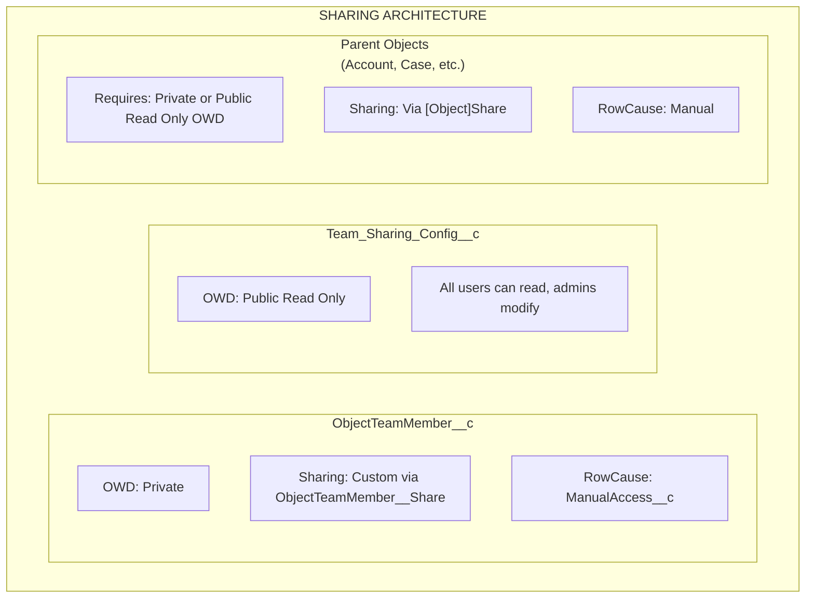

import { Aside } from '@astrojs/starlight/components';

## Freigabearchitektur

## Wie Freigabe funktioniert

### ObjectTeamMember__c

- **OWD**: Private
- **Freigabemechanismus**: Benutzerdefinierte Freigabe über `ObjectTeamMember__Share`
- **RowCause**: `ManualAccess__c`

Wenn ein Teammitglied hinzugefügt wird, erstellt das System einen `ObjectTeamMember__Share`-Datensatz, damit das Teammitglied seinen eigenen Teammitgliedschaftsdatensatz sehen kann.

### Team_Sharing_Config__c

- **OWD**: Public Read Only
- Alle Benutzer können die Konfiguration lesen (erforderlich für Komponenten-Rendering)
- Nur Administratoren können Konfigurationen ändern

### Übergeordnete Objekte

- **Anforderung**: Objekte müssen **Private** oder **Public Read Only** OWD haben
- **Freigabemechanismus**: Über Standard-`[Object]Share`-Tabellen (z. B. `AccountShare`, `CaseShare`)
- **RowCause**: Manual

<Aside type="caution">
Wenn das OWD des übergeordneten Objekts auf **Public Read/Write** gesetzt ist, können Freigabedatensätze keinen zusätzlichen Zugriff gewähren, da Benutzer bereits vollen Zugriff haben. Flexible Team Share benötigt Private oder Public Read Only OWD, um ordnungsgemäß zu funktionieren.
</Aside>

## Zugriffsebenenmapping

Wenn ein Teammitglied mit einer Zugriffsebene hinzugefügt wird, wird es auf den Salesforce-Freigabedatensatzzugriff gemappt:

| ObjectTeamMember__c Access_Level__c | [Object]Share AccessLevel | Beschreibung |
|-------------------------------------|--------------------------|-------------|
| **Read Only** | `Read` | Teammitglied kann den Datensatz anzeigen |
| **Read/Write** | `Edit` | Teammitglied kann den Datensatz anzeigen und bearbeiten |

## Lebenszyklus von Freigabedatensätzen

### Freigaben erstellen

Wenn ein Teammitglied hinzugefügt wird:

1. `ObjectTeamMember__c`-Datensatz wird eingefügt
2. Trigger wird ausgelöst und stellt `ShareRecordQueueable` in die Warteschlange
3. Queueable erstellt zwei Freigabedatensätze:
   - **Parent-Freigabe**: `[Object]Share`-Datensatz, der dem Benutzer Zugriff auf den übergeordneten Datensatz gewährt
   - **Teammitglied-Freigabe**: `ObjectTeamMember__Share`-Datensatz, der dem Benutzer Sichtbarkeit seiner Teammitgliedschaft gewährt

### Freigaben aktualisieren

Wenn sich die Zugriffsebene eines Teammitglieds ändert:

1. `ObjectTeamMember__c`-Datensatz wird aktualisiert
2. Trigger wird ausgelöst und stellt `ShareRecordQueueable` in die Warteschlange
3. Queueable löscht alte Freigabe und erstellt neue mit aktualisierter Zugriffsebene

### Freigaben löschen

Wenn ein Teammitglied entfernt wird:

1. `ObjectTeamMember__c`-Datensatz wird gelöscht
2. Trigger wird ausgelöst und stellt `ShareRecordQueueable` in die Warteschlange
3. Queueable löscht beide Freigabedatensätze (Parent und Teammitglied)

### Bulk-Neuberechnung

Wenn eine Freigabekonfiguration umgeschaltet wird:

- **Deaktiviert**: `SharingRecalculationBatch` entfernt alle Freigabedatensätze für dieses Objekt
- **Reaktiviert**: `SharingRecalculationBatch` erstellt Freigabedatensätze für alle vorhandenen Teammitglieder neu

## Unterstützte Share-Objekte

### Standardobjekte

| Objekt | Freigabetabelle |
|--------|------------|
| Account | `AccountShare` |
| Contact | `ContactShare` |
| Case | `CaseShare` |
| Lead | `LeadShare` |
| Opportunity | `OpportunityShare` |
| Campaign | `CampaignShare` |
| Order | `OrderShare` |

### Benutzerdefinierte Objekte

Benutzerdefinierte Objekte folgen dem Muster: `ObjectName__c` → `ObjectName__Share`

Das System verwendet eine fest codierte Whitelist für Standardobjekte und leitet den Freigabetabellennamen für benutzerdefinierte Objekte automatisch ab.

## Bereitstellungsanforderungen

### Org-Anforderungen

- Salesforce **Enterprise Edition** oder höher (für Freigabemodellunterstützung)
- Objekte müssen **Private** oder **Public Read Only** OWD haben, um von der Freigabe zu profitieren

### Benutzeranforderungen

- Benutzer benötigen zugewiesenen entsprechenden Permission Set
- Benutzer benötigen Basiszugriff auf Objekte (z. B. Account-Lesezugriff, um Account-Teams zu verwenden)
