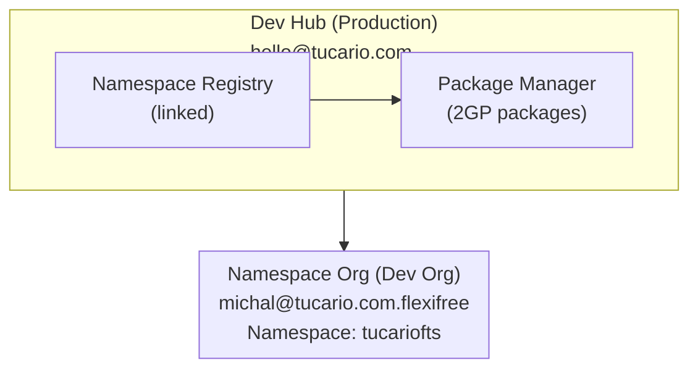

import { Aside } from '@astrojs/starlight/components';

## Architektur



## Voraussetzungen

### 1. Dev Hub (Production)

- Dev Hub aktiviert: Setup > Dev Hub > Enable
- Verbundener Namespace: App Launcher > Namespace Registries > Link Namespace

### 2. Namespace Org (Partner Developer Org)

- Registrierter Namespace (einmalig, irreversibel)
- Setup > Package Manager > Edit > Namespace Prefix

### 3. Lokale Umgebung

- Salesforce CLI installiert
- Autorisierung für beide Orgs

## Schnellreferenz (Copy-Paste)

```bash
# 1. Orgs prüfen
sf org list

# 2. Pakete prüfen
sf package list --target-dev-hub DevHub

# 3. Versionen prüfen
sf package version list --packages FlexibleTeamShare --target-dev-hub DevHub

# 4. Neue Version erstellen (BETA)
sf package version create --package FlexibleTeamShare --installation-key-bypass --wait 20 --code-coverage --target-dev-hub DevHub --definition-file config/package-scratch-def.json

# 5. Installation testen (ID und Org-Alias ersetzen)
sf package install --package 04tXXXXXXXXXXXXXXX --target-org TestOrg --wait 10

# 6. Zu RELEASED promoten (IRREVERSIBEL!)
sf package version promote --package 04tXXXXXXXXXXXXXXX --target-dev-hub DevHub
```

## Befehle

### Org-Autorisierung

```bash
# Dev Hub (Production)
sf org login web --alias DevHub --set-default-dev-hub

# Namespace Org (Dev-Org mit Namespace)
sf org login web --alias FlexiFREE
```

### Verbundene Orgs prüfen

```bash
sf org list
```

### Vorhandene Pakete prüfen

```bash
sf package list --target-dev-hub DevHub
```

### Paketversionen prüfen

```bash
sf package version list --packages FlexibleTeamShare --target-dev-hub DevHub
```

## Neue Paketversion erstellen

### 1. Version in sfdx-project.json aktualisieren (optional)

```json
{
  "packageDirectories": [
    {
      "versionName": "ver 0.2",
      "versionNumber": "0.2.0.NEXT",
      "path": "force-app",
      "default": true,
      "package": "FlexibleTeamShare"
    }
  ],
  "namespace": "tucariofts"
}
```

### 2. Paketversion erstellen (Beta)

```bash
sf package version create \
  --package FlexibleTeamShare \
  --installation-key-bypass \
  --wait 20 \
  --code-coverage \
  --target-dev-hub DevHub \
  --definition-file config/package-scratch-def.json
```

<Aside type="caution">
Der Parameter `--definition-file` ist erforderlich für Übersetzungsunterstützung! Die Datei `config/package-scratch-def.json` enthält `enableTranslationWorkbench: true`.
</Aside>

### 3. Installation testen

```bash
sf package install \
  --package 04tXXXXXXXXXXXXXXX \
  --target-org TestOrg \
  --wait 10
```

### 4. Zu Released (Production) promoten

```bash
sf package version promote \
  --package 04tXXXXXXXXXXXXXXX \
  --target-dev-hub DevHub
```

<Aside type="caution">
Nach der Promotion ist die Version **IRREVERSIBEL** freigegeben und bereit für AppExchange!
</Aside>

## Veröffentlichung auf AppExchange

1. Bei [Partner Community](https://partners.salesforce.com) anmelden
2. Publishing > Listings > New Listing
3. Promoted Paketversion hinzufügen
4. Listing-Details ausfüllen
5. Zur Überprüfung einreichen

## Fehlerbehebung

### "Not available for deploy for this organization" (Übersetzungen)

Scratch-Org hat Translation Workbench nicht aktiviert.

**Lösung:** Verwenden Sie `--definition-file config/package-scratch-def.json`, das Folgendes enthält:

```json
{
  "orgName": "Package Build Org",
  "edition": "Enterprise",
  "settings": {
    "languageSettings": {
      "enableTranslationWorkbench": true,
      "enableEndUserLanguages": true,
      "enablePlatformLanguages": true
    }
  }
}
```

### "No such column" (FLS-Fehler)

Verwenden Sie `WITH SYSTEM_MODE` anstelle von `WITH USER_MODE` in SOQL-Abfragen.

### "You cannot deploy to a required field"

Entfernen Sie erforderliche Felder aus Permission Sets (erforderliche Felder benötigen keine FLS).
