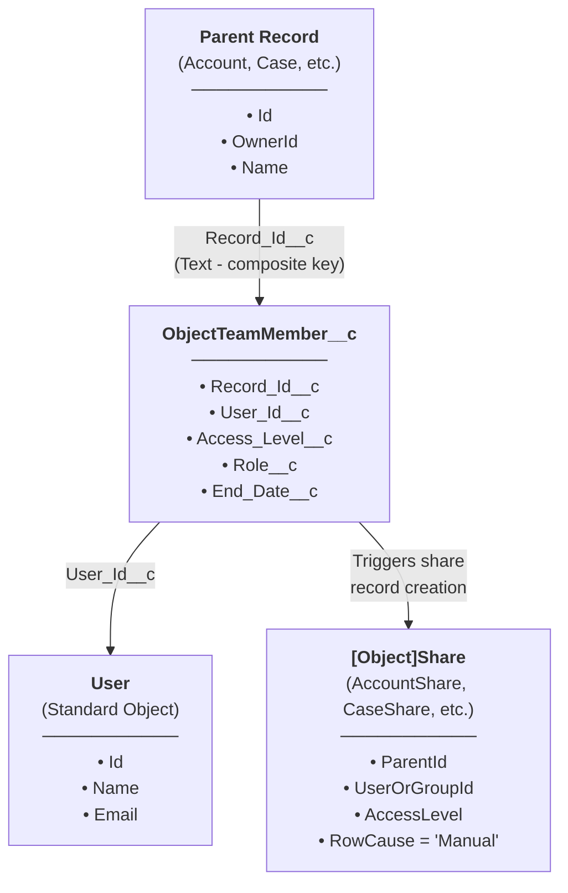
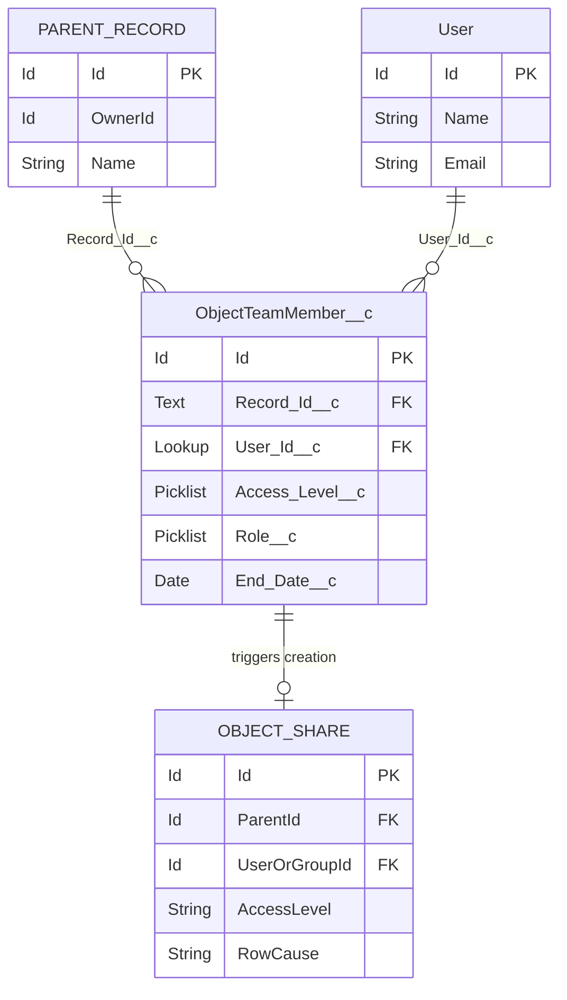
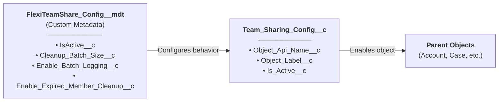
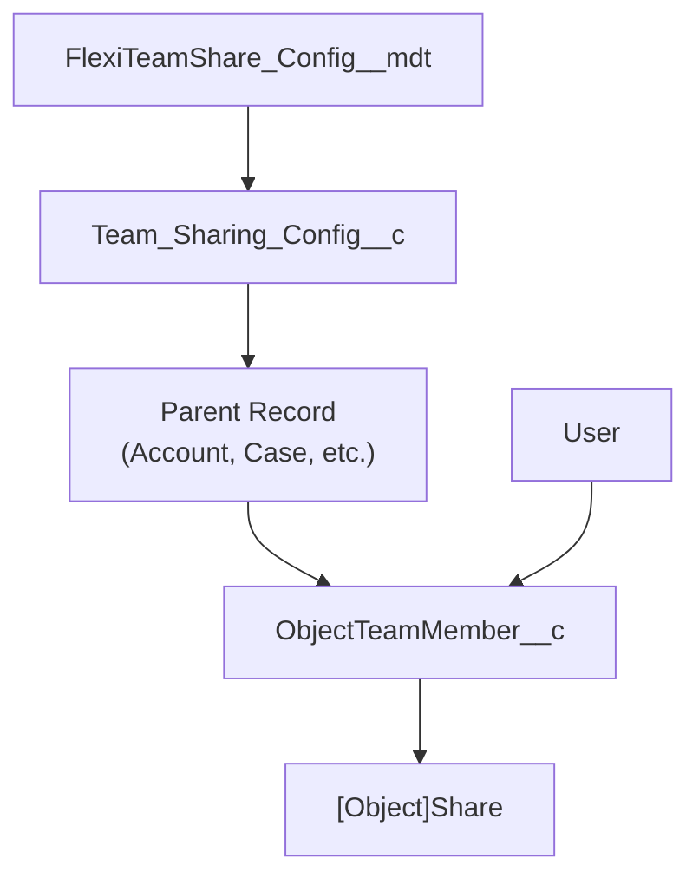

## Modelo de Datos Principal

## Diagrama de Relación de Entidades

## Objetos Personalizados

### ObjectTeamMember__c

Almacena asignaciones de miembros del equipo que vinculan un usuario a un registro padre.

| Campo | Tipo | Descripción |
|-------|------|-------------|
| `Record_Id__c` | Text | Clave compuesta en formato `ObjectName:RecordId` |
| `User_Id__c` | Lookup(User) | El usuario miembro del equipo |
| `Access_Level__c` | Picklist | Read Only, Read/Write |
| `Role__c` | Picklist | Owner, Manager, User |
| `End_Date__c` | Date | Fecha de vencimiento opcional para acceso temporal |

### Team_Sharing_Config__c

Configuración por objeto para uso compartido de equipo.

| Campo | Tipo | Descripción |
|-------|------|-------------|
| `Object_Api_Name__c` | Text | Nombre de API del objeto configurado |
| `Object_Label__c` | Text | Etiqueta de visualización para el objeto |
| `Is_Active__c` | Checkbox | Si el uso compartido de equipo está activo para este objeto |

### FlexiTeamShare_Config__mdt

Configuración a nivel de aplicación almacenada como Custom Metadata.

| Campo | Tipo | Descripción |
|-------|------|-------------|
| `IsActive__c` | Checkbox | Interruptor maestro para la aplicación |
| `Cleanup_Batch_Size__c` | Number | Tamaño de lote para trabajos de limpieza |
| `Enable_Batch_Logging__c` | Checkbox | Habilitar registro de depuración en trabajos por lotes |
| `Enable_Expired_Member_Cleanup__c` | Checkbox | Habilitar limpieza automática de miembros vencidos |

## Objetos de Configuración

## Descripción General del Modelo Completo

