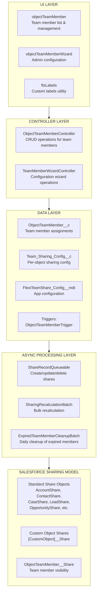
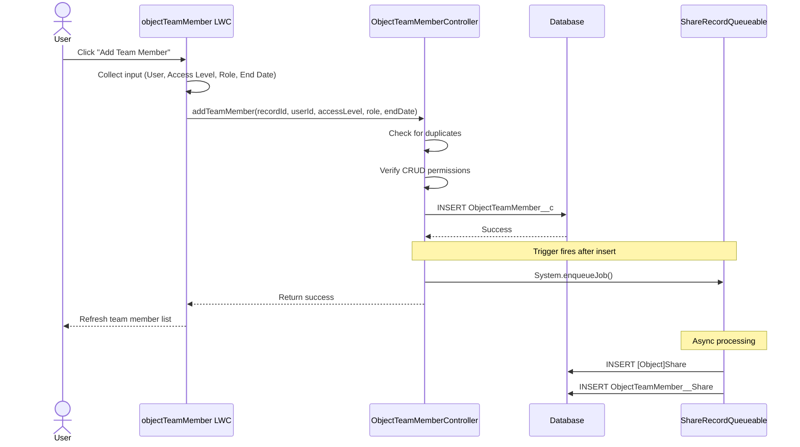
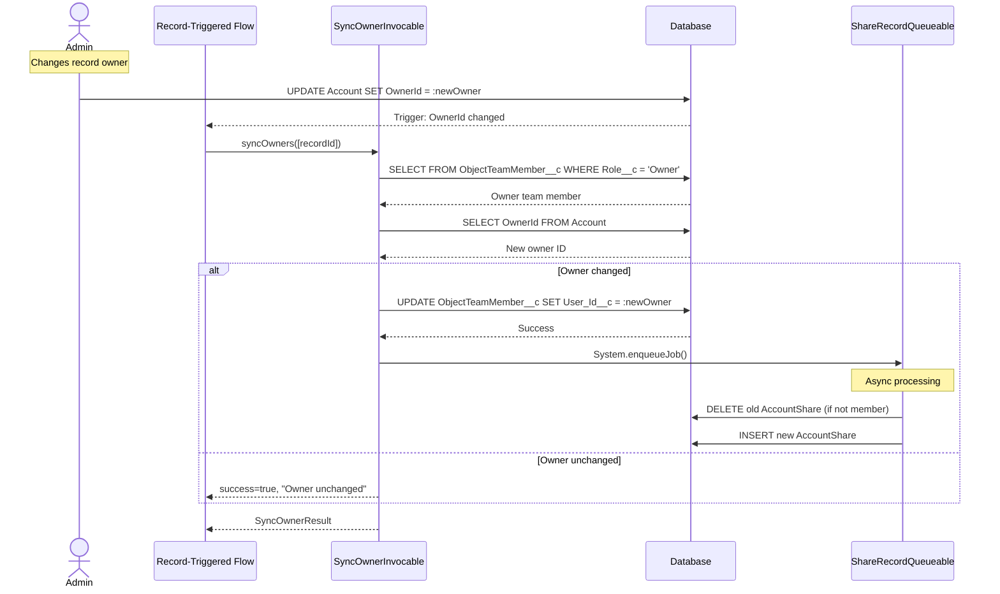
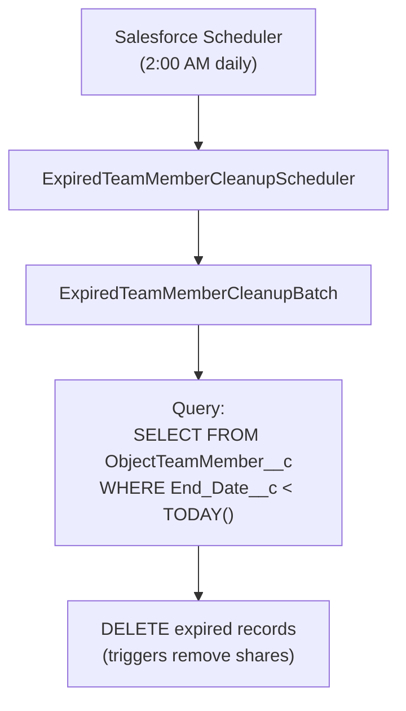

import { Aside } from '@astrojs/starlight/components';

Este documento proporciona una descripción técnica detallada de la solución Flexible Team Share, incluida la arquitectura del sistema, el flujo de datos y las capas de procesamiento.

## Arquitectura del Sistema

## Capas

### Capa de UI

Tres Lightning Web Components:

| Componente | Propósito |
|-----------|---------|
| **objectTeamMember** | Muestra miembros del equipo en páginas de registro. Soporta agregar/editar/eliminar, lista contraíble y límite de visualización configurable. |
| **objectTeamMemberWizard** | Interfaz de administrador para configurar objetos, gestionar configuraciones y programar trabajos. |
| **ftsLabels** | Componente de utilidad que proporciona Custom Labels para soporte de i18n (35 idiomas). |

### Capa de Controlador

| Controlador | Métodos |
|-----------|---------|
| **ObjectTeamMemberController** | `getTeamMembers()`, `addTeamMember()`, `updateTeamMember()`, `removeTeamMember()`, `isCurrentUserManager()`, `isSharingConfigured()`, `getAccessLevelOptions()` |
| **TeamMemberWizardController** | `getExistingConfigs()`, `getAvailableObjects()`, `createConfig()`, `toggleConfigStatus()`, `deleteConfig()`, `getScheduledJobInfo()`, `scheduleCleanupJob()` |
| **SyncOwnerInvocable** | `syncOwners()` — Invocable Action para sincronizar el miembro del equipo Owner cuando cambia el propietario padre. Llamable desde Flow o Apex, completamente bulkificado. |

### Capa de Datos

Objetos personalizados y un trigger que se dispara en cambios de miembros del equipo:

- **ObjectTeamMember__c** — almacena asignaciones de miembros del equipo
- **Team_Sharing_Config__c** — configuración de uso compartido por objeto
- **FlexiTeamShare_Config__mdt** — configuración a nivel de aplicación (Custom Metadata)
- **ObjectTeamMemberTrigger** → **ObjectTeamMemberTriggerHandler** — maneja Before Insert, Before Update, Before Delete

### Capa de Procesamiento Asíncrono

| Componente | Tipo | Propósito |
|-----------|------|---------|
| **ShareRecordQueueable** | Queueable | Crea, actualiza y elimina registros compartidos para objetos padre y miembros del equipo |
| **SharingRecalculationBatch** | Batchable | Recalcula de forma masiva todos los usos compartidos cuando cambia la configuración |
| **ExpiredTeamMemberCleanupBatch** | Batchable | Elimina miembros del equipo vencidos (trabajo por lotes programado diariamente) |
| **ExpiredTeamMemberCleanupScheduler** | Schedulable | Programa el lote de limpieza (se ejecuta a las 2:00 AM diariamente) |

## Flujo de Datos: Agregar un Miembro del Equipo

## Flujo de Datos: Sincronización de Cambio de Propietario

## Flujo de Datos: Limpieza de Miembros Vencidos

## Manejo de Errores

### Capa de Controlador

- Todos los métodos públicos envueltos en try-catch
- Mensajes de error amigables mediante Custom Labels
- `AuraHandledException` para visualización de errores en LWC

### Procesamiento Asíncrono

- `Database.insert/update/delete(records, false)` — éxito parcial
- Errores individuales registrados, no fallan todo el lote
- Estadísticas de errores rastreadas en trabajos por lotes

### Capa de Trigger

- El patrón de manejador de trigger previene la recursión
- Los errores afloran al llamador de la operación DML

## Consideraciones de Rendimiento

### Procesamiento Asíncrono

- Las operaciones de registros compartidos usan Queueable (sin bloqueo)
- Las operaciones masivas usan Batchable con tamaño de lote configurable
- Sin DML síncrono en registros compartidos en triggers

### Optimización de Consultas

- Campos indexados usados en cláusulas WHERE
- El formato `Record_Id__c` permite consultas LIKE eficientes
- Conjuntos de resultados limitados con cláusulas LIMIT

### Caché

- `@AuraEnabled(cacheable=true)` para operaciones de lectura
- Configuración de aplicación en caché en la transacción

## Arquitectura de Integración

**Sin integraciones externas** — este paquete opera completamente dentro de Salesforce:

- Sin llamadas HTTP
- Sin APIs externas
- Sin Named Credentials
- Sin External Objects
- Sin Connected Apps

### Dependencias de Plataforma

| Componente | Uso |
|-----------|-------|
| Apex Sharing | Crea/gestiona registros compartidos |
| Queueable Apex | Operaciones asíncronas de registros compartidos |
| Batchable Apex | Recálculo masivo de uso compartido, limpieza |
| Schedulable Apex | Trabajo de limpieza diaria |
| Custom Metadata | Configuración de aplicación |
| Lightning Web Components | Interfaz de usuario |
| Custom Labels | Internacionalización |
