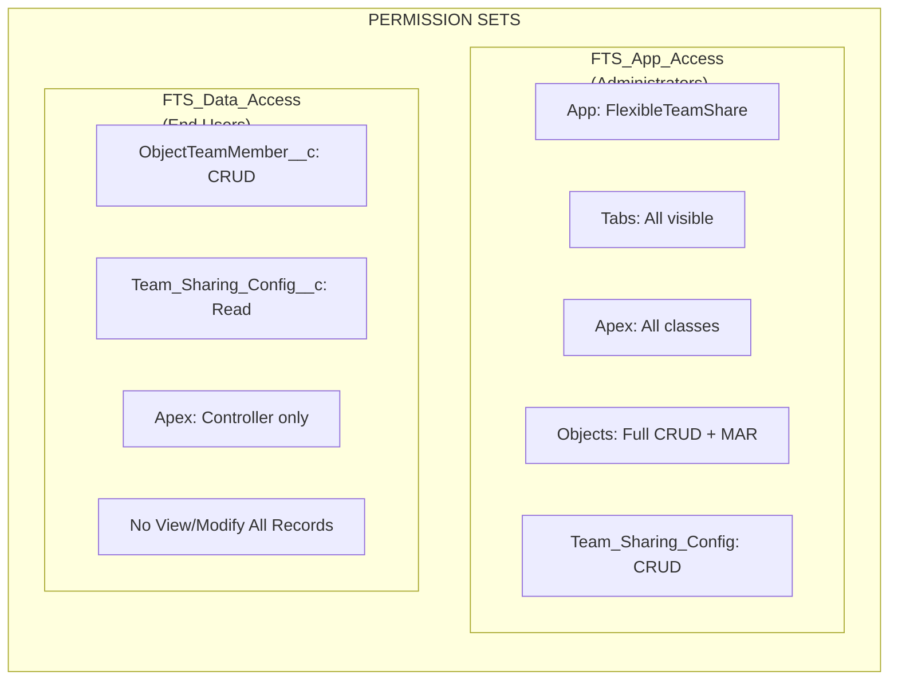
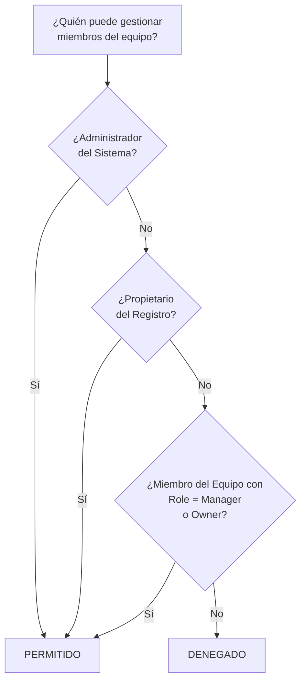
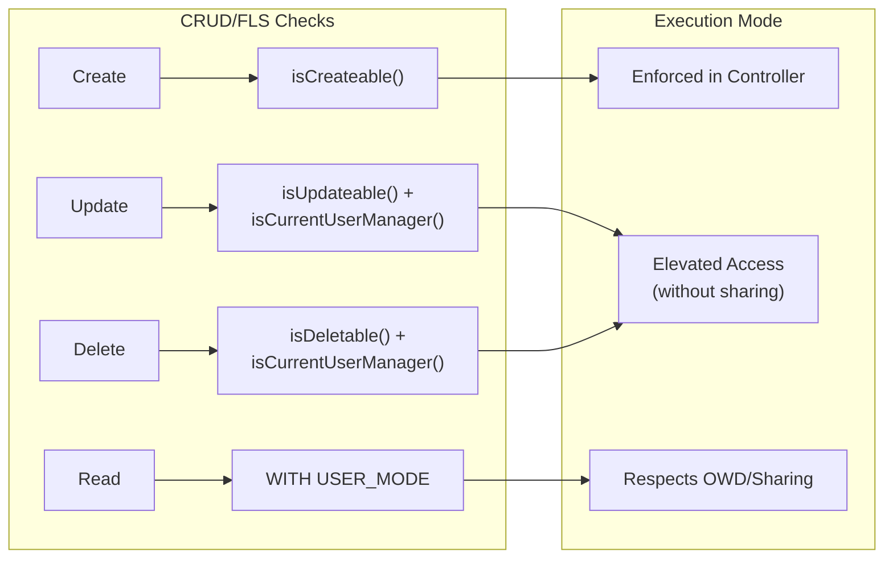
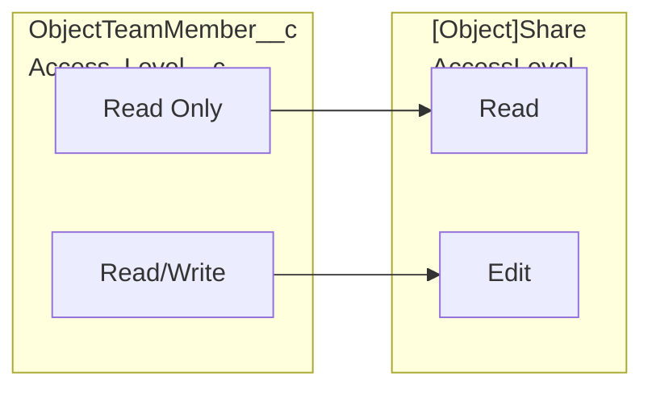
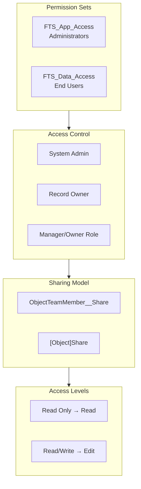

import { Aside } from '@astrojs/starlight/components';

## Modelo de Permisos

### Permission Sets

| Permission Set | Audiencia | Capacidades |
|---------------|----------|-------------|
| **FTS_App_Access** | Administradores | Acceso completo a la aplicación, todas las pestañas, todas las clases Apex, CRUD completo + Modify All Records en objetos, Team_Sharing_Config CRUD |
| **FTS_Data_Access** | Usuarios Finales | ObjectTeamMember__c CRUD, Team_Sharing_Config__c Read, solo clases Apex de controlador, sin View/Modify All Records |

## Lógica de Control de Acceso

El método `isCurrentUserManager()` determina quién puede gestionar miembros del equipo:

1. **Administradores del Sistema** — siempre permitido
2. **Propietarios de Registros** — siempre permitido
3. **Miembros del equipo con rol Manager/Owner** — permitido
4. **Todos los demás** — denegado

## Aplicación de CRUD/FLS

| Operación | Verificación de Seguridad | Implementación |
|-----------|---------------|----------------|
| Create Team Member | `Schema.sObjectType.ObjectTeamMember__c.isCreateable()` | Aplicado en el controlador |
| Update Team Member | `isUpdateable()` + `isCurrentUserManager()` | Acceso elevado (without sharing) después de autorización |
| Delete Team Member | `isDeletable()` + `isCurrentUserManager()` | Acceso elevado (without sharing) después de autorización |
| Read Team Members | `WITH USER_MODE` / sharing model | Respeta OWD/sharing |

<Aside type="note">
Las operaciones Update y Delete usan acceso elevado (`without sharing`) para permitir que los gerentes modifiquen cualquier miembro del equipo en el registro, no solo los que crearon. La autorización siempre se verifica primero mediante `isCurrentUserManager()`.
</Aside>

## Validación de Entrada

| Entrada | Validación | Ubicación |
|-------|-----------|----------|
| `recordId` | No en blanco, formato de ID de Salesforce válido | Controlador |
| `userId` | No en blanco, ID de Usuario válido | Controlador |
| `accessLevel` | No en blanco, valor de picklist válido | Controlador + Picklist |
| `role` | No en blanco, valor de picklist válido | Controlador + Picklist |
| `endDate` | Debe ser fecha futura o nula | Controlador + Validation Rule |
| `objectApiName` | Derivado del ID de Salesforce (no entrada de usuario) | Controlador |

### Validation Rules

| Regla | Objeto | Descripción |
|------|--------|-------------|
| `End_Date_Cannot_Be_Past` | `ObjectTeamMember__c` | Previene establecer fecha de finalización en el pasado |

## Mapeo de Nivel de Acceso

## Descripción General Completa de Seguridad

## Mejores Prácticas de Seguridad Implementadas

| Control | Estado | Implementación |
|---------|--------|---------------|
| Verificaciones CRUD en controladores | Implementado | `isAccessible()`, `isCreateable()`, `isUpdateable()`, `isDeletable()` |
| Aplicación de FLS | Implementado | Permission Sets controlan el acceso a campos |
| Prevención de inyección SOQL | Implementado | Variables de enlace para entrada de usuario, lista blanca para nombres de objetos |
| Sharing model | Implementado | `with sharing` en controladores, `without sharing` solo donde está documentado |
| Validación de entrada | Implementado | Verificaciones de nulo, validación de formato, reglas de negocio |
| Prevención de XSS | Implementado | El framework LWC maneja la codificación de salida |

## Seguridad de Integración Externa

| Verificación | Resultado |
|-------|--------|
| Llamadas HTTP | Ninguna — el paquete no realiza llamadas externas |
| Named Credentials | No usado |
| External Objects | No usado |
| Remote Site Settings | No requerido |
| Violaciones CSP | Aprobado — sin violaciones de Content-Security-Policy |
