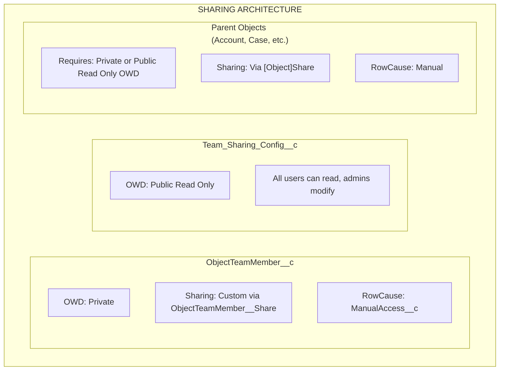

import { Aside } from '@astrojs/starlight/components';

## Arquitectura de Uso Compartido

## Cómo Funciona el Uso Compartido

### ObjectTeamMember__c

- **OWD**: Private
- **Mecanismo de uso compartido**: Uso compartido personalizado mediante `ObjectTeamMember__Share`
- **RowCause**: `ManualAccess__c`

Cuando se agrega un miembro del equipo, el sistema crea un registro `ObjectTeamMember__Share` para que el miembro del equipo pueda ver su propio registro de membresía de equipo.

### Team_Sharing_Config__c

- **OWD**: Public Read Only
- Todos los usuarios pueden leer la configuración (necesario para la renderización del componente)
- Solo los administradores pueden modificar las configuraciones

### Objetos Padre

- **Requisito**: Los objetos deben tener OWD **Private** o **Public Read Only**
- **Mecanismo de uso compartido**: Mediante tablas estándar `[Object]Share` (por ejemplo, `AccountShare`, `CaseShare`)
- **RowCause**: Manual

<Aside type="caution">
Si el OWD del objeto padre está establecido en **Public Read/Write**, los registros compartidos no pueden otorgar acceso adicional ya que los usuarios ya tienen acceso completo. Flexible Team Share requiere OWD Private o Public Read Only para funcionar correctamente.
</Aside>

## Mapeo de Nivel de Acceso

Cuando se agrega un miembro del equipo con un nivel de acceso, se mapea al acceso del registro compartido de Salesforce:

| ObjectTeamMember__c Access_Level__c | [Object]Share AccessLevel | Descripción |
|-------------------------------------|--------------------------|-------------|
| **Read Only** | `Read` | El miembro del equipo puede ver el registro |
| **Read/Write** | `Edit` | El miembro del equipo puede ver y editar el registro |

## Ciclo de Vida del Registro Compartido

### Crear Usos Compartidos

Cuando se agrega un miembro del equipo:

1. Se inserta el registro `ObjectTeamMember__c`
2. Se dispara el trigger y se encola `ShareRecordQueueable`
3. Queueable crea dos registros compartidos:
   - **Parent share**: Registro `[Object]Share` que otorga al usuario acceso al registro padre
   - **Team member share**: Registro `ObjectTeamMember__Share` que otorga al usuario visibilidad de su membresía de equipo

### Actualizar Usos Compartidos

Cuando cambia el nivel de acceso de un miembro del equipo:

1. Se actualiza el registro `ObjectTeamMember__c`
2. Se dispara el trigger y se encola `ShareRecordQueueable`
3. Queueable elimina el uso compartido antiguo y crea uno nuevo con el nivel de acceso actualizado

### Eliminar Usos Compartidos

Cuando se elimina un miembro del equipo:

1. Se elimina el registro `ObjectTeamMember__c`
2. Se dispara el trigger y se encola `ShareRecordQueueable`
3. Queueable elimina ambos registros compartidos (padre y miembro del equipo)

### Recálculo Masivo

Cuando se alterna una configuración de uso compartido:

- **Desactivado**: `SharingRecalculationBatch` elimina todos los registros compartidos para ese objeto
- **Reactivado**: `SharingRecalculationBatch` recrea registros compartidos para todos los miembros del equipo existentes

## Objetos Share Soportados

### Objetos Estándar

| Objeto | Tabla Share |
|--------|------------|
| Account | `AccountShare` |
| Contact | `ContactShare` |
| Case | `CaseShare` |
| Lead | `LeadShare` |
| Opportunity | `OpportunityShare` |
| Campaign | `CampaignShare` |
| Order | `OrderShare` |

### Objetos Personalizados

Los objetos personalizados siguen el patrón: `ObjectName__c` → `ObjectName__Share`

El sistema usa una lista blanca codificada para objetos estándar y deriva el nombre de la tabla share para objetos personalizados automáticamente.

## Requisitos de Implementación

### Requisitos de Organización

- Salesforce **Enterprise Edition** o superior (para soporte del modelo de uso compartido)
- Los objetos deben tener OWD **Private** o **Public Read Only** para beneficiarse del uso compartido

### Requisitos de Usuario

- Los usuarios necesitan el Permission Set apropiado asignado
- Los usuarios necesitan acceso al objeto base (por ejemplo, acceso de lectura de Account para usar equipos de Account)
