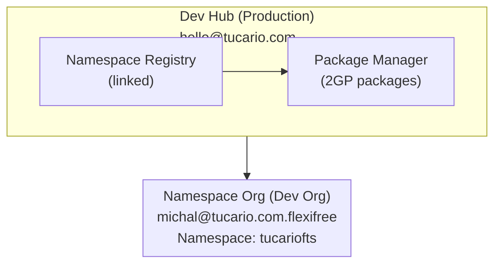

import { Aside } from '@astrojs/starlight/components';

## Arquitectura



## Requisitos Previos

### 1. Dev Hub (Production)

- Dev Hub habilitado: Setup > Dev Hub > Enable
- Namespace conectado: App Launcher > Namespace Registries > Link Namespace

### 2. Namespace Org (Partner Developer Org)

- Namespace registrado (única vez, irreversible)
- Setup > Package Manager > Edit > Namespace Prefix

### 3. Entorno Local

- Salesforce CLI instalado
- Autorización a ambas organizaciones

## Referencia Rápida (Copiar-Pegar)

```bash
# 1. Verificar organizaciones
sf org list

# 2. Verificar paquetes
sf package list --target-dev-hub DevHub

# 3. Verificar versiones
sf package version list --packages FlexibleTeamShare --target-dev-hub DevHub

# 4. Crear nueva versión (BETA)
sf package version create --package FlexibleTeamShare --installation-key-bypass --wait 20 --code-coverage --target-dev-hub DevHub --definition-file config/package-scratch-def.json

# 5. Probar instalación (reemplace ID y alias de org)
sf package install --package 04tXXXXXXXXXXXXXXX --target-org TestOrg --wait 10

# 6. Promover a RELEASED (¡IRREVERSIBLE!)
sf package version promote --package 04tXXXXXXXXXXXXXXX --target-dev-hub DevHub
```

## Comandos

### Autorización de Organización

```bash
# Dev Hub (production)
sf org login web --alias DevHub --set-default-dev-hub

# Namespace Org (dev org with namespace)
sf org login web --alias FlexiFREE
```

### Verificar Organizaciones Conectadas

```bash
sf org list
```

### Verificar Paquetes Existentes

```bash
sf package list --target-dev-hub DevHub
```

### Verificar Versiones de Paquete

```bash
sf package version list --packages FlexibleTeamShare --target-dev-hub DevHub
```

## Crear una Nueva Versión de Paquete

### 1. Actualizar Versión en sfdx-project.json (opcional)

```json
{
  "packageDirectories": [
    {
      "versionName": "ver 0.2",
      "versionNumber": "0.2.0.NEXT",
      "path": "force-app",
      "default": true,
      "package": "FlexibleTeamShare"
    }
  ],
  "namespace": "tucariofts"
}
```

### 2. Crear Versión de Paquete (beta)

```bash
sf package version create \
  --package FlexibleTeamShare \
  --installation-key-bypass \
  --wait 20 \
  --code-coverage \
  --target-dev-hub DevHub \
  --definition-file config/package-scratch-def.json
```

<Aside type="caution">
¡El parámetro `--definition-file` es requerido para soporte de traducción! El archivo `config/package-scratch-def.json` contiene `enableTranslationWorkbench: true`.
</Aside>

### 3. Probar Instalación

```bash
sf package install \
  --package 04tXXXXXXXXXXXXXXX \
  --target-org TestOrg \
  --wait 10
```

### 4. Promover a Released (Production)

```bash
sf package version promote \
  --package 04tXXXXXXXXXXXXXXX \
  --target-dev-hub DevHub
```

<Aside type="caution">
Después de la promoción, la versión es **IRREVERSIBLEMENTE** lanzada y lista para AppExchange!
</Aside>

## Publicar en AppExchange

1. Inicie sesión en [Partner Community](https://partners.salesforce.com)
2. Publishing > Listings > New Listing
3. Agregue versión de paquete promovida
4. Complete los detalles del listado
5. Envíe para revisión

## Solución de Problemas

### "Not available for deploy for this organization" (Traducciones)

La scratch org no tiene Translation Workbench habilitado.

**Solución:** Use `--definition-file config/package-scratch-def.json` que incluye:

```json
{
  "orgName": "Package Build Org",
  "edition": "Enterprise",
  "settings": {
    "languageSettings": {
      "enableTranslationWorkbench": true,
      "enableEndUserLanguages": true,
      "enablePlatformLanguages": true
    }
  }
}
```

### "No such column" (errores FLS)

Use `WITH SYSTEM_MODE` en lugar de `WITH USER_MODE` en consultas SOQL.

### "You cannot deploy to a required field"

Elimine campos requeridos de Permission Sets (los campos requeridos no necesitan FLS).
