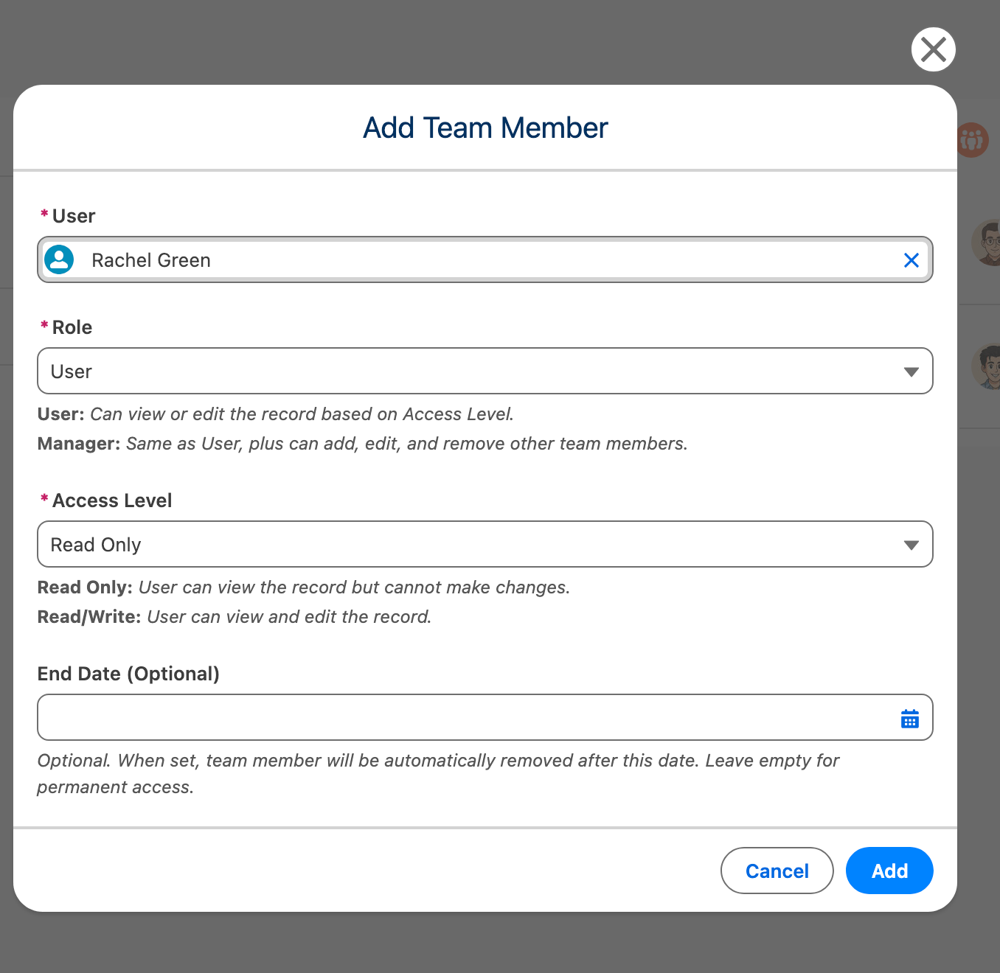

import { Aside } from '@astrojs/starlight/components';

## Caso de Uso 2: Agregar Miembro del Equipo al Registro (Manager)

### Objetivo

Agregar un miembro del equipo a un registro de Case con acceso Read/Write.

### Requisitos Previos

- El usuario tiene el Permission Set FTS_Data_Access
- El objeto Case está configurado para uso compartido de equipo
- El usuario es propietario del registro O tiene rol Manager en el registro

### Pasos

| Paso | Acción | Resultado Esperado |
|------|--------|----------------|
| 1 | Abrir un registro de Case | Carga la página de detalle del Case |
| 2 | Localizar el componente "Object Team" | El componente muestra "No team members" o lista existente |
| 3 | Hacer clic en el botón "Add" (+) | Se abre el modal Add Team Member |
| 4 | Buscar el usuario "Test User" | El usuario aparece en la búsqueda |
| 5 | Seleccionar usuario | Se puebla el ID de Usuario |
| 6 | Establecer Access Level en "Read/Write" | Nivel de acceso seleccionado |
| 7 | Establecer Role en "User" | Rol seleccionado |
| 8 | (Opcional) Establecer End Date en fecha futura | Fecha de finalización establecida |
| 9 | Hacer clic en "Add" | El modal se cierra, el usuario aparece en la lista del equipo |

### Puntos de Validación

- [ ] La búsqueda de usuario muestra foto y correo electrónico
- [ ] Opciones de nivel de acceso: Read Only, Read/Write
- [ ] Opciones de rol: Manager, User (Owner no es seleccionable)
- [ ] La fecha de finalización debe ser futura (error de validación si es pasada)
- [ ] El miembro duplicado muestra mensaje de error
- [ ] Se crea registro compartido para Case (verificar mediante Setup > Sharing)

---

## Caso de Uso 3: Editar Miembro del Equipo (Manager)

### Objetivo

Cambiar el nivel de acceso de un miembro del equipo de Read/Write a Read Only.

### Requisitos Previos

- Existe miembro del equipo en el registro
- El usuario actual tiene permisos de gerente

### Pasos

| Paso | Acción | Resultado Esperado |
|------|--------|----------------|
| 1 | Abrir registro con miembros del equipo | Lista de miembros del equipo visible |
| 2 | Hacer clic en el icono de menú (&#8942;) en la fila del miembro del equipo | El menú desplegable muestra opciones Edit/Delete |
| 3 | Hacer clic en "Edit" | Se abre el modal de edición con valores actuales |
| 4 | Cambiar Access Level a "Read Only" | Nuevo valor seleccionado |
| 5 | Hacer clic en "Save" | El modal se cierra, el nivel de acceso se actualiza |

### Puntos de Validación

- [ ] Los valores originales se pre-pueblan en el formulario de edición
- [ ] El usuario no puede cambiarse (solo lectura)
- [ ] El nivel de acceso del registro compartido se actualiza en consecuencia
- [ ] Se muestra mensaje toast de éxito

---

## Caso de Uso 4: Eliminar Miembro del Equipo (Manager)

### Objetivo

Eliminar un miembro del equipo de un registro.

### Requisitos Previos

- Existe miembro del equipo en el registro
- El usuario actual tiene permisos de gerente

### Pasos

| Paso | Acción | Resultado Esperado |
|------|--------|----------------|
| 1 | Abrir registro con miembros del equipo | Lista de miembros del equipo visible |
| 2 | Hacer clic en el icono de menú (&#8942;) en la fila del miembro del equipo | El menú desplegable muestra opciones Edit/Delete |
| 3 | Hacer clic en "Delete" | Se abre el modal de confirmación |
| 4 | Hacer clic en "Delete" para confirmar | El modal se cierra, el miembro se elimina de la lista |

### Puntos de Validación

- [ ] La confirmación muestra el nombre del miembro
- [ ] Se elimina el registro compartido para el objeto padre
- [ ] Se muestra mensaje toast de éxito
- [ ] El miembro ya no aparece en la lista

---

## Caso de Uso 5: Ver Equipo (End User)

### Objetivo

Ver miembros del equipo en un registro donde el usuario es miembro del equipo.

### Requisitos Previos

- El usuario tiene el Permission Set FTS_Data_Access
- El usuario es miembro del equipo en el registro

### Pasos

| Paso | Acción | Resultado Esperado |
|------|--------|----------------|
| 1 | Abrir un registro donde el usuario es miembro del equipo | Carga la página de detalle del registro |
| 2 | Ver el componente "Object Team" | Lista de miembros del equipo visible |
| 3 | Ver la entrada propia en la lista | Muestra nombre, foto, rol, nivel de acceso |
| 4 | Si hay más de 5 miembros, hacer clic en "Show X more" | La lista completa se expande |
| 5 | Hacer clic en "Show less" | La lista se contrae de vuelta a 5 miembros |

### Puntos de Validación

- [ ] El usuario puede ver miembros del equipo
- [ ] Los botones Add/Edit/Delete NO son visibles (a menos que el usuario sea Manager)
- [ ] El miembro con rol Owner se muestra con insignia
- [ ] Se muestra la fecha de finalización si está establecida
- [ ] Si hay más de 5 miembros, la lista está contraída con botón "Show X more"
- [ ] Al hacer clic en "Show X more" se expande la lista completa
- [ ] Al hacer clic en "Show less" se contrae la lista
- [ ] El propietario del registro siempre aparece primero en la lista

---

## Caso de Uso 6: Asignación Temporal de Equipo

### Objetivo

Agregar un miembro del equipo con una fecha de vencimiento para acceso temporal.

### Requisitos Previos

- Permisos de gerente en el registro
- Trabajo de limpieza programado (opcional pero recomendado)

### Pasos

| Paso | Acción | Resultado Esperado |
|------|--------|----------------|
| 1 | Agregar miembro del equipo (Caso de Uso 2) | Modal abierto |
| 2 | Establecer End Date a 7 días desde ahora | Fecha seleccionada |
| 3 | Guardar | Miembro agregado con fecha de finalización mostrada |
| 4 | Esperar a que pase la fecha de finalización | — |
| 5 | Se ejecuta el trabajo de limpieza (2:00 AM) | Miembro eliminado automáticamente |

### Puntos de Validación

- [ ] La fecha de finalización se muestra en la lista de miembros del equipo
- [ ] No se permite fecha de finalización pasada (error de validación)
- [ ] Los miembros vencidos se limpian mediante el trabajo por lotes
- [ ] Los registros compartidos se eliminan cuando se elimina el miembro

---

## Caso de Uso 10: Sincronización de Cambio de Propietario

### Objetivo

Actualizar automáticamente el Owner del equipo cuando cambia el propietario del registro padre.

### Contexto

Cuando el campo `OwnerId` de un registro cambia (por ejemplo, una Account se reasigna a otro representante de ventas), el registro `ObjectTeamMember__c` con `Role__c = 'Owner'` debe actualizarse para reflejar el nuevo propietario. Esto no es automático — requiere un Flow o trigger Apex.

### Requisitos Previos

- Uso compartido de equipo configurado para el objeto
- Existen miembros del equipo en registros (rol Owner creado automáticamente)
- Acceso de administrador para crear Flows

### Configuración mediante Flow (Recomendado)

Vea la [guía de Configuración](/es/getting-started/configuration/#owner-change-synchronization) para instrucciones de configuración detalladas.

### Puntos de Validación

- [ ] El Flow se dispara solo cuando cambia OwnerId
- [ ] ObjectTeamMember__c con Role='Owner' se actualiza al nuevo propietario
- [ ] Se elimina el registro compartido del propietario anterior (si ya no es miembro)
- [ ] Se crea el registro compartido del nuevo propietario
- [ ] Los propietarios Queue se manejan (usa el usuario en ejecución)
- [ ] Se soportan operaciones masivas (múltiples registros a la vez)

### Objetos Soportados

- Account, Opportunity, Case, Lead, Campaign, Order
- Cualquier objeto personalizado con uso compartido de equipo habilitado
