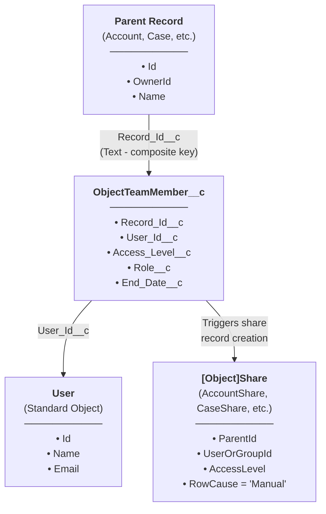
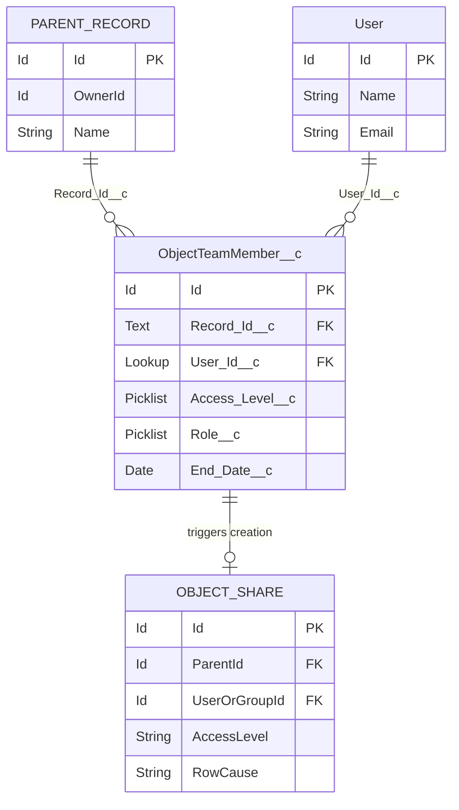
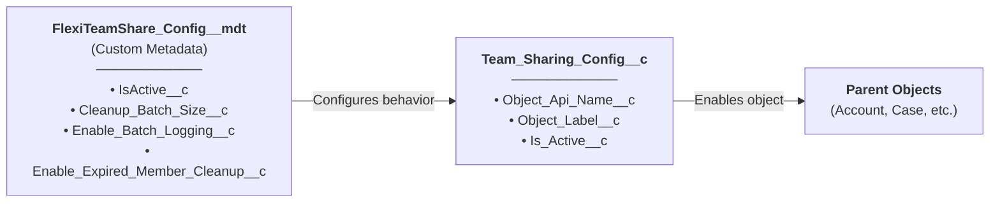
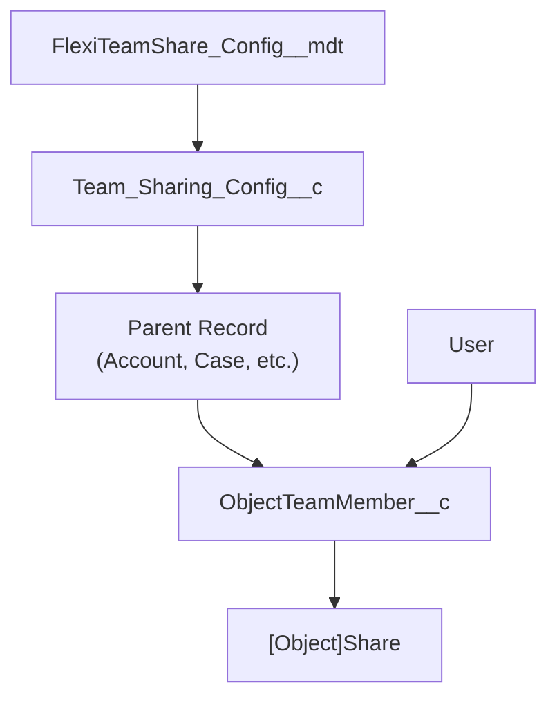

## Modèle de données principal

## Diagramme de relations entre entités

## Objets personnalisés

### ObjectTeamMember__c

Stocke les affectations de membres d'équipe reliant un utilisateur à un enregistrement parent.

| Champ | Type | Description |
|-------|------|-------------|
| `Record_Id__c` | Text | Clé composite au format `ObjectName:RecordId` |
| `User_Id__c` | Lookup(User) | L'utilisateur membre d'équipe |
| `Access_Level__c` | Picklist | Read Only, Read/Write |
| `Role__c` | Picklist | Owner, Manager, User |
| `End_Date__c` | Date | Date d'expiration optionnelle pour l'accès temporaire |

### Team_Sharing_Config__c

Configuration par objet pour le partage d'équipe.

| Champ | Type | Description |
|-------|------|-------------|
| `Object_Api_Name__c` | Text | Nom API de l'objet configuré |
| `Object_Label__c` | Text | Étiquette d'affichage pour l'objet |
| `Is_Active__c` | Checkbox | Si le partage d'équipe est actif pour cet objet |

### FlexiTeamShare_Config__mdt

Configuration au niveau de l'application stockée en tant que Custom Metadata.

| Champ | Type | Description |
|-------|------|-------------|
| `IsActive__c` | Checkbox | Basculer principal pour l'application |
| `Cleanup_Batch_Size__c` | Number | Taille de batch pour les tâches de nettoyage |
| `Enable_Batch_Logging__c` | Checkbox | Activer la journalisation de débogage dans les tâches batch |
| `Enable_Expired_Member_Cleanup__c` | Checkbox | Activer le nettoyage automatique des membres expirés |

## Objets de configuration

## Vue d'ensemble complète du modèle

