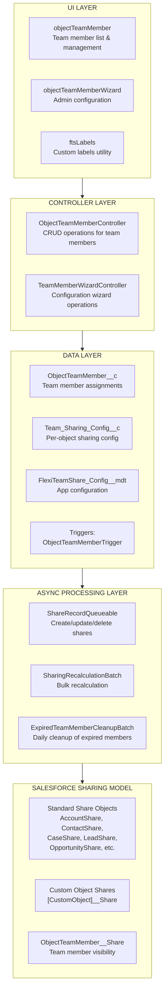
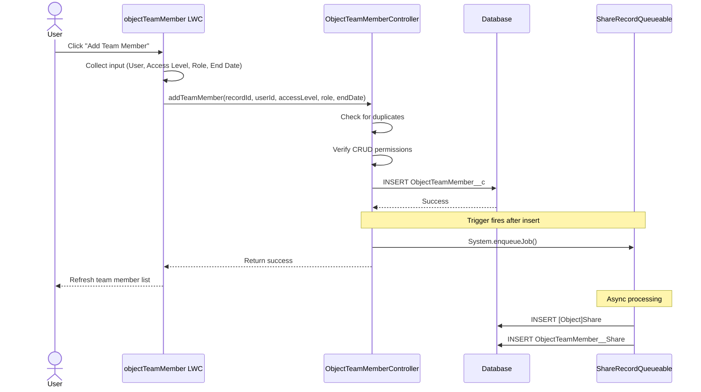
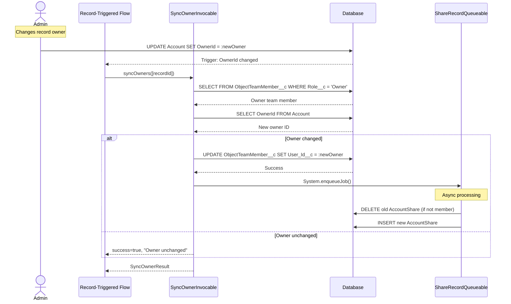
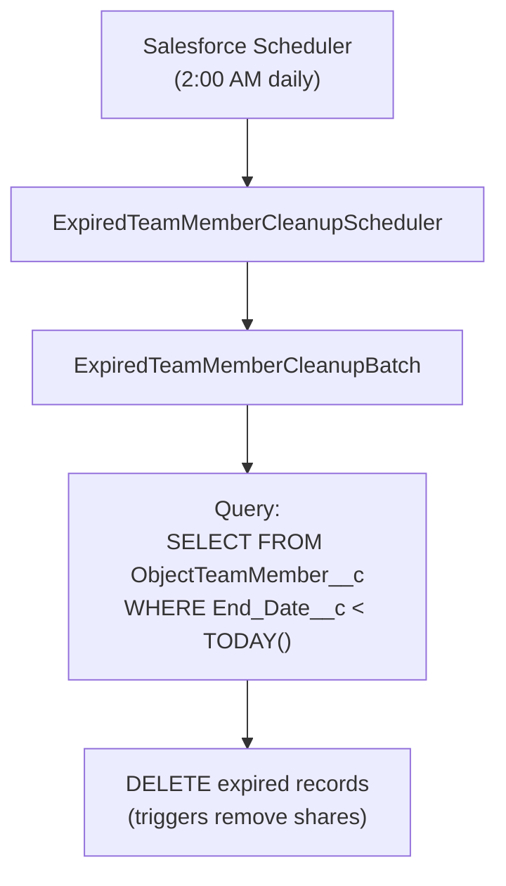

import { Aside } from '@astrojs/starlight/components';

Ce document fournit une description technique détaillée de la solution Flexible Team Share, incluant l'architecture système, le flux de données et les couches de traitement.

## Architecture système

## Couches

### Couche UI

Trois Lightning Web Components :

| Composant | Objectif |
|-----------|---------|
| **objectTeamMember** | Affiche les membres d'équipe sur les pages d'enregistrement. Prend en charge l'ajout/modification/suppression, la liste réductible et la limite d'affichage configurable. |
| **objectTeamMemberWizard** | Interface administrateur pour configurer les objets, gérer les paramètres et planifier les tâches. |
| **ftsLabels** | Composant utilitaire fournissant des Custom Labels pour la prise en charge i18n (35 langues). |

### Couche contrôleur

| Contrôleur | Méthodes |
|-----------|---------|
| **ObjectTeamMemberController** | `getTeamMembers()`, `addTeamMember()`, `updateTeamMember()`, `removeTeamMember()`, `isCurrentUserManager()`, `isSharingConfigured()`, `getAccessLevelOptions()` |
| **TeamMemberWizardController** | `getExistingConfigs()`, `getAvailableObjects()`, `createConfig()`, `toggleConfigStatus()`, `deleteConfig()`, `getScheduledJobInfo()`, `scheduleCleanupJob()` |
| **SyncOwnerInvocable** | `syncOwners()` — Invocable Action pour synchroniser le membre d'équipe Owner lorsque le propriétaire parent change. Appelable depuis Flow ou Apex, entièrement bulkifié. |

### Couche de données

Objets personnalisés et un déclencheur qui se déclenche lors des changements de membre d'équipe :

- **ObjectTeamMember__c** — stocke les affectations de membres d'équipe
- **Team_Sharing_Config__c** — configuration de partage par objet
- **FlexiTeamShare_Config__mdt** — configuration au niveau de l'application (Custom Metadata)
- **ObjectTeamMemberTrigger** → **ObjectTeamMemberTriggerHandler** — gère Before Insert, Before Update, Before Delete

### Couche de traitement asynchrone

| Composant | Type | Objectif |
|-----------|------|---------|
| **ShareRecordQueueable** | Queueable | Crée, met à jour et supprime des enregistrements de partage pour les objets parents et les membres d'équipe |
| **SharingRecalculationBatch** | Batchable | Recalcule en masse tous les partages lorsque la configuration change |
| **ExpiredTeamMemberCleanupBatch** | Batchable | Supprime les membres d'équipe expirés (tâche planifiée quotidienne) |
| **ExpiredTeamMemberCleanupScheduler** | Schedulable | Planifie le batch de nettoyage (s'exécute à 2h00 du matin quotidiennement) |

## Flux de données : Ajout d'un membre d'équipe

## Flux de données : Synchronisation du changement de propriétaire

## Flux de données : Nettoyage des membres expirés

## Gestion des erreurs

### Couche contrôleur

- Toutes les méthodes publiques enveloppées dans try-catch
- Messages d'erreur conviviaux via Custom Labels
- `AuraHandledException` pour l'affichage des erreurs LWC

### Traitement asynchrone

- `Database.insert/update/delete(records, false)` — succès partiel
- Les erreurs individuelles sont enregistrées, n'échouent pas tout le batch
- Statistiques d'erreur suivies dans les tâches batch

### Couche déclencheur

- Le modèle de gestionnaire de déclencheur prévient la récursion
- Les erreurs remontent à l'appelant de l'opération DML

## Considérations de performance

### Traitement asynchrone

- Les opérations d'enregistrement de partage utilisent Queueable (non bloquant)
- Les opérations en masse utilisent Batchable avec une taille de batch configurable
- Aucun DML synchrone sur les enregistrements de partage dans les déclencheurs

### Optimisation des requêtes

- Champs indexés utilisés dans les clauses WHERE
- Le format `Record_Id__c` permet des requêtes LIKE efficaces
- Ensembles de résultats limités avec des clauses LIMIT

### Mise en cache

- `@AuraEnabled(cacheable=true)` pour les opérations de lecture
- Configuration de l'application mise en cache dans la transaction

## Architecture d'intégration

**Aucune intégration externe** — ce package fonctionne entièrement dans Salesforce :

- Aucun HTTP callout
- Aucune API externe
- Aucun Named Credentials
- Aucun External Objects
- Aucune Connected Apps

### Dépendances de plateforme

| Composant | Utilisation |
|-----------|-------|
| Apex Sharing | Crée/gère les enregistrements de partage |
| Queueable Apex | Opérations asynchrones d'enregistrement de partage |
| Batchable Apex | Recalcul en masse du partage, nettoyage |
| Schedulable Apex | Tâche de nettoyage quotidienne |
| Custom Metadata | Configuration de l'application |
| Lightning Web Components | Interface utilisateur |
| Custom Labels | Internationalisation |
