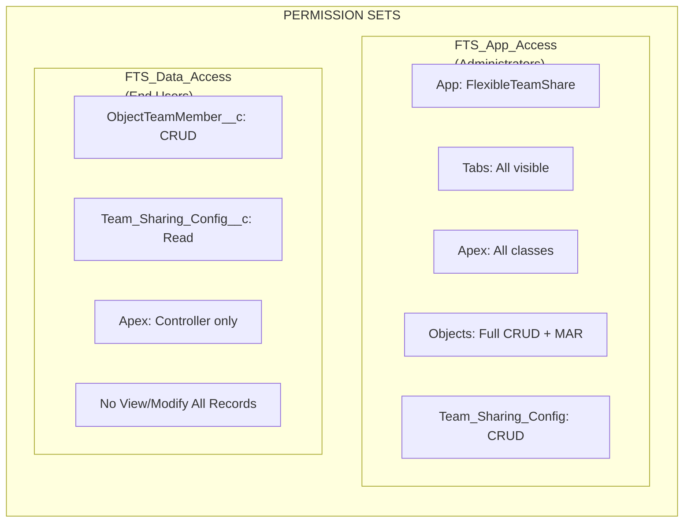
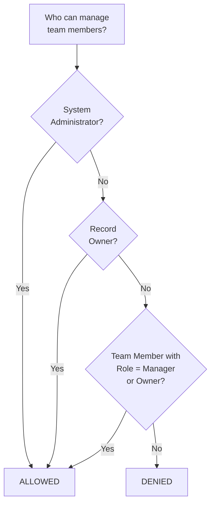
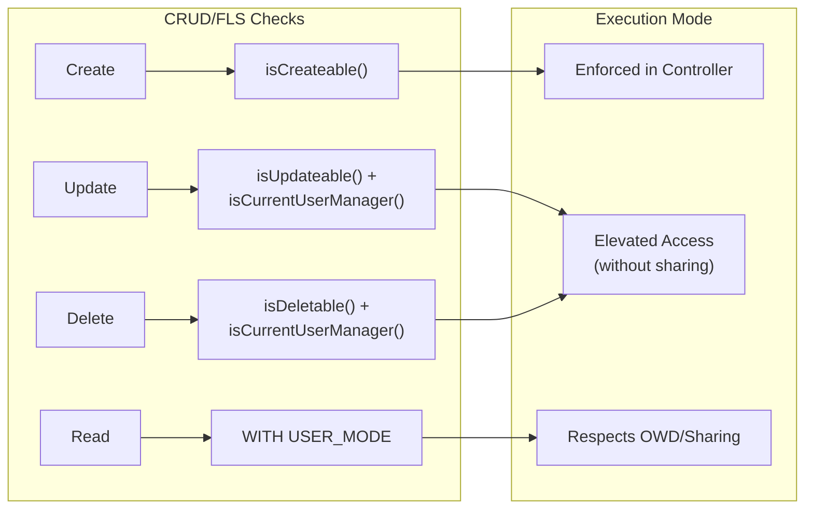
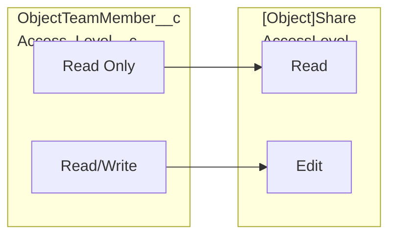
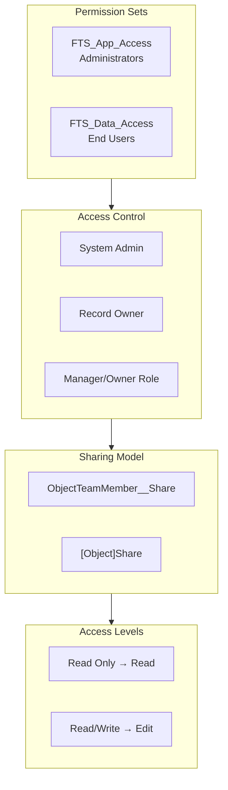

import { Aside } from '@astrojs/starlight/components';

## Modèle de permissions

### Ensembles de permissions

| Permission Set | Audience | Capacités |
|---------------|----------|-------------|
| **FTS_App_Access** | Administrateurs | Accès complet à l'application, tous les onglets, toutes les classes Apex, CRUD complet + Modify All Records sur les objets, Team_Sharing_Config CRUD |
| **FTS_Data_Access** | Utilisateurs finaux | ObjectTeamMember__c CRUD, Team_Sharing_Config__c Read, classes Apex contrôleur uniquement, aucun View/Modify All Records |

## Logique de contrôle d'accès

La méthode `isCurrentUserManager()` détermine qui peut gérer les membres d'équipe :

1. **System Administrators** — toujours autorisés
2. **Record Owners** — toujours autorisés
3. **Membres d'équipe avec rôle Manager/Owner** — autorisés
4. **Tous les autres** — refusés

## Application CRUD/FLS

| Opération | Vérification de sécurité | Implémentation |
|-----------|---------------|----------------|
| Create Team Member | `Schema.sObjectType.ObjectTeamMember__c.isCreateable()` | Appliqué dans le contrôleur |
| Update Team Member | `isUpdateable()` + `isCurrentUserManager()` | Accès élevé (without sharing) après autorisation |
| Delete Team Member | `isDeletable()` + `isCurrentUserManager()` | Accès élevé (without sharing) après autorisation |
| Read Team Members | `WITH USER_MODE` / sharing model | Respecte OWD/partage |

<Aside type="note">
Les opérations Update et Delete utilisent un accès élevé (`without sharing`) pour permettre aux gestionnaires de modifier n'importe quel membre d'équipe sur l'enregistrement, pas seulement ceux qu'ils ont créés. L'autorisation est toujours vérifiée d'abord via `isCurrentUserManager()`.
</Aside>

## Validation des entrées

| Entrée | Validation | Emplacement |
|-------|-----------|----------|
| `recordId` | Non vide, format d'ID Salesforce valide | Controller |
| `userId` | Non vide, User ID valide | Controller |
| `accessLevel` | Non vide, valeur de liste de sélection valide | Controller + Picklist |
| `role` | Non vide, valeur de liste de sélection valide | Controller + Picklist |
| `endDate` | Doit être une date future ou null | Controller + Validation Rule |
| `objectApiName` | Dérivé de l'ID Salesforce (pas d'entrée utilisateur) | Controller |

### Règles de validation

| Règle | Objet | Description |
|------|--------|-------------|
| `End_Date_Cannot_Be_Past` | `ObjectTeamMember__c` | Empêche la définition d'une date de fin dans le passé |

## Mappage des niveaux d'accès

## Vue d'ensemble complète de la sécurité

## Meilleures pratiques de sécurité implémentées

| Contrôle | Statut | Implémentation |
|---------|--------|---------------|
| Vérifications CRUD dans les contrôleurs | Implémenté | `isAccessible()`, `isCreateable()`, `isUpdateable()`, `isDeletable()` |
| Application FLS | Implémenté | Les ensembles de permissions contrôlent l'accès aux champs |
| Prévention de l'injection SOQL | Implémenté | Variables liées pour l'entrée utilisateur, liste blanche pour les noms d'objets |
| Modèle de partage | Implémenté | `with sharing` sur les contrôleurs, `without sharing` uniquement là où documenté |
| Validation des entrées | Implémenté | Vérifications null, validation de format, règles métier |
| Prévention XSS | Implémenté | Le framework LWC gère l'encodage de sortie |

## Sécurité de l'intégration externe

| Vérification | Résultat |
|-------|--------|
| HTTP Callouts | Aucun — le package ne fait aucun appel externe |
| Named Credentials | Non utilisé |
| External Objects | Non utilisé |
| Remote Site Settings | Non requis |
| Violations CSP | Réussite — aucune violation Content-Security-Policy |
