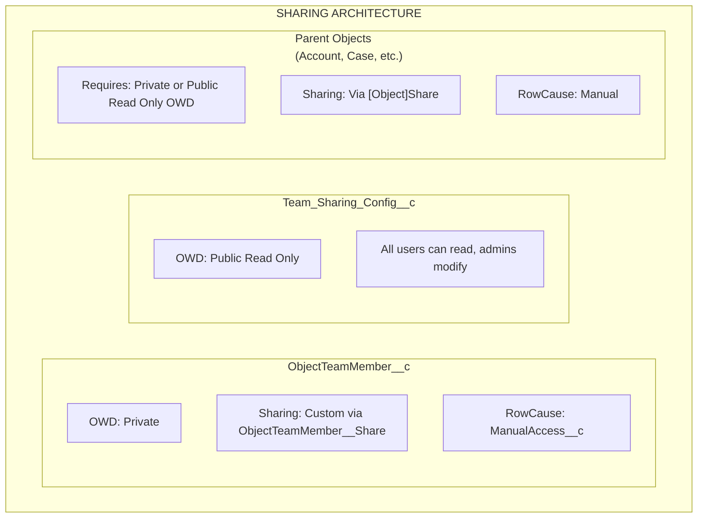

import { Aside } from '@astrojs/starlight/components';

## Architecture de partage

## Comment fonctionne le partage

### ObjectTeamMember__c

- **OWD** : Private
- **Mécanisme de partage** : Partage personnalisé via `ObjectTeamMember__Share`
- **RowCause** : `ManualAccess__c`

Lorsqu'un membre d'équipe est ajouté, le système crée un enregistrement `ObjectTeamMember__Share` afin que le membre d'équipe puisse voir son propre enregistrement d'appartenance à l'équipe.

### Team_Sharing_Config__c

- **OWD** : Public Read Only
- Tous les utilisateurs peuvent lire la configuration (nécessaire pour le rendu du composant)
- Seuls les administrateurs peuvent modifier les configurations

### Objets parents

- **Exigence** : Les objets doivent avoir un OWD **Private** ou **Public Read Only**
- **Mécanisme de partage** : Via les tables `[Object]Share` standard (par exemple, `AccountShare`, `CaseShare`)
- **RowCause** : Manual

<Aside type="caution">
Si l'OWD de l'objet parent est défini sur **Public Read/Write**, les enregistrements de partage ne peuvent pas accorder d'accès supplémentaire puisque les utilisateurs ont déjà un accès complet. Flexible Team Share nécessite un OWD Private ou Public Read Only pour fonctionner correctement.
</Aside>

## Mappage des niveaux d'accès

Lorsqu'un membre d'équipe est ajouté avec un niveau d'accès, il est mappé à l'accès d'enregistrement de partage Salesforce :

| ObjectTeamMember__c Access_Level__c | [Object]Share AccessLevel | Description |
|-------------------------------------|--------------------------|-------------|
| **Read Only** | `Read` | Le membre d'équipe peut voir l'enregistrement |
| **Read/Write** | `Edit` | Le membre d'équipe peut voir et modifier l'enregistrement |

## Cycle de vie des enregistrements de partage

### Création de partages

Lorsqu'un membre d'équipe est ajouté :

1. L'enregistrement `ObjectTeamMember__c` est inséré
2. Le déclencheur se déclenche et met en file d'attente `ShareRecordQueueable`
3. Queueable crée deux enregistrements de partage :
   - **Partage parent** : enregistrement `[Object]Share` donnant à l'utilisateur l'accès à l'enregistrement parent
   - **Partage membre d'équipe** : enregistrement `ObjectTeamMember__Share` donnant à l'utilisateur la visibilité de son appartenance à l'équipe

### Mise à jour de partages

Lorsque le niveau d'accès d'un membre d'équipe change :

1. L'enregistrement `ObjectTeamMember__c` est mis à jour
2. Le déclencheur se déclenche et met en file d'attente `ShareRecordQueueable`
3. Queueable supprime l'ancien partage et en crée un nouveau avec le niveau d'accès mis à jour

### Suppression de partages

Lorsqu'un membre d'équipe est supprimé :

1. L'enregistrement `ObjectTeamMember__c` est supprimé
2. Le déclencheur se déclenche et met en file d'attente `ShareRecordQueueable`
3. Queueable supprime les deux enregistrements de partage (parent et membre d'équipe)

### Recalcul en masse

Lorsqu'une configuration de partage est basculée :

- **Désactivée** : `SharingRecalculationBatch` supprime tous les enregistrements de partage pour cet objet
- **Réactivée** : `SharingRecalculationBatch` recrée les enregistrements de partage pour tous les membres d'équipe existants

## Objets de partage pris en charge

### Objets standard

| Objet | Table de partage |
|--------|------------|
| Account | `AccountShare` |
| Contact | `ContactShare` |
| Case | `CaseShare` |
| Lead | `LeadShare` |
| Opportunity | `OpportunityShare` |
| Campaign | `CampaignShare` |
| Order | `OrderShare` |

### Objets personnalisés

Les objets personnalisés suivent le modèle : `ObjectName__c` → `ObjectName__Share`

Le système utilise une liste blanche codée en dur pour les objets standard et dérive automatiquement le nom de la table de partage pour les objets personnalisés.

## Exigences de déploiement

### Exigences de l'organisation

- Salesforce **Enterprise Edition** ou supérieur (pour la prise en charge du modèle de partage)
- Les objets doivent avoir un OWD **Private** ou **Public Read Only** pour bénéficier du partage

### Exigences utilisateur

- Les utilisateurs ont besoin de l'ensemble de permissions approprié attribué
- Les utilisateurs ont besoin d'un accès de base aux objets (par exemple, accès en lecture aux comptes pour utiliser les équipes de comptes)
