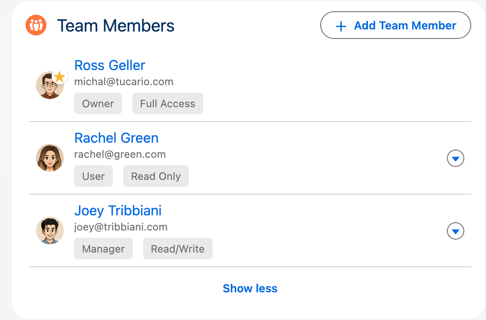
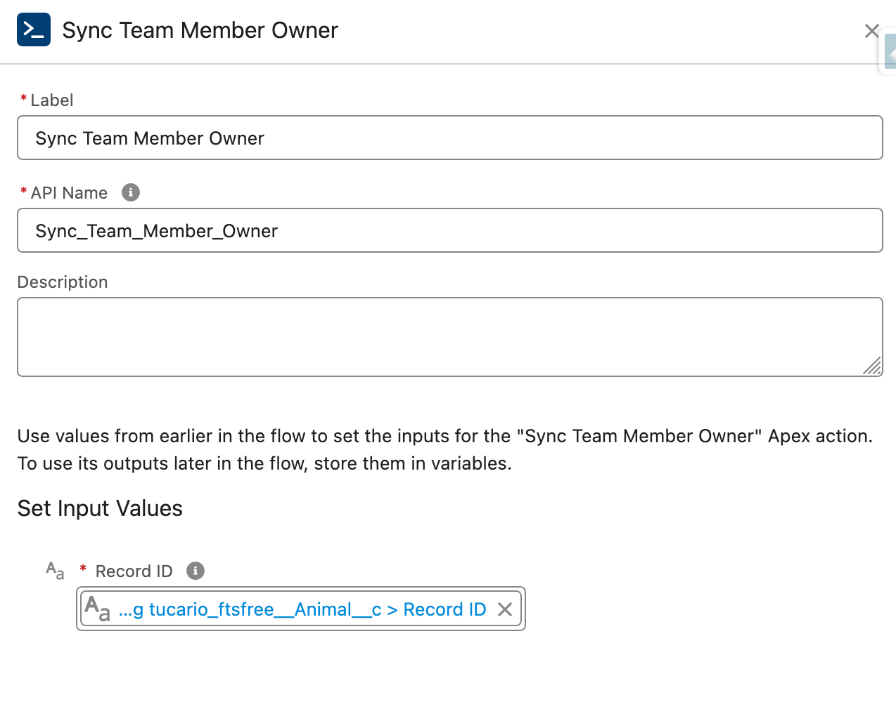
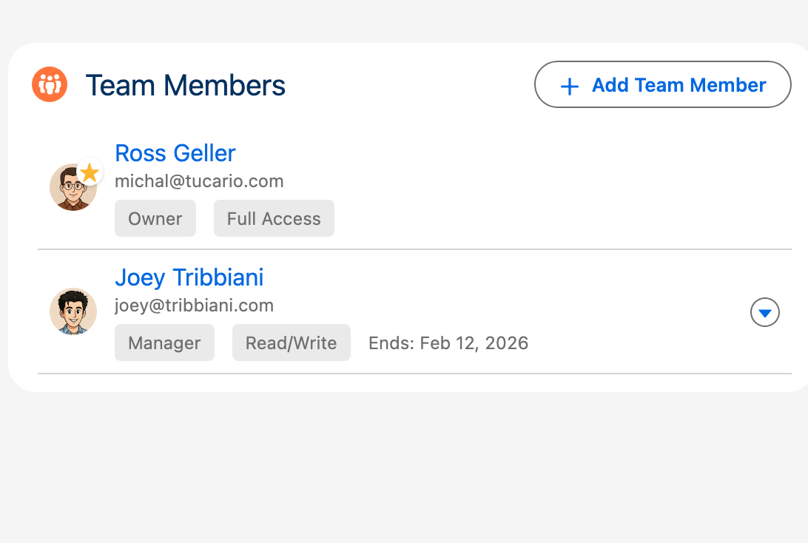
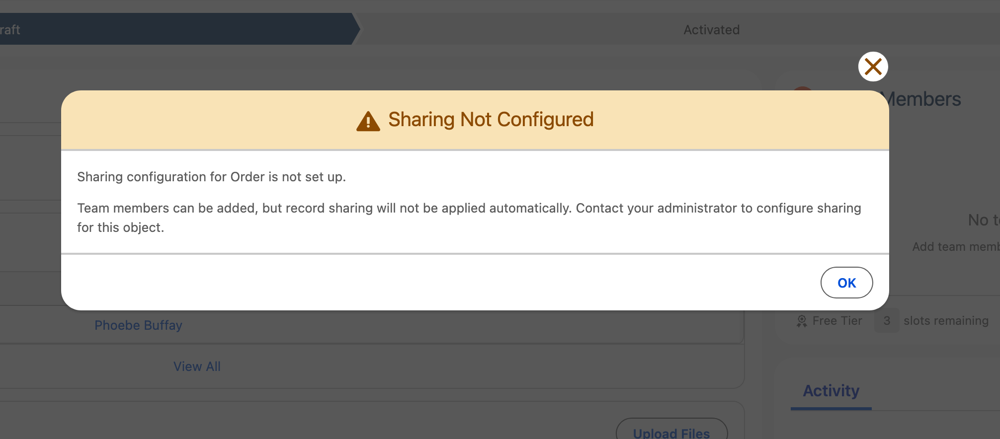
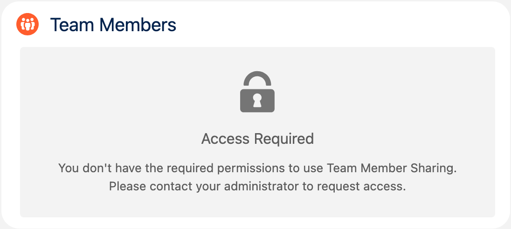
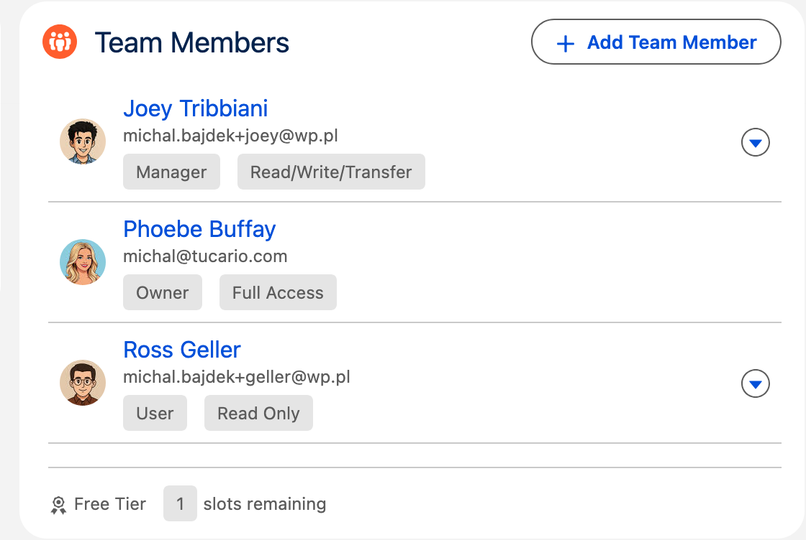
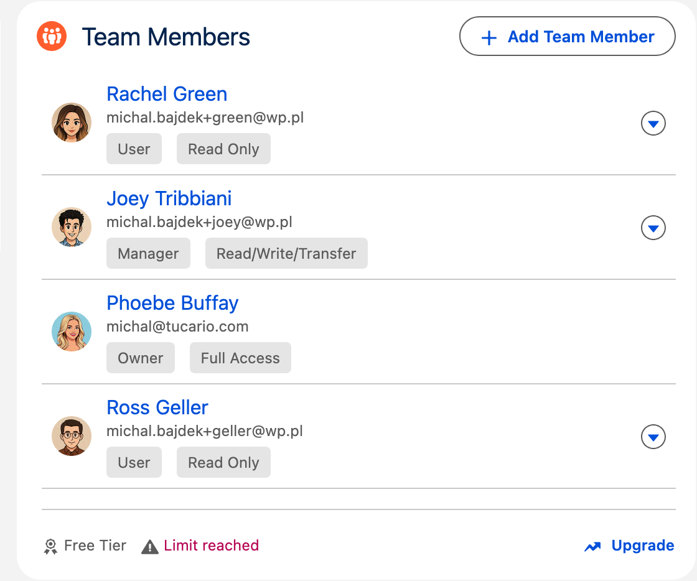
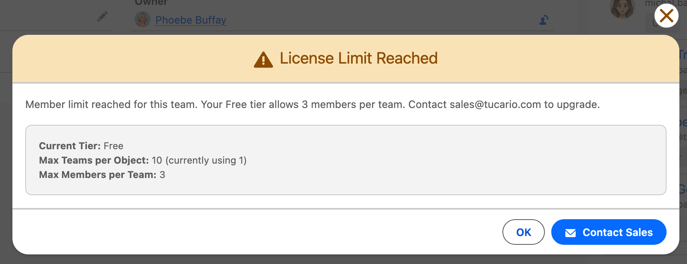

import { Aside, Steps } from '@astrojs/starlight/components';

## Configuration du composant

Le composant Object Team Member peut être configuré directement dans Lightning App Builder avec les propriétés suivantes :

| Propriété | Type | Par défaut | Description |
|----------|------|---------|-------------|
| **Card Title** | String | Team Members | Le titre affiché sur la carte du composant |
| **Max Displayed Members** | Integer | 5 | Nombre maximum de membres d'équipe affichés avant réduction. Définir à 0 pour tout afficher |

Lorsque le nombre de membres d'équipe dépasse la limite configurée, la liste se réduit et affiche un bouton **"Show all (X more)"**. En cliquant dessus, la liste complète s'affiche, avec un bouton **"Show less"** pour la réduire à nouveau. Le propriétaire de l'enregistrement apparaît toujours en premier dans la liste, quelle que soit la limite d'affichage.


### Comportement de la limite d'affichage

| Paramètre | Comportement |
|---------|----------|
| Max Displayed Members = **5** (par défaut) | Affiche les 5 premiers membres, "Show X more" pour le reste |
| Max Displayed Members = **0** | Tous les membres d'équipe visibles, pas de réduction/expansion |
| Max Displayed Members = **3** (personnalisé) | Affiche les 3 premiers membres, "Show X more" pour le reste |

## Rôles des membres d'équipe

Lors de l'ajout d'utilisateurs à une équipe, vous leur attribuez l'un des rôles suivants :

| Rôle | Description | Capacités |
|------|-------------|-------------|
| **Owner** | Le propriétaire de l'enregistrement | Attribué automatiquement lors de la création d'un enregistrement. Ne peut pas être attribué ou supprimé manuellement. A un accès complet pour gérer les membres d'équipe. Supprimé automatiquement lorsqu'il n'y a plus d'autres utilisateurs dans l'équipe. |
| **Manager** | Administrateur d'équipe | Peut ajouter, modifier et supprimer des membres d'équipe. Utilisez ce rôle pour les utilisateurs qui doivent gérer la composition de l'équipe. |
| **User** | Membre d'équipe standard | Peut voir la liste des membres d'équipe mais ne peut pas la modifier. Utilisez ce rôle pour les utilisateurs qui n'ont besoin que d'accéder à l'enregistrement. |



<Aside type="note">
- Le rôle **Owner** est créé automatiquement par le système et représente le propriétaire actuel de l'enregistrement
- Les rôles **Manager** et **User** reçoivent un accès à l'enregistrement en fonction de leur niveau d'accès attribué (Read Only ou Read/Write)
- Seuls les utilisateurs avec les rôles **Owner** ou **Manager** peuvent ajouter, modifier ou supprimer des membres d'équipe
</Aside>

## Synchronisation du changement de propriétaire

Lorsque le propriétaire de l'enregistrement change (par exemple, un compte est réattribué à un autre commercial), le membre d'équipe Owner n'est **PAS automatiquement mis à jour**. Le système crée l'enregistrement Owner lorsque le premier membre d'équipe est ajouté, mais il ne suit pas les changements de propriétaire ultérieurs sur l'enregistrement parent.

Pour maintenir le propriétaire de l'équipe synchronisé avec le propriétaire de l'enregistrement, vous devez créer un **Record-Triggered Flow**.

<Aside type="note" title="Pourquoi ce n'est pas automatique ?">
Les packages gérés Salesforce ne peuvent pas inclure de déclencheurs sur des objets standard comme Account ou Opportunity. Flexible Team Share fournit une **Invocable Action** que vous pouvez appeler depuis un Flow pour synchroniser le propriétaire si nécessaire.
</Aside>

### Configuration via Flow (recommandé)

<Steps>
1. Allez dans **Setup** > **Flows**
2. Cliquez sur **New Flow** > **Record-Triggered Flow**
3. Sélectionnez l'objet (par exemple, Account)
4. Configurez le déclencheur : **"A record is updated"**
5. Ajoutez une condition d'entrée : Formula > `ISCHANGED({!$Record.OwnerId})` évalue à `true`
6. Définissez **"When to Run the Flow"** sur **"After the record is saved"**
7. Ajoutez un élément **Action**
8. Recherchez **"Sync Team Member Owner"**
9. Définissez le paramètre **"Record ID"** sur `{!$Record.Id}`
10. Laissez **"Object API Name"** vide (dérivé automatiquement de Record ID)
11. Enregistrez et **Activez** le Flow
</Steps>




<Aside type="tip">
Répétez ces étapes pour chaque objet sur lequel vous souhaitez une synchronisation automatique du propriétaire (par exemple, Account, Opportunity, Case, Lead).
</Aside>

### Configuration via Apex Trigger

```apex
trigger AccountOwnerSync on Account(after update) {
  List<tucariofts.SyncOwnerInvocable.SyncOwnerRequest> requests =
    new List<tucariofts.SyncOwnerInvocable.SyncOwnerRequest>();

  for (Account acc : Trigger.new) {
    Account oldAcc = Trigger.oldMap.get(acc.Id);
    if (acc.OwnerId != oldAcc.OwnerId) {
      tucariofts.SyncOwnerInvocable.SyncOwnerRequest req =
        new tucariofts.SyncOwnerInvocable.SyncOwnerRequest();
      req.recordId = acc.Id;
      requests.add(req);
    }
  }

  if (!requests.isEmpty()) {
    tucariofts.SyncOwnerInvocable.syncOwners(requests);
  }
}
```

### Appel depuis le code Apex (enregistrement unique)

```apex
tucariofts.SyncOwnerInvocable.SyncOwnerRequest request =
    new tucariofts.SyncOwnerInvocable.SyncOwnerRequest();
request.recordId = accountId;

List<tucariofts.SyncOwnerInvocable.SyncOwnerResult> results =
    tucariofts.SyncOwnerInvocable.syncOwners(
        new List<tucariofts.SyncOwnerInvocable.SyncOwnerRequest>{ request }
    );

if (results[0].success) {
    System.debug('Owner synced: ' + results[0].oldOwnerId +
                 ' → ' + results[0].newOwnerId);
} else {
    System.debug('Sync failed: ' + results[0].message);
}
```

### Objet de résultat

| Champ | Type | Description |
|-------|------|-------------|
| `success` | Boolean | Si la synchronisation a réussi |
| `message` | String | Message de résultat ou détails d'erreur |
| `oldOwnerId` | Id | ID utilisateur du propriétaire précédent |
| `newOwnerId` | Id | ID utilisateur du nouveau propriétaire |

### Scénarios d'erreur

| Scénario | Résultat |
|----------|--------|
| Aucun membre d'équipe sur l'enregistrement | `success = false`, "No Owner team member found" |
| Propriétaire inchangé | `success = true`, "Owner unchanged, no update needed" |
| Record ID null | `success = false`, "Record ID is required" |
| Record ID invalide | `success = false`, message d'erreur |

### Limitations importantes

**Propriétaires de file d'attente non pris en charge** — Flexible Team Share ne prend pas en charge les files d'attente en tant que propriétaires d'équipe. Lorsqu'un enregistrement est détenu par une file d'attente :

- Le système utilise l'**utilisateur actuel** (la personne qui ajoute le premier membre d'équipe) comme propriétaire dans l'équipe
- Si vous changez ultérieurement le propriétaire de l'enregistrement d'une file d'attente à un utilisateur, exécutez l'action Sync Owner pour mettre à jour l'équipe
- Si vous changez le propriétaire d'un utilisateur à une file d'attente, le propriétaire de l'équipe restera l'utilisateur précédent

**Le Flow doit être créé par objet** — Vous devez créer un Flow séparé pour chaque type d'objet sur lequel vous souhaitez une synchronisation du propriétaire. L'Invocable Action fonctionne avec n'importe quel objet, mais Salesforce nécessite des Record-Triggered Flows séparés par objet.

## Accès temporaire avec date de fin

Lors de l'ajout d'un membre d'équipe, vous pouvez optionnellement définir une **End Date** pour accorder un accès temporaire à un enregistrement. Ceci est utile pour :

- Les collaborations basées sur des projets avec des calendriers définis
- Les consultants ou entrepreneurs temporaires
- La couverture des vacances ou les responsabilités déléguées
- Les périodes d'audit ou de révision

### Comment ça fonctionne

<Steps>
1. Lors de l'ajout ou de la modification d'un membre d'équipe, définissez le champ **End Date** sur le dernier jour où il devrait avoir accès
2. Le membre d'équipe conserve un accès complet jusqu'à la fin de ce jour
3. Après le passage de la End Date, la tâche de nettoyage planifiée supprime automatiquement le membre d'équipe et révoque son accès
</Steps>



### Processus de nettoyage automatique

- Une tâche batch planifiée s'exécute quotidiennement (par défaut à 2h00 du matin) pour supprimer les membres d'équipe expirés
- Lorsqu'un membre d'équipe est supprimé, son enregistrement de partage est également supprimé, révoquant l'accès à l'enregistrement
- La tâche de nettoyage peut être gérée depuis l'assistant de configuration


## Tâche planifiée

Flexible Team Share inclut une tâche de nettoyage automatique qui supprime les membres d'équipe expirés. Cette tâche est automatiquement planifiée lors de l'installation du package.

### Vérifier la tâche

<Steps>
1. Allez dans **Setup** > **Scheduled Jobs**
2. Recherchez **Flexible Team Share - Expired Member Cleanup**
3. Vérifiez que la tâche est planifiée pour s'exécuter quotidiennement
</Steps>


### Gestion manuelle de la tâche

Les administrateurs peuvent gérer la tâche de nettoyage depuis l'assistant de configuration :

- **Schedule Job** — Planifier manuellement si non en cours d'exécution
- **Unschedule Job** — Arrêter le nettoyage automatique
- **Run Now** — Exécuter le nettoyage immédiatement

## Dépannage

### Avertissement "Configuration Not Found"

**Symptôme :** Une fenêtre modale d'avertissement apparaît indiquant qu'aucune configuration n'existe pour cet objet.

**Cause :** Le composant Membre d'équipe a été ajouté à une page d'enregistrement avant de configurer l'objet dans l'assistant de configuration.

**Solution :**
<Steps>
1. Allez dans l'assistant de configuration (application Flexible Team Share > Configuration)
2. Ajoutez et déployez une configuration pour cet objet
3. Retournez à la page d'enregistrement — le composant devrait maintenant fonctionner correctement
</Steps>



### Erreur "No Access"

**Symptôme :** Le composant affiche un message "No Access" avec une icône de cadenas au lieu des membres d'équipe.

**Cause :** L'utilisateur actuel n'a pas le groupe d'ensemble de permissions requis attribué.

**Solution :**
<Steps>
1. Allez dans **Setup** > **Permission Set Groups**
2. Attribuez le groupe d'ensemble de permissions **Admin** ou **User** aux utilisateurs concernés
3. Les utilisateurs peuvent avoir besoin de se déconnecter et de se reconnecter pour que les modifications prennent effet
</Steps>



### Avertissement "Limit Reached"

**Symptôme :** Le bouton "Add Team Member" est désactivé et un message indique que la limite a été atteinte.

**Cause :** Vous avez atteint le nombre maximum de membres d'équipe autorisés.

**Solution :** Supprimez les membres d'équipe inactifs ou inutiles pour libérer des emplacements.

| Membres d'équipe dans la limite | Membres d'équipe au-delà de la limite |
|:-----|:-----|
|  |  |



### Le partage ne fonctionne pas

**Symptôme :** Les membres d'équipe sont ajoutés avec succès mais ils ne peuvent pas accéder à l'enregistrement.

**Cause :** Le paramètre de partage Organization-Wide Default (OWD) de l'objet est défini sur Public Read/Write.

**Solution :**
<Steps>
1. Allez dans **Setup** > **Sharing Settings**
2. Changez l'OWD de l'objet en **Private** ou **Public Read Only**
3. Note : La modification des paramètres OWD peut affecter l'accès d'autres utilisateurs — consultez votre administrateur Salesforce
</Steps>

## Support

Pour toute question ou problème, veuillez contacter [support@tucario.com](mailto:support@tucario.com).
