import { Aside, Steps } from '@astrojs/starlight/components';

Ce guide vous accompagne dans l'installation de Flexible Team Share et la réalisation de la configuration initiale sur votre organisation Salesforce.

## Prérequis

### Valeurs par défaut au niveau de l'organisation

Avant de configurer Flexible Team Share, assurez-vous que les paramètres de partage OWD sont correctement configurés pour les objets sur lesquels vous souhaitez activer la fonctionnalité d'équipe.

**Paramètres de partage requis** — pour que Flexible Team Share fonctionne correctement, l'OWD de l'objet doit être défini sur l'une des valeurs suivantes :

- **Private** — Les utilisateurs ne peuvent voir que leurs propres enregistrements (recommandé)
- **Public Read Only** — Les utilisateurs peuvent voir tous les enregistrements mais ne peuvent pas les modifier

<Aside type="caution">
Si l'OWD est défini sur **Public Read/Write**, les enregistrements de partage ne peuvent pas accorder d'accès supplémentaire puisque les utilisateurs ont déjà un accès complet à tous les enregistrements.
</Aside>

### Comment vérifier/mettre à jour les paramètres de partage

<Steps>
1. Allez dans **Setup** > **Sharing Settings**
2. Trouvez l'objet que vous souhaitez configurer
3. Vérifiez que l'accès par défaut est défini sur **Private** ou **Public Read Only**
4. Si nécessaire, cliquez sur **Edit** pour modifier les paramètres
</Steps>

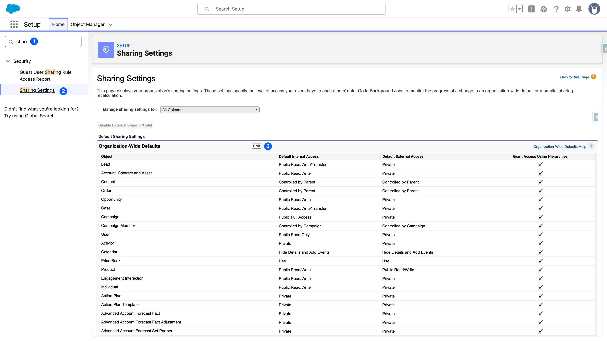

## Installation depuis AppExchange

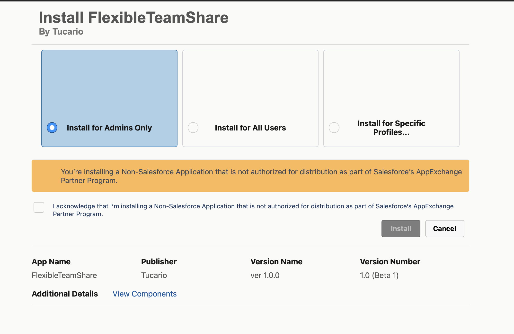

<Steps>
1. **Sélectionnez "Install for Admins Only"** — Nous recommandons fortement cette option. L'installation pour "All Users" accorderait à tout le monde un accès immédiat à l'application d'administration et à l'assistant de configuration. En limitant l'installation aux administrateurs, vous gardez le contrôle total et pouvez accorder l'accès à des utilisateurs spécifiques via les ensembles de permissions ultérieurement.
2. **Confirmez l'avertissement** — Cochez la case pour confirmer que vous installez une application non-Salesforce.
3. **Confirmez l'installation** — Cliquez sur le bouton **Install** pour continuer.
</Steps>

## Étape 1 : Attribuer les permissions

Flexible Team Share inclut deux groupes d'ensembles de permissions avec différents niveaux d'accès :

| Groupe d'ensemble de permissions | Description |
|---------------------|-------------|
| **Flexible Team Share - Admin** | Accès complet aux données des membres d'équipe + accès à l'application de configuration administrateur |
| **Flexible Team Share - User** | Accès aux données des membres d'équipe uniquement (peut afficher et gérer les membres d'équipe sur les enregistrements) |

### Attribution des groupes d'ensembles de permissions

<Steps>
1. Allez dans **Setup** > **Permission Set Groups**
2. Cliquez sur **Flexible Team Share - Admin** ou **Flexible Team Share - User**

   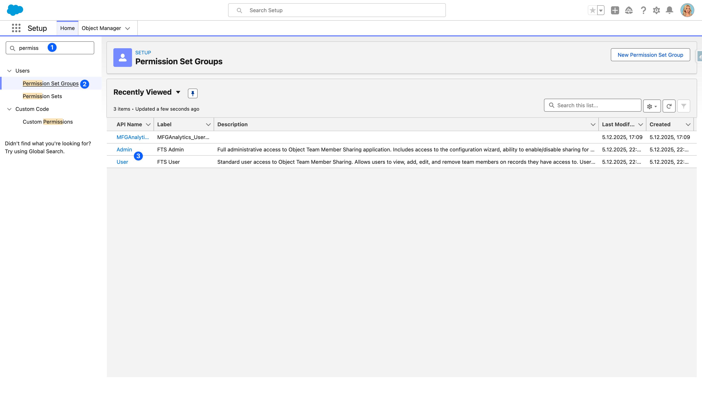

3. Cliquez sur **Manage Assignments** > **Add Assignments**
4. Sélectionnez les utilisateurs et cliquez sur **Next** > **Assign**

   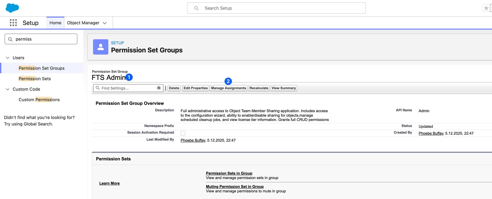
</Steps>

<Aside type="tip">
Attribuez le groupe d'ensemble de permissions **Admin** aux administrateurs système qui configureront l'application. Attribuez le groupe d'ensemble de permissions **User** aux utilisateurs finaux qui utiliseront la fonctionnalité d'équipe sur les enregistrements.
</Aside>

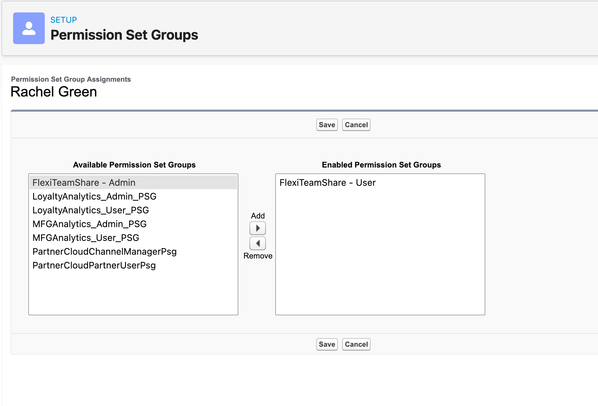

## Étape 2 : Configurer les objets

Utilisez l'assistant de configuration pour activer la fonctionnalité d'équipe pour des objets spécifiques.

### Ouvrir l'assistant de configuration

<Steps>
1. Ouvrez le **App Launcher** (menu à 9 points)
2. Recherchez et sélectionnez **Flexible Team Share**
3. Naviguez vers l'onglet **Configuration**
</Steps>

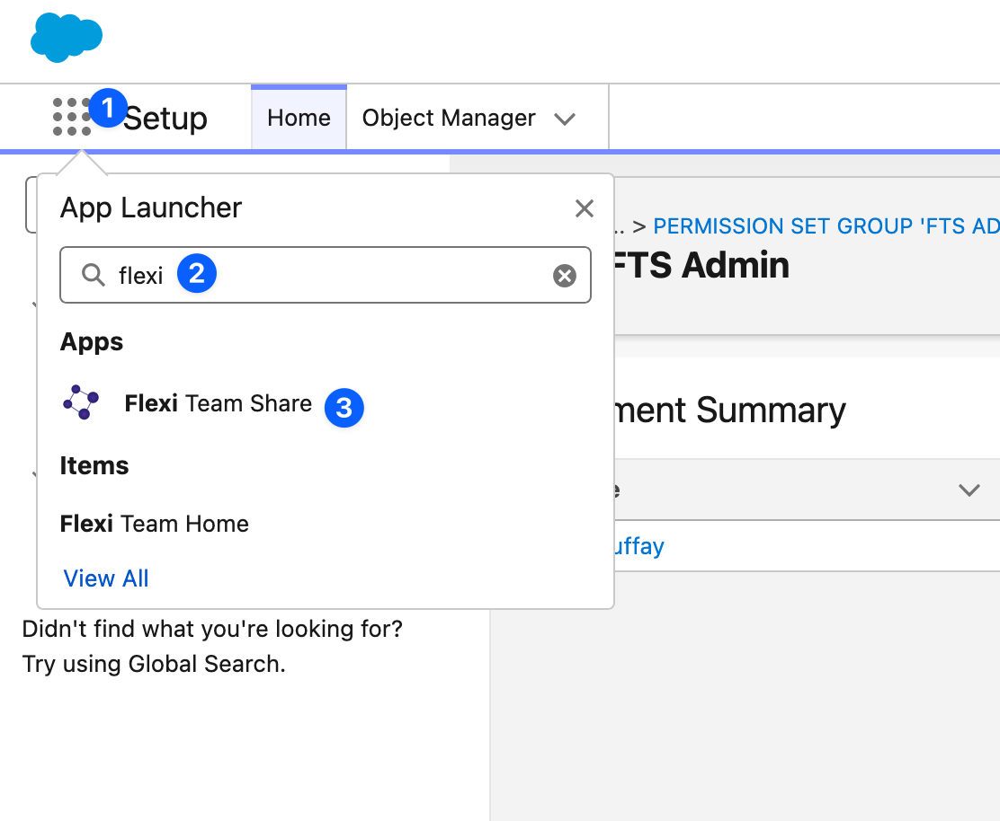

### Ajouter une configuration d'objet

<Steps>
1. Dans l'assistant de configuration, cliquez sur **Add New Configuration**
2. Sélectionnez l'objet que vous souhaitez activer (par exemple, `Custom_Object__c` ou un objet standard)
3. Fournissez une étiquette pour la configuration
4. Cliquez sur **Deploy**
</Steps>

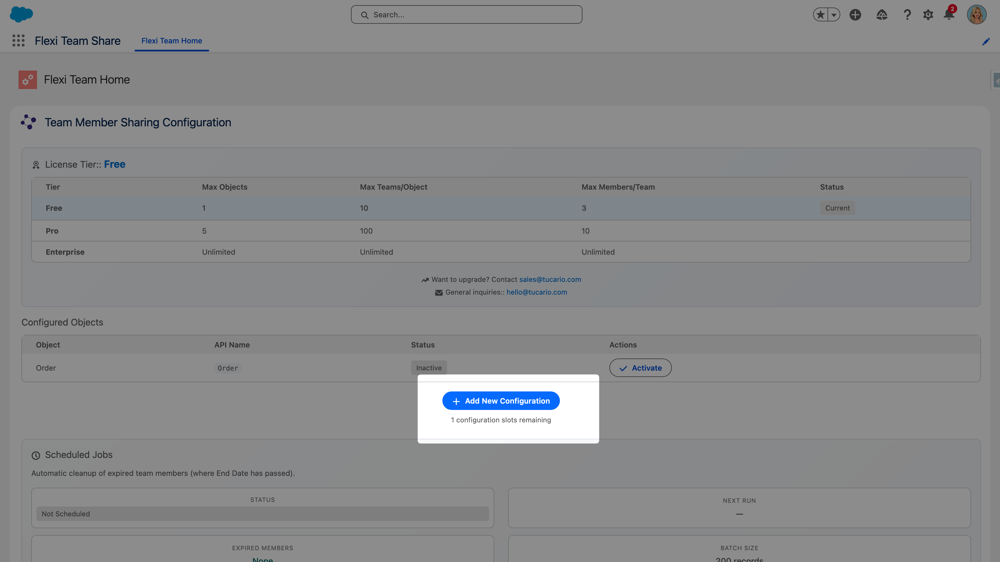
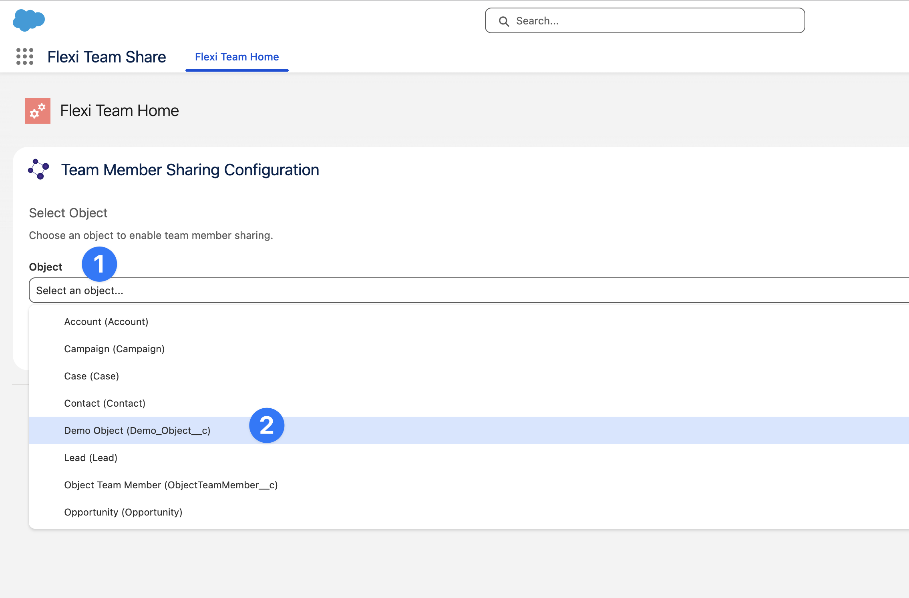
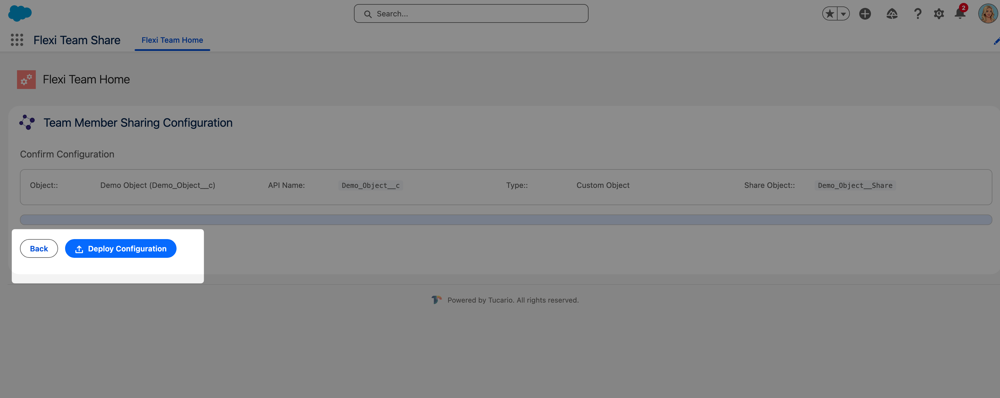
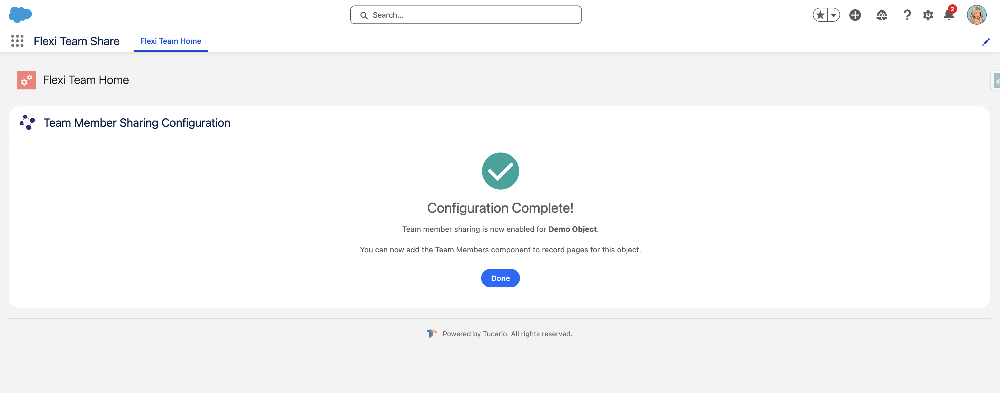

L'assistant créera l'enregistrement Custom Metadata nécessaire pour activer la fonctionnalité d'équipe pour l'objet sélectionné.

### Activer/Désactiver les configurations

Utilisez le bouton bascule à côté de chaque configuration pour activer ou désactiver la fonctionnalité d'équipe. La désactivation d'une configuration masquera le composant membre d'équipe sur les enregistrements de cet objet.

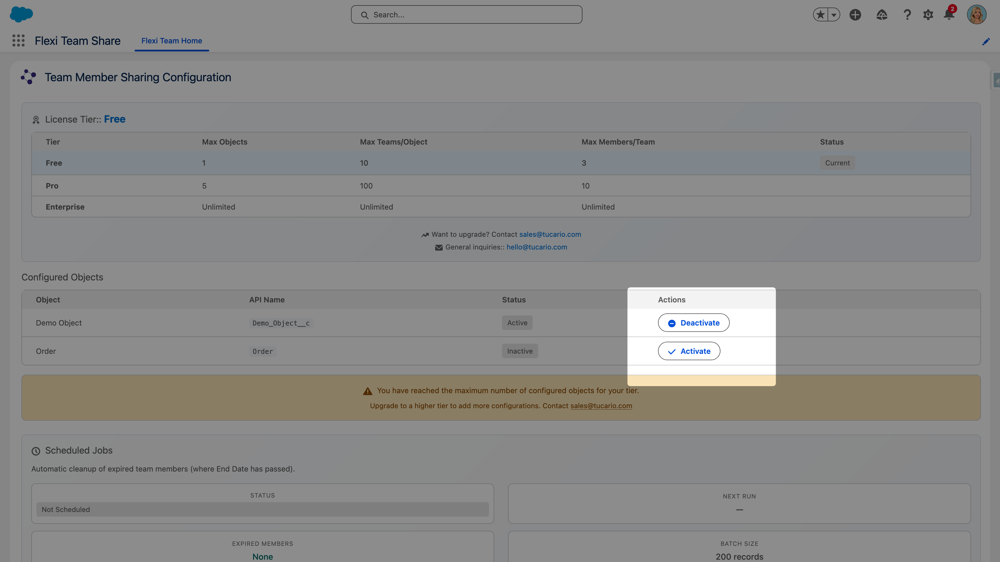

## Étape 3 : Ajouter le composant aux pages d'enregistrement

Après avoir configuré un objet, ajoutez le composant Membre d'équipe à la mise en page de la page d'enregistrement.

### Utilisation de Lightning App Builder

<Steps>
1. Naviguez vers un enregistrement de l'objet configuré
2. Cliquez sur l'**icône d'engrenage** > **Edit Page**

   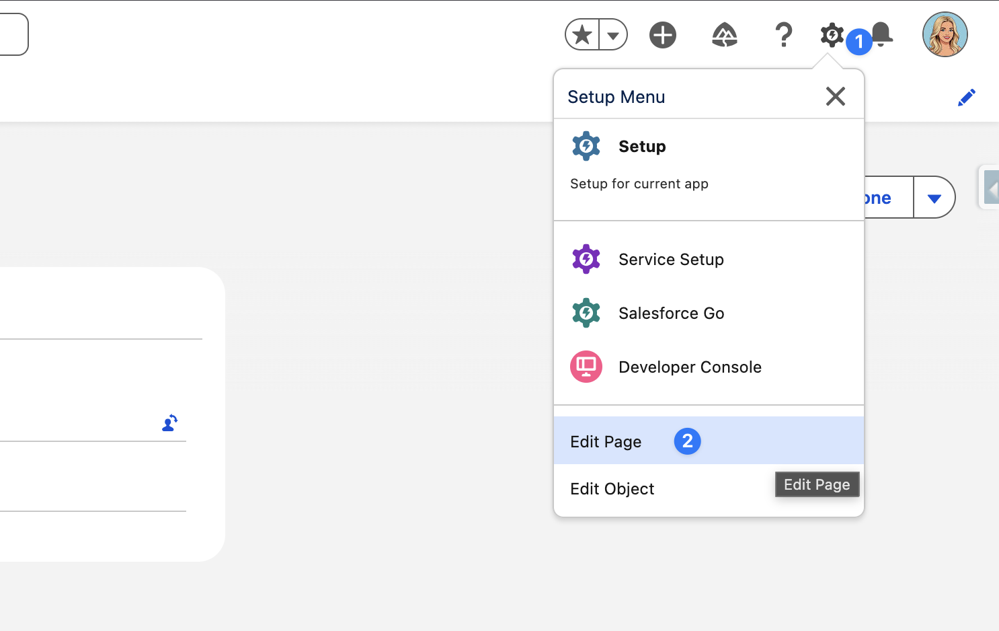

3. Dans Lightning App Builder, trouvez **objectTeamMember** dans le panneau Composants (sous Custom)
4. Faites glisser le composant vers l'emplacement souhaité sur la page

   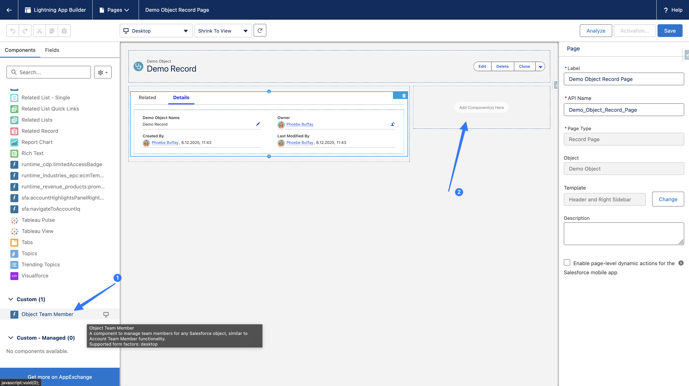

5. Cliquez sur **Save**
6. Si demandé, **Activez** la page pour les utilisateurs/profils appropriés
</Steps>

### Recommandations de placement du composant

| Emplacement | Idéal pour |
|----------|----------|
| **Right Sidebar** | Accès rapide sans occuper l'espace de contenu principal |
| **Related Lists Section** | Maintient les membres d'équipe regroupés avec d'autres données associées |
| **New Tab** | Idéal pour les scénarios complexes de gestion d'équipe |

## Liste de vérification

Après avoir terminé l'installation, vérifiez les éléments suivants :

- [ ] Les paramètres de partage OWD sont correctement configurés pour les objets cibles
- [ ] Les utilisateurs administrateurs ont le groupe d'ensemble de permissions Admin attribué
- [ ] Les utilisateurs finaux ont le groupe d'ensemble de permissions User attribué
- [ ] Au moins un objet est configuré dans l'assistant de configuration
- [ ] Le composant Membre d'équipe est ajouté à la page d'enregistrement
- [ ] La tâche planifiée de nettoyage est en cours d'exécution (voir [Configuration](/fr/getting-started/configuration/#scheduled-job))
