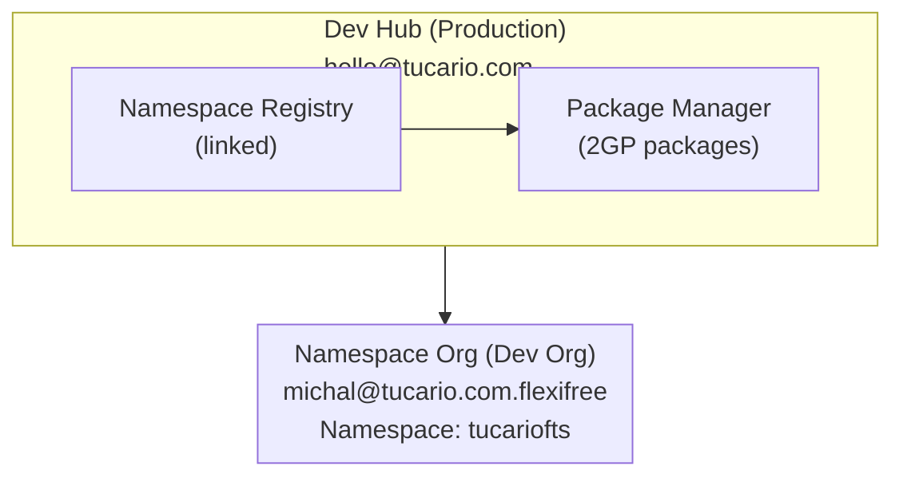

import { Aside } from '@astrojs/starlight/components';

## Architecture



## Prérequis

### 1. Dev Hub (Production)

- Dev Hub activé : Setup > Dev Hub > Enable
- Namespace connecté : App Launcher > Namespace Registries > Link Namespace

### 2. Namespace Org (Partner Developer Org)

- Namespace enregistré (unique, irréversible)
- Setup > Package Manager > Edit > Namespace Prefix

### 3. Environnement local

- Salesforce CLI installé
- Autorisation aux deux organisations

## Référence rapide (copier-coller)

```bash
# 1. Vérifier les organisations
sf org list

# 2. Vérifier les packages
sf package list --target-dev-hub DevHub

# 3. Vérifier les versions
sf package version list --packages FlexibleTeamShare --target-dev-hub DevHub

# 4. Créer une nouvelle version (BETA)
sf package version create --package FlexibleTeamShare --installation-key-bypass --wait 20 --code-coverage --target-dev-hub DevHub --definition-file config/package-scratch-def.json

# 5. Tester l'installation (remplacer l'ID et l'alias de l'organisation)
sf package install --package 04tXXXXXXXXXXXXXXX --target-org TestOrg --wait 10

# 6. Promouvoir en RELEASED (IRRÉVERSIBLE !)
sf package version promote --package 04tXXXXXXXXXXXXXXX --target-dev-hub DevHub
```

## Commandes

### Autorisation d'organisation

```bash
# Dev Hub (production)
sf org login web --alias DevHub --set-default-dev-hub

# Namespace Org (dev org avec namespace)
sf org login web --alias FlexiFREE
```

### Vérifier les organisations connectées

```bash
sf org list
```

### Vérifier les packages existants

```bash
sf package list --target-dev-hub DevHub
```

### Vérifier les versions du package

```bash
sf package version list --packages FlexibleTeamShare --target-dev-hub DevHub
```

## Création d'une nouvelle version du package

### 1. Mettre à jour la version dans sfdx-project.json (optionnel)

```json
{
  "packageDirectories": [
    {
      "versionName": "ver 0.2",
      "versionNumber": "0.2.0.NEXT",
      "path": "force-app",
      "default": true,
      "package": "FlexibleTeamShare"
    }
  ],
  "namespace": "tucariofts"
}
```

### 2. Créer une version du package (beta)

```bash
sf package version create \
  --package FlexibleTeamShare \
  --installation-key-bypass \
  --wait 20 \
  --code-coverage \
  --target-dev-hub DevHub \
  --definition-file config/package-scratch-def.json
```

<Aside type="caution">
Le paramètre `--definition-file` est requis pour la prise en charge des traductions ! Le fichier `config/package-scratch-def.json` contient `enableTranslationWorkbench: true`.
</Aside>

### 3. Tester l'installation

```bash
sf package install \
  --package 04tXXXXXXXXXXXXXXX \
  --target-org TestOrg \
  --wait 10
```

### 4. Promouvoir en version (production)

```bash
sf package version promote \
  --package 04tXXXXXXXXXXXXXXX \
  --target-dev-hub DevHub
```

<Aside type="caution">
Après la promotion, la version est **IRRÉVERSIBLEMENT** publiée et prête pour AppExchange !
</Aside>

## Publication sur AppExchange

1. Connectez-vous à [Partner Community](https://partners.salesforce.com)
2. Publishing > Listings > New Listing
3. Ajoutez la version du package promue
4. Remplissez les détails de la liste
5. Soumettez pour examen

## Dépannage

### "Not available for deploy for this organization" (traductions)

L'organisation scratch n'a pas Translation Workbench activé.

**Solution :** Utilisez `--definition-file config/package-scratch-def.json` qui inclut :

```json
{
  "orgName": "Package Build Org",
  "edition": "Enterprise",
  "settings": {
    "languageSettings": {
      "enableTranslationWorkbench": true,
      "enableEndUserLanguages": true,
      "enablePlatformLanguages": true
    }
  }
}
```

### "No such column" (erreurs FLS)

Utilisez `WITH SYSTEM_MODE` au lieu de `WITH USER_MODE` dans les requêtes SOQL.

### "You cannot deploy to a required field"

Supprimez les champs requis des ensembles de permissions (les champs requis n'ont pas besoin de FLS).
