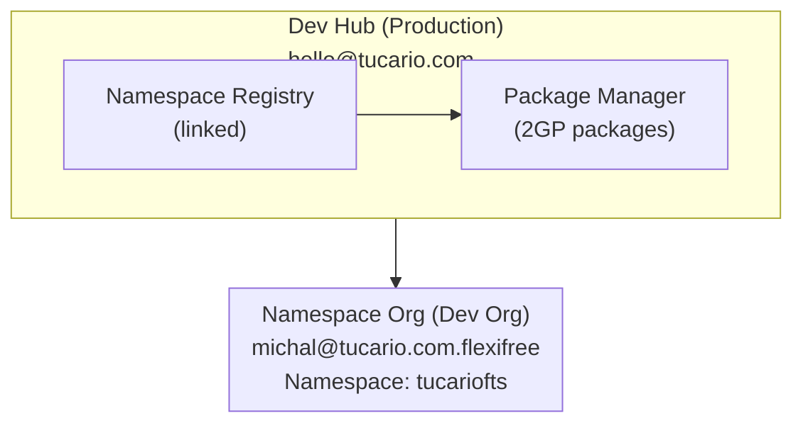

import { Aside } from '@astrojs/starlight/components';

## Architecture



## Prerequisites

### 1. Dev Hub (Production)

- Dev Hub enabled: Setup > Dev Hub > Enable
- Connected namespace: App Launcher > Namespace Registries > Link Namespace

### 2. Namespace Org (Partner Developer Org)

- Registered namespace (one-time, irreversible)
- Setup > Package Manager > Edit > Namespace Prefix

### 3. Local Environment

- Salesforce CLI installed
- Authorization to both orgs

## Quick Reference (Copy-Paste)

```bash
# 1. Check orgs
sf org list

# 2. Check packages
sf package list --target-dev-hub DevHub

# 3. Check versions
sf package version list --packages FlexibleTeamShare --target-dev-hub DevHub

# 4. Create new version (BETA)
sf package version create --package FlexibleTeamShare --installation-key-bypass --wait 20 --code-coverage --target-dev-hub DevHub --definition-file config/package-scratch-def.json

# 5. Test install (replace ID and org alias)
sf package install --package 04tXXXXXXXXXXXXXXX --target-org TestOrg --wait 10

# 6. Promote to RELEASED (IRREVERSIBLE!)
sf package version promote --package 04tXXXXXXXXXXXXXXX --target-dev-hub DevHub
```

## Commands

### Org Authorization

```bash
# Dev Hub (production)
sf org login web --alias DevHub --set-default-dev-hub

# Namespace Org (dev org with namespace)
sf org login web --alias FlexiFREE
```

### Check Connected Orgs

```bash
sf org list
```

### Check Existing Packages

```bash
sf package list --target-dev-hub DevHub
```

### Check Package Versions

```bash
sf package version list --packages FlexibleTeamShare --target-dev-hub DevHub
```

## Creating a New Package Version

### 1. Update Version in sfdx-project.json (optional)

```json
{
  "packageDirectories": [
    {
      "versionName": "ver 0.2",
      "versionNumber": "0.2.0.NEXT",
      "path": "force-app",
      "default": true,
      "package": "FlexibleTeamShare"
    }
  ],
  "namespace": "tucariofts"
}
```

### 2. Create Package Version (beta)

```bash
sf package version create \
  --package FlexibleTeamShare \
  --installation-key-bypass \
  --wait 20 \
  --code-coverage \
  --target-dev-hub DevHub \
  --definition-file config/package-scratch-def.json
```

<Aside type="caution">
The `--definition-file` parameter is required for translation support! The file `config/package-scratch-def.json` contains `enableTranslationWorkbench: true`.
</Aside>

### 3. Test Installation

```bash
sf package install \
  --package 04tXXXXXXXXXXXXXXX \
  --target-org TestOrg \
  --wait 10
```

### 4. Promote to Released (Production)

```bash
sf package version promote \
  --package 04tXXXXXXXXXXXXXXX \
  --target-dev-hub DevHub
```

<Aside type="caution">
After promotion, the version is **IRREVERSIBLY** released and ready for AppExchange!
</Aside>

## Publishing to AppExchange

1. Log in to [Partner Community](https://partners.salesforce.com)
2. Publishing > Listings > New Listing
3. Add promoted package version
4. Fill in listing details
5. Submit for review

## Troubleshooting

### "Not available for deploy for this organization" (Translations)

Scratch org doesn't have Translation Workbench enabled.

**Solution:** Use `--definition-file config/package-scratch-def.json` which includes:

```json
{
  "orgName": "Package Build Org",
  "edition": "Enterprise",
  "settings": {
    "languageSettings": {
      "enableTranslationWorkbench": true,
      "enableEndUserLanguages": true,
      "enablePlatformLanguages": true
    }
  }
}
```

### "No such column" (FLS errors)

Use `WITH SYSTEM_MODE` instead of `WITH USER_MODE` in SOQL queries.

### "You cannot deploy to a required field"

Remove required fields from permission sets (required fields don't need FLS).
