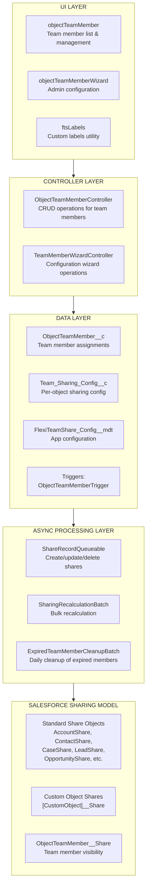
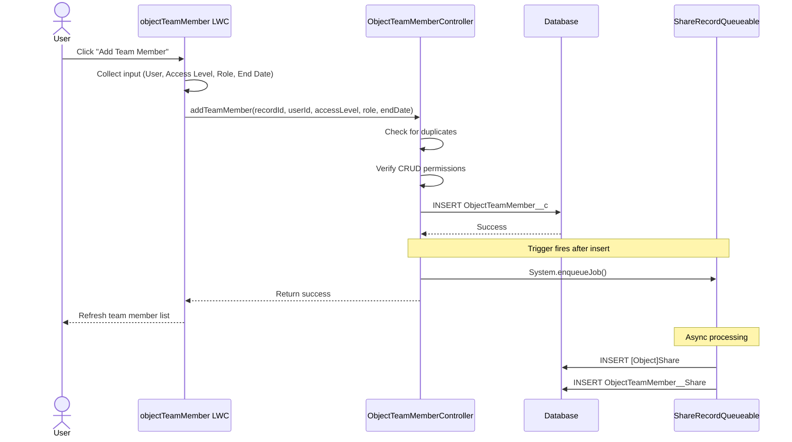
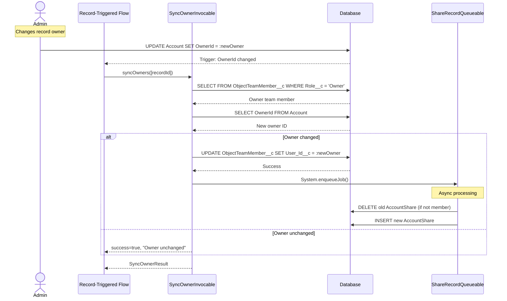
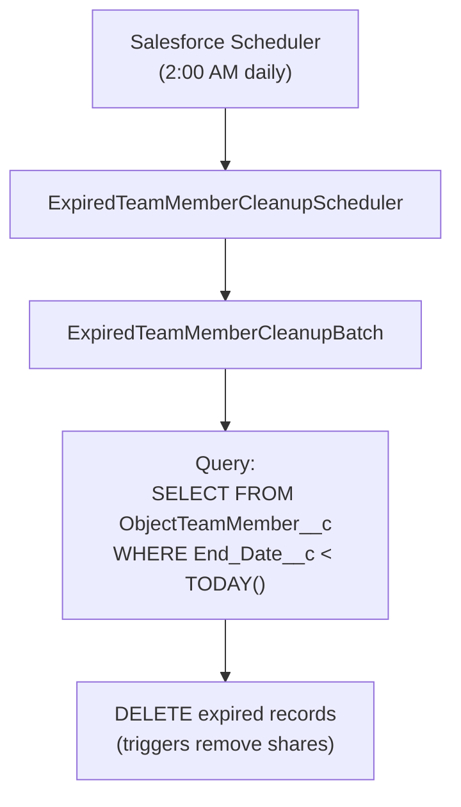

import { Aside } from '@astrojs/starlight/components';

このドキュメントは、システムアーキテクチャ、データフロー、処理レイヤーを含む、Flexible Team Shareソリューションの詳細な技術説明を提供します。

## システムアーキテクチャ

## レイヤー

### UIレイヤー

3つのLightning Web Components：

| コンポーネント | 目的 |
|-----------|---------|
| **objectTeamMember** | レコードページにチームメンバーを表示します。追加/編集/削除、折りたたみ可能なリスト、設定可能な表示制限をサポートします。 |
| **objectTeamMemberWizard** | オブジェクトの設定、設定の管理、ジョブのスケジューリングを行う管理インターフェース。 |
| **ftsLabels** | i18nサポート（35言語）のためのCustom Labelsを提供するユーティリティコンポーネント。 |

### Controllerレイヤー

| Controller | メソッド |
|-----------|---------|
| **ObjectTeamMemberController** | `getTeamMembers()`、`addTeamMember()`、`updateTeamMember()`、`removeTeamMember()`、`isCurrentUserManager()`、`isSharingConfigured()`、`getAccessLevelOptions()` |
| **TeamMemberWizardController** | `getExistingConfigs()`、`getAvailableObjects()`、`createConfig()`、`toggleConfigStatus()`、`deleteConfig()`、`getScheduledJobInfo()`、`scheduleCleanupJob()` |
| **SyncOwnerInvocable** | `syncOwners()` — 親オーナーが変更されたときにOwnerチームメンバーを同期するInvocable Action。FlowまたはApexから呼び出し可能で、完全にバルク化されています。 |

### Dataレイヤー

カスタムオブジェクトと、チームメンバーの変更時に起動するトリガー：

- **ObjectTeamMember__c** — チームメンバーの割り当てを保存
- **Team_Sharing_Config__c** — オブジェクトごとの共有設定
- **FlexiTeamShare_Config__mdt** — アプリレベルの設定（Custom Metadata）
- **ObjectTeamMemberTrigger** → **ObjectTeamMemberTriggerHandler** — Before Insert、Before Update、Before Deleteを処理

### 非同期処理レイヤー

| コンポーネント | タイプ | 目的 |
|-----------|------|---------|
| **ShareRecordQueueable** | Queueable | 親オブジェクトとチームメンバーの共有レコードを作成、更新、削除 |
| **SharingRecalculationBatch** | Batchable | 設定変更時にすべての共有をバルク再計算 |
| **ExpiredTeamMemberCleanupBatch** | Batchable | 期限切れのチームメンバーを削除（毎日のスケジュールジョブ） |
| **ExpiredTeamMemberCleanupScheduler** | Schedulable | クリーンアップバッチをスケジュール（毎日午前2:00に実行） |

## データフロー：チームメンバーの追加

## データフロー：オーナー変更の同期

## データフロー：期限切れメンバーのクリーンアップ

## エラーハンドリング

### Controllerレイヤー

- すべてのpublicメソッドがtry-catchでラップされています
- Custom Labelsを介したユーザーフレンドリーなエラーメッセージ
- LWCエラー表示のための`AuraHandledException`

### 非同期処理

- `Database.insert/update/delete(records, false)` — 部分的な成功
- 個別のエラーはログに記録され、バッチ全体が失敗することはありません
- バッチジョブでエラー統計を追跡

### Triggerレイヤー

- トリガーハンドラーパターンが再帰を防止
- エラーはDML操作の呼び出し元に表示されます

## パフォーマンスに関する考慮事項

### 非同期処理

- 共有レコード操作はQueueableを使用（ノンブロッキング）
- バルク操作は設定可能なバッチサイズでBatchableを使用
- トリガーで共有レコードの同期DMLなし

### クエリの最適化

- WHERE句でインデックス付きフィールドを使用
- `Record_Id__c`形式により効率的なLIKEクエリが可能
- LIMIT句で結果セットを制限

### キャッシング

- 読み取り操作には`@AuraEnabled(cacheable=true)`
- トランザクション内でアプリ設定をキャッシュ

## 統合アーキテクチャ

**外部統合なし** — このパッケージは完全にSalesforce内で動作します：

- HTTPコールアウトなし
- 外部APIなし
- Named Credentialsなし
- External Objectsなし
- Connected Appsなし

### プラットフォームの依存関係

| コンポーネント | 使用方法 |
|-----------|-------|
| Apex Sharing | 共有レコードの作成/管理 |
| Queueable Apex | 非同期共有レコード操作 |
| Batchable Apex | バルク共有再計算、クリーンアップ |
| Schedulable Apex | 毎日のクリーンアップジョブ |
| Custom Metadata | アプリ設定 |
| Lightning Web Components | ユーザーインターフェース |
| Custom Labels | 国際化 |
