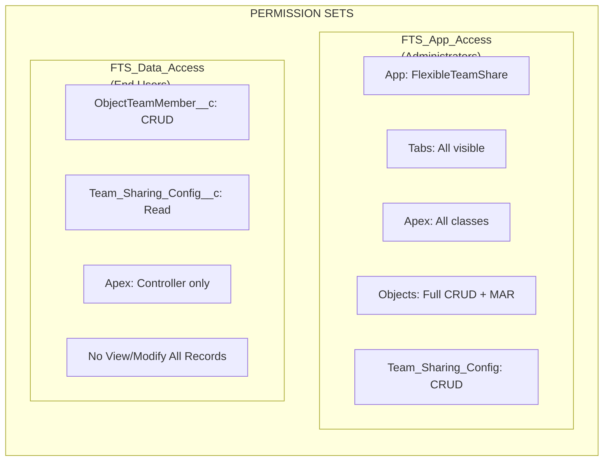
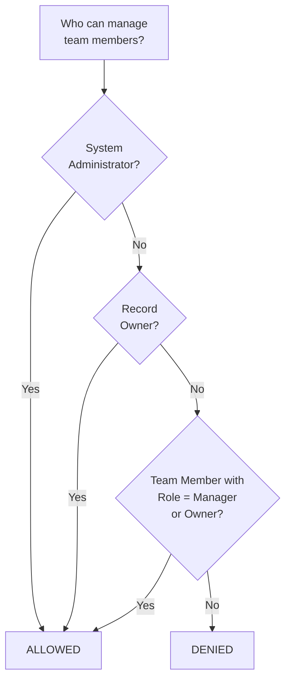
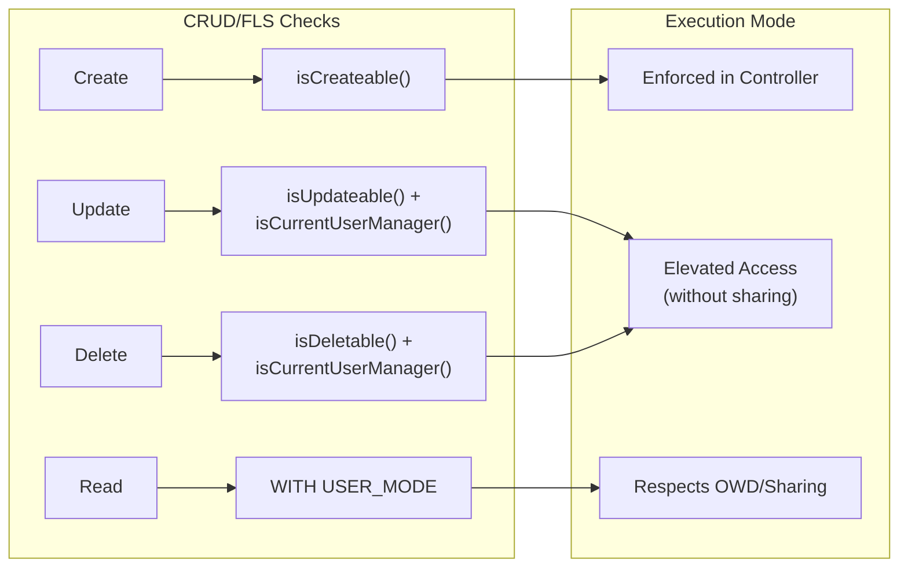
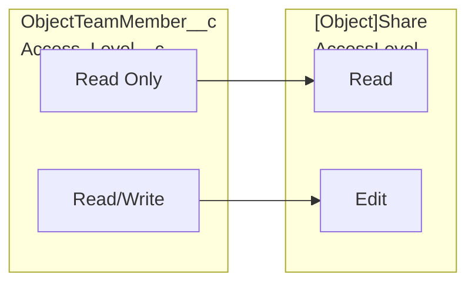
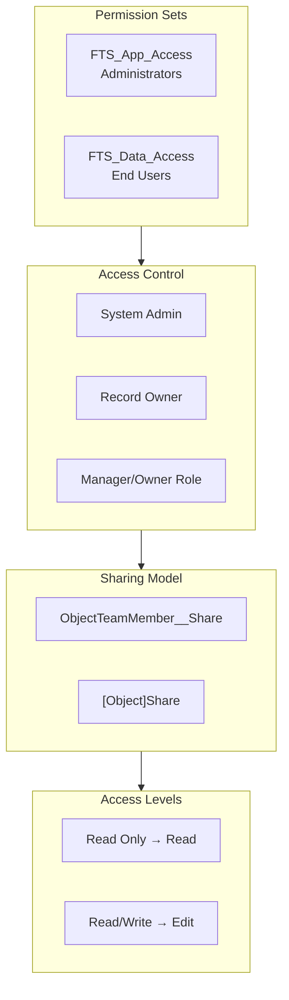

import { Aside } from '@astrojs/starlight/components';

## 権限モデル

### Permission Sets

| Permission Set | 対象者 | 機能 |
|---------------|----------|-------------|
| **FTS_App_Access** | 管理者 | 完全なアプリアクセス、すべてのタブ、すべてのApexクラス、オブジェクトへの完全なCRUD + Modify All Records、Team_Sharing_ConfigのCRUD |
| **FTS_Data_Access** | エンドユーザー | ObjectTeamMember__cのCRUD、Team_Sharing_Config__cの読み取り、コントローラーApexクラスのみ、View/Modify All Recordsなし |

## アクセス制御ロジック

`isCurrentUserManager()`メソッドは、誰がチームメンバーを管理できるかを決定します：

1. **System Administrators** — 常に許可
2. **Record Owners** — 常に許可
3. **Manager/Ownerロールのチームメンバー** — 許可
4. **その他全員** — 拒否

## CRUD/FLS実施

| 操作 | セキュリティチェック | 実装 |
|-----------|---------------|----------------|
| チームメンバー作成 | `Schema.sObjectType.ObjectTeamMember__c.isCreateable()` | コントローラーで実施 |
| チームメンバー更新 | `isUpdateable()` + `isCurrentUserManager()` | 認証後に昇格されたアクセス（without sharing） |
| チームメンバー削除 | `isDeletable()` + `isCurrentUserManager()` | 認証後に昇格されたアクセス（without sharing） |
| チームメンバー読み取り | `WITH USER_MODE` / 共有モデル | OWD/共有を尊重 |

<Aside type="note">
更新および削除操作は、マネージャーが作成したものだけでなく、レコード上の任意のチームメンバーを変更できるように、昇格されたアクセス（`without sharing`）を使用します。認証は常に`isCurrentUserManager()`を介して最初にチェックされます。
</Aside>

## 入力検証

| 入力 | 検証 | 場所 |
|-------|-----------|----------|
| `recordId` | 空白でない、有効なSalesforce ID形式 | Controller |
| `userId` | 空白でない、有効なUser ID | Controller |
| `accessLevel` | 空白でない、有効なピックリスト値 | Controller + Picklist |
| `role` | 空白でない、有効なピックリスト値 | Controller + Picklist |
| `endDate` | 将来の日付またはnullである必要がある | Controller + Validation Rule |
| `objectApiName` | Salesforce IDから導出（ユーザー入力ではない） | Controller |

### 検証ルール

| ルール | オブジェクト | 説明 |
|------|--------|-------------|
| `End_Date_Cannot_Be_Past` | `ObjectTeamMember__c` | 過去の終了日の設定を防止 |

## アクセスレベルマッピング

## 完全なセキュリティ概要

## 実装されたセキュリティベストプラクティス

| 制御 | ステータス | 実装 |
|---------|--------|---------------|
| コントローラーでのCRUDチェック | 実装済み | `isAccessible()`、`isCreateable()`、`isUpdateable()`、`isDeletable()` |
| FLS実施 | 実装済み | Permission Setsがフィールドアクセスを制御 |
| SOQLインジェクション防止 | 実装済み | ユーザー入力にはバインド変数、オブジェクト名にはホワイトリスト |
| 共有モデル | 実装済み | コントローラーで`with sharing`、文書化された場所でのみ`without sharing` |
| 入力検証 | 実装済み | Nullチェック、形式検証、ビジネスルール |
| XSS防止 | 実装済み | LWCフレームワークが出力エンコーディングを処理 |

## 外部統合セキュリティ

| チェック | 結果 |
|-------|--------|
| HTTPコールアウト | なし — パッケージは外部呼び出しを行いません |
| Named Credentials | 使用していません |
| External Objects | 使用していません |
| Remote Site Settings | 不要 |
| CSP違反 | 合格 — Content-Security-Policy違反なし |
