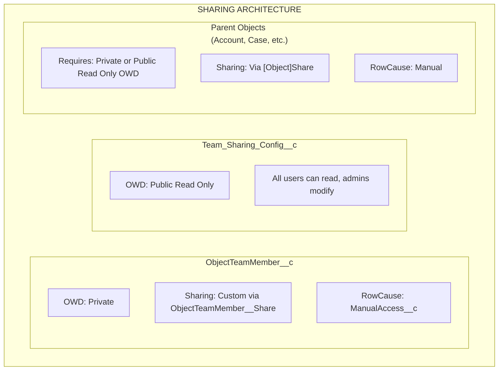

import { Aside } from '@astrojs/starlight/components';

## 共有アーキテクチャ

## 共有の仕組み

### ObjectTeamMember__c

- **OWD**: Private
- **共有メカニズム**: `ObjectTeamMember__Share`を介したカスタム共有
- **RowCause**: `ManualAccess__c`

チームメンバーが追加されると、システムは`ObjectTeamMember__Share`レコードを作成し、チームメンバーが自分のチームメンバーシップレコードを表示できるようにします。

### Team_Sharing_Config__c

- **OWD**: Public Read Only
- すべてのユーザーが設定を読み取ることができます（コンポーネントのレンダリングに必要）
- 管理者のみが設定を変更できます

### 親オブジェクト

- **要件**: オブジェクトは**Private**または**Public Read Only**のOWDを持っている必要があります
- **共有メカニズム**: 標準の`[Object]Share`テーブル（例：`AccountShare`、`CaseShare`）を介して
- **RowCause**: Manual

<Aside type="caution">
親オブジェクトのOWDが**Public Read/Write**に設定されている場合、ユーザーはすでに完全なアクセス権を持っているため、共有レコードで追加のアクセス権を付与できません。Flexible Team Shareが正しく機能するには、PrivateまたはPublic Read OnlyのOWDが必要です。
</Aside>

## アクセスレベルマッピング

チームメンバーがアクセスレベルとともに追加されると、Salesforce共有レコードアクセスにマッピングされます：

| ObjectTeamMember__c Access_Level__c | [Object]Share AccessLevel | 説明 |
|-------------------------------------|--------------------------|-------------|
| **Read Only** | `Read` | チームメンバーはレコードを表示できます |
| **Read/Write** | `Edit` | チームメンバーはレコードを表示および編集できます |

## 共有レコードのライフサイクル

### 共有の作成

チームメンバーが追加されたとき：

1. `ObjectTeamMember__c`レコードが挿入されます
2. トリガーが起動し、`ShareRecordQueueable`をエンキューします
3. Queueableが2つの共有レコードを作成します：
   - **親共有**: ユーザーに親レコードへのアクセスを付与する`[Object]Share`レコード
   - **チームメンバー共有**: ユーザーに自分のチームメンバーシップを表示可能にする`ObjectTeamMember__Share`レコード

### 共有の更新

チームメンバーのアクセスレベルが変更されたとき：

1. `ObjectTeamMember__c`レコードが更新されます
2. トリガーが起動し、`ShareRecordQueueable`をエンキューします
3. Queueableが古い共有を削除し、更新されたアクセスレベルで新しいものを作成します

### 共有の削除

チームメンバーが削除されたとき：

1. `ObjectTeamMember__c`レコードが削除されます
2. トリガーが起動し、`ShareRecordQueueable`をエンキューします
3. Queueableが両方の共有レコード（親とチームメンバー）を削除します

### バルク再計算

共有設定がトグルされたとき：

- **無効化**: `SharingRecalculationBatch`がそのオブジェクトのすべての共有レコードを削除します
- **再有効化**: `SharingRecalculationBatch`がすべての既存のチームメンバーの共有レコードを再作成します

## サポートされている共有オブジェクト

### 標準オブジェクト

| オブジェクト | 共有テーブル |
|--------|------------|
| Account | `AccountShare` |
| Contact | `ContactShare` |
| Case | `CaseShare` |
| Lead | `LeadShare` |
| Opportunity | `OpportunityShare` |
| Campaign | `CampaignShare` |
| Order | `OrderShare` |

### カスタムオブジェクト

カスタムオブジェクトは次のパターンに従います：`ObjectName__c` → `ObjectName__Share`

システムは標準オブジェクトのハードコードされたホワイトリストを使用し、カスタムオブジェクトの共有テーブル名を自動的に導出します。

## デプロイ要件

### 組織要件

- Salesforce **Enterprise Edition**以上（共有モデルサポートのため）
- オブジェクトは共有の恩恵を受けるために**Private**または**Public Read Only**のOWDを持っている必要があります

### ユーザー要件

- ユーザーには適切なPermission Setが割り当てられている必要があります
- ユーザーには基本オブジェクトアクセスが必要です（例：アカウントチームを使用するにはアカウントの読み取りアクセス）
