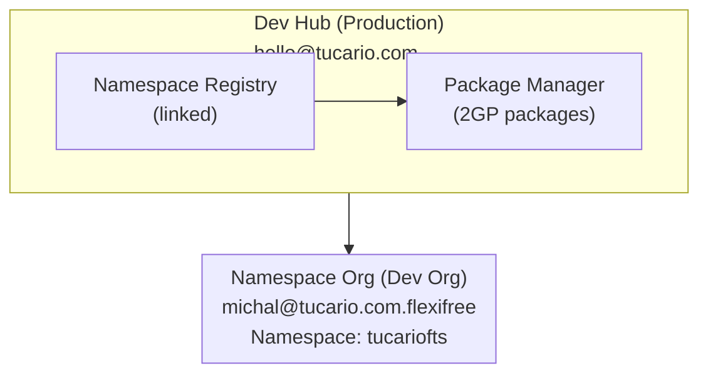

import { Aside } from '@astrojs/starlight/components';

## アーキテクチャ



## 前提条件

### 1. Dev Hub（本番環境）

- Dev Hubが有効：設定 > Dev Hub > 有効化
- 接続されたネームスペース：App Launcher > Namespace Registries > Link Namespace

### 2. Namespace Org（Partner Developer Org）

- 登録されたネームスペース（1回限り、元に戻せません）
- 設定 > Package Manager > 編集 > Namespace Prefix

### 3. ローカル環境

- Salesforce CLIがインストールされている
- 両方の組織への認証

## クイックリファレンス（コピー＆ペースト）

```bash
# 1. 組織を確認
sf org list

# 2. パッケージを確認
sf package list --target-dev-hub DevHub

# 3. バージョンを確認
sf package version list --packages FlexibleTeamShare --target-dev-hub DevHub

# 4. 新しいバージョンを作成（BETA）
sf package version create --package FlexibleTeamShare --installation-key-bypass --wait 20 --code-coverage --target-dev-hub DevHub --definition-file config/package-scratch-def.json

# 5. インストールをテスト（IDと組織エイリアスを置き換える）
sf package install --package 04tXXXXXXXXXXXXXXX --target-org TestOrg --wait 10

# 6. RELEASEDにプロモート（元に戻せません！）
sf package version promote --package 04tXXXXXXXXXXXXXXX --target-dev-hub DevHub
```

## コマンド

### 組織の認証

```bash
# Dev Hub（本番環境）
sf org login web --alias DevHub --set-default-dev-hub

# Namespace Org（ネームスペース付きdev org）
sf org login web --alias FlexiFREE
```

### 接続された組織を確認

```bash
sf org list
```

### 既存のパッケージを確認

```bash
sf package list --target-dev-hub DevHub
```

### パッケージバージョンを確認

```bash
sf package version list --packages FlexibleTeamShare --target-dev-hub DevHub
```

## 新しいパッケージバージョンの作成

### 1. sfdx-project.jsonでバージョンを更新（オプション）

```json
{
  "packageDirectories": [
    {
      "versionName": "ver 0.2",
      "versionNumber": "0.2.0.NEXT",
      "path": "force-app",
      "default": true,
      "package": "FlexibleTeamShare"
    }
  ],
  "namespace": "tucariofts"
}
```

### 2. パッケージバージョンを作成（beta）

```bash
sf package version create \
  --package FlexibleTeamShare \
  --installation-key-bypass \
  --wait 20 \
  --code-coverage \
  --target-dev-hub DevHub \
  --definition-file config/package-scratch-def.json
```

<Aside type="caution">
翻訳サポートには`--definition-file`パラメータが必要です！ファイル`config/package-scratch-def.json`には`enableTranslationWorkbench: true`が含まれています。
</Aside>

### 3. インストールをテスト

```bash
sf package install \
  --package 04tXXXXXXXXXXXXXXX \
  --target-org TestOrg \
  --wait 10
```

### 4. Released（本番環境）にプロモート

```bash
sf package version promote \
  --package 04tXXXXXXXXXXXXXXX \
  --target-dev-hub DevHub
```

<Aside type="caution">
プロモート後、バージョンは**元に戻せず**にリリースされ、AppExchangeに対応します！
</Aside>

## AppExchangeへの公開

1. [Partner Community](https://partners.salesforce.com)にログイン
2. Publishing > Listings > New Listing
3. プロモートされたパッケージバージョンを追加
4. リスティング詳細を入力
5. レビューのために送信

## トラブルシューティング

### 「この組織ではデプロイに使用できません」（翻訳）

スクラッチ組織でTranslation Workbenchが有効になっていません。

**解決策：** 次を含む`--definition-file config/package-scratch-def.json`を使用：

```json
{
  "orgName": "Package Build Org",
  "edition": "Enterprise",
  "settings": {
    "languageSettings": {
      "enableTranslationWorkbench": true,
      "enableEndUserLanguages": true,
      "enablePlatformLanguages": true
    }
  }
}
```

### 「そのような列はありません」（FLSエラー）

SOQLクエリで`WITH USER_MODE`の代わりに`WITH SYSTEM_MODE`を使用します。

### 「必須フィールドにデプロイできません」

Permission Setから必須フィールドを削除します（必須フィールドにはFLSが不要です）。
