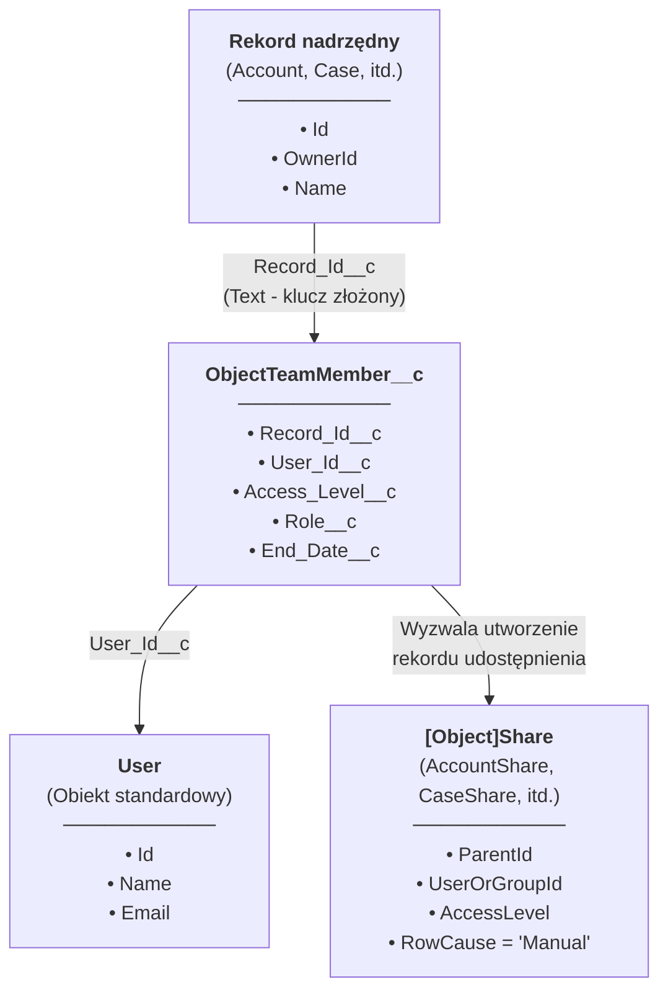
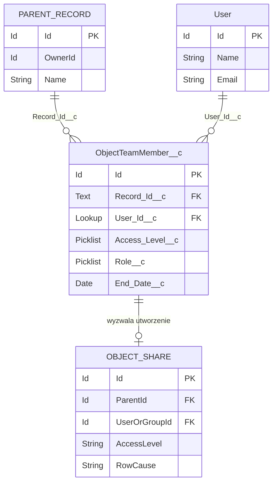
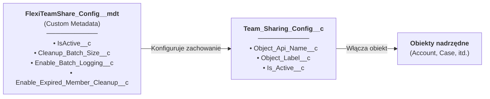
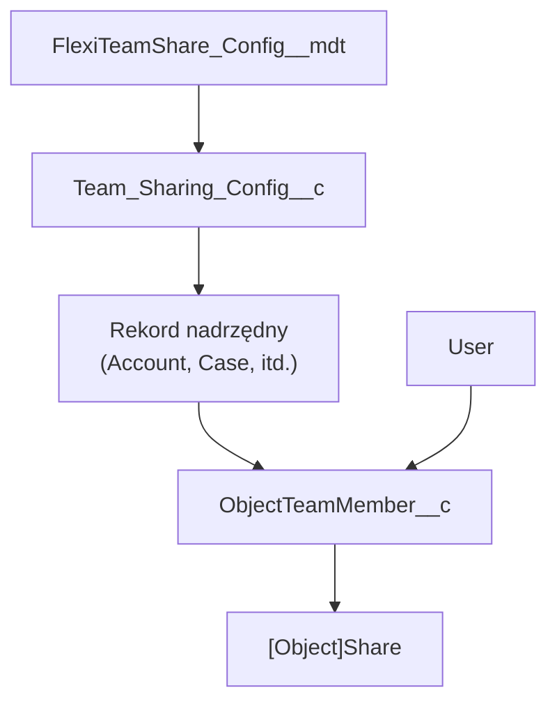

## Główny model danych

## Diagram relacji encji

## Obiekty niestandardowe

### ObjectTeamMember__c

Przechowuje przypisania członków zespołu łączące użytkownika z rekordem nadrzędnym.

| Pole | Typ | Opis |
|-------|------|-------------|
| `Record_Id__c` | Text | Klucz złożony w formacie `ObjectName:RecordId` |
| `User_Id__c` | Lookup(User) | Użytkownik będący członkiem zespołu |
| `Access_Level__c` | Picklist | Read Only, Read/Write |
| `Role__c` | Picklist | Owner, Manager, User |
| `End_Date__c` | Date | Opcjonalna data wygaśnięcia dla dostępu tymczasowego |

### Team_Sharing_Config__c

Konfiguracja udostępniania per obiekt.

| Pole | Typ | Opis |
|-------|------|-------------|
| `Object_Api_Name__c` | Text | Nazwa API skonfigurowanego obiektu |
| `Object_Label__c` | Text | Etykieta wyświetlana dla obiektu |
| `Is_Active__c` | Checkbox | Czy udostępnianie zespołowe jest aktywne dla tego obiektu |

### FlexiTeamShare_Config__mdt

Konfiguracja na poziomie aplikacji przechowywana jako Custom Metadata.

| Pole | Typ | Opis |
|-------|------|-------------|
| `IsActive__c` | Checkbox | Główny przełącznik dla aplikacji |
| `Cleanup_Batch_Size__c` | Number | Rozmiar partii dla zadań czyszczenia |
| `Enable_Batch_Logging__c` | Checkbox | Włącz logowanie debugowania w zadaniach wsadowych |
| `Enable_Expired_Member_Cleanup__c` | Checkbox | Włącz automatyczne czyszczenie wygasłych członków |

## Obiekty konfiguracyjne

## Pełny przegląd modelu

