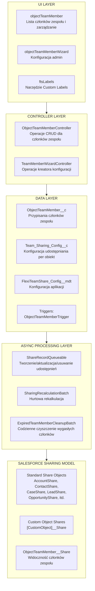
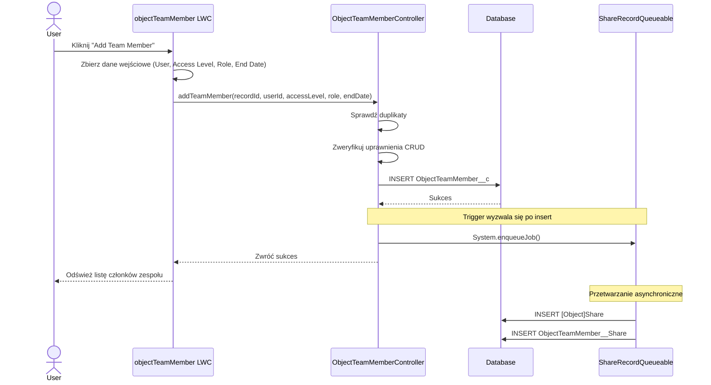
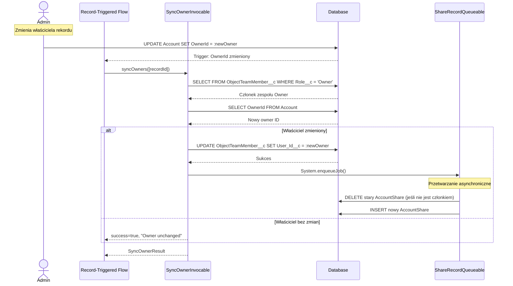
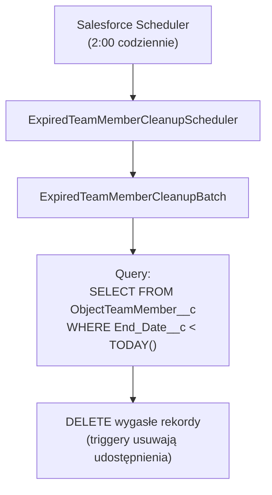

import { Aside } from '@astrojs/starlight/components';

Niniejszy dokument zawiera szczegółowy opis techniczny rozwiązania Flexible Team Share, w tym architekturę systemu, przepływ danych i warstwy przetwarzania.

## Architektura systemu

## Warstwy

### Warstwa UI

Trzy Lightning Web Components:

| Komponent | Przeznaczenie |
|-----------|---------|
| **objectTeamMember** | Wyświetla członków zespołu na stronach rekordów. Obsługuje dodawanie/edycję/usuwanie, zwijanie listy i konfigurowalny limit wyświetlania. |
| **objectTeamMemberWizard** | Interfejs administracyjny do konfiguracji obiektów, zarządzania ustawieniami i planowania zadań. |
| **ftsLabels** | Komponent narzędziowy zapewniający Custom Labels dla obsługi i18n (35 języków). |

### Warstwa kontrolera

| Kontroler | Metody |
|-----------|---------|
| **ObjectTeamMemberController** | `getTeamMembers()`, `addTeamMember()`, `updateTeamMember()`, `removeTeamMember()`, `isCurrentUserManager()`, `isSharingConfigured()`, `getAccessLevelOptions()` |
| **TeamMemberWizardController** | `getExistingConfigs()`, `getAvailableObjects()`, `createConfig()`, `toggleConfigStatus()`, `deleteConfig()`, `getScheduledJobInfo()`, `scheduleCleanupJob()` |
| **SyncOwnerInvocable** | `syncOwners()` — Invocable Action do synchronizacji członka zespołu Owner, gdy zmienia się właściciel nadrzędny. Wywoływalna z Flow lub Apex, w pełni zbulkowana. |

### Warstwa danych

Obiekty niestandardowe i trigger wyzwalany przy zmianach członków zespołu:

- **ObjectTeamMember__c** — przechowuje przypisania członków zespołu
- **Team_Sharing_Config__c** — konfiguracja udostępniania per obiekt
- **FlexiTeamShare_Config__mdt** — konfiguracja na poziomie aplikacji (Custom Metadata)
- **ObjectTeamMemberTrigger** → **ObjectTeamMemberTriggerHandler** — obsługuje Before Insert, Before Update, Before Delete

### Warstwa przetwarzania asynchronicznego

| Komponent | Typ | Przeznaczenie |
|-----------|------|---------|
| **ShareRecordQueueable** | Queueable | Tworzy, aktualizuje i usuwa rekordy udostępnień dla obiektów nadrzędnych i członków zespołu |
| **SharingRecalculationBatch** | Batchable | Hurtowa rekalkulacja wszystkich udostępnień przy zmianie konfiguracji |
| **ExpiredTeamMemberCleanupBatch** | Batchable | Usuwa wygasłych członków zespołu (codzienne zaplanowane zadanie) |
| **ExpiredTeamMemberCleanupScheduler** | Schedulable | Planuje zadanie czyszczenia (uruchamia się codziennie o 2:00) |

## Przepływ danych: dodawanie członka zespołu

## Przepływ danych: synchronizacja zmiany właściciela

## Przepływ danych: czyszczenie wygasłych członków

## Obsługa błędów

### Warstwa kontrolera

- Wszystkie metody publiczne opakowane w try-catch
- Przyjazne użytkownikowi komunikaty błędów za pomocą Custom Labels
- `AuraHandledException` dla wyświetlania błędów LWC

### Przetwarzanie asynchroniczne

- `Database.insert/update/delete(records, false)` — częściowy sukces
- Indywidualne błędy logowane, nie powodują niepowodzenia całej partii
- Statystyki błędów śledzone w zadaniach wsadowych

### Warstwa triggera

- Wzorzec trigger handler zapobiega rekurencji
- Błędy przekazywane do wywołującego operację DML

## Zagadnienia wydajnościowe

### Przetwarzanie asynchroniczne

- Operacje na rekordach udostępnień wykorzystują Queueable (nieblokujące)
- Operacje hurtowe wykorzystują Batchable z konfigurowalnym rozmiarem partii
- Brak synchronicznych operacji DML na rekordach udostępnień w triggerach

### Optymalizacja zapytań

- Pola indeksowane używane w klauzulach WHERE
- Format `Record_Id__c` umożliwia efektywne zapytania LIKE
- Ograniczone zestawy wyników za pomocą klauzul LIMIT

### Cachowanie

- `@AuraEnabled(cacheable=true)` dla operacji odczytu
- Konfiguracja aplikacji cachowana w transakcji

## Architektura integracji

**Brak integracji zewnętrznych** — ten pakiet działa w całości w ramach Salesforce:

- Brak wywołań HTTP
- Brak zewnętrznych API
- Brak Named Credentials
- Brak External Objects
- Brak Connected Apps

### Zależności platformowe

| Komponent | Użycie |
|-----------|-------|
| Apex Sharing | Tworzy/zarządza rekordami udostępnień |
| Queueable Apex | Asynchroniczne operacje na rekordach udostępnień |
| Batchable Apex | Hurtowa rekalkulacja udostępnień, czyszczenie |
| Schedulable Apex | Codzienne zadanie czyszczenia |
| Custom Metadata | Konfiguracja aplikacji |
| Lightning Web Components | Interfejs użytkownika |
| Custom Labels | Internacjonalizacja |
