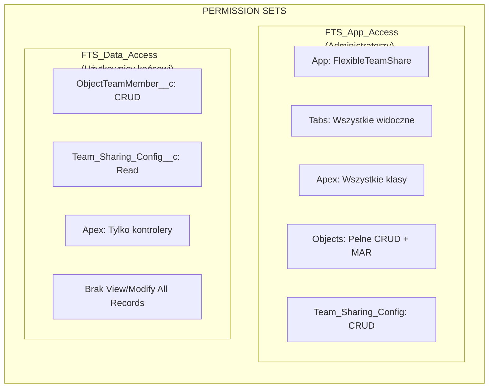
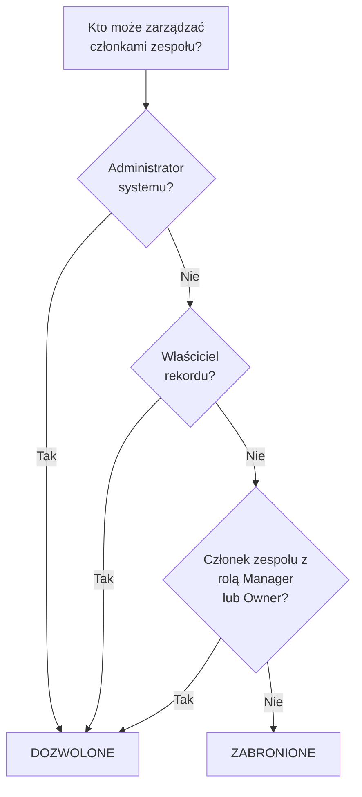
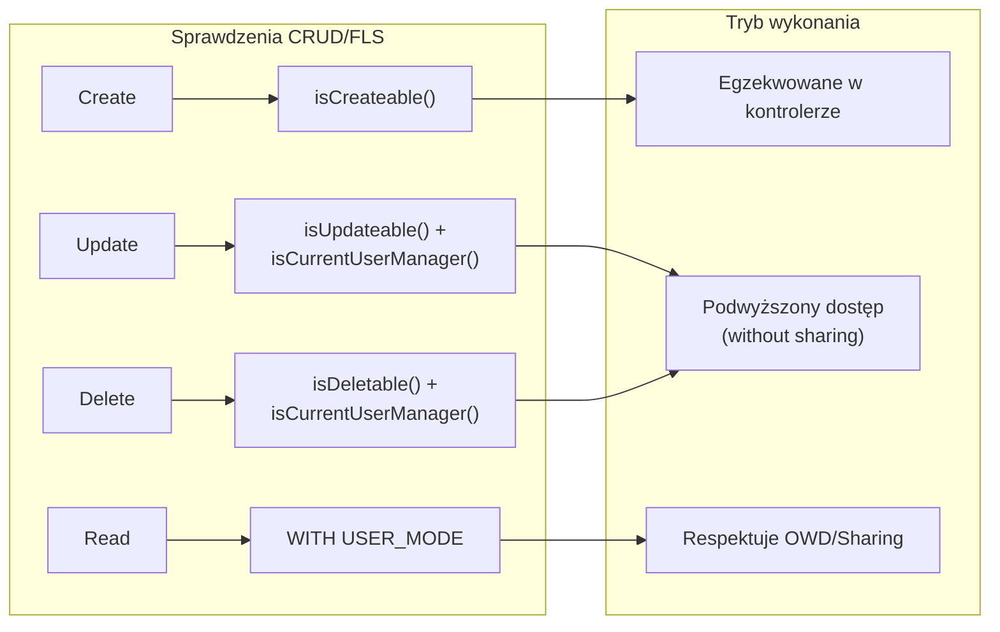
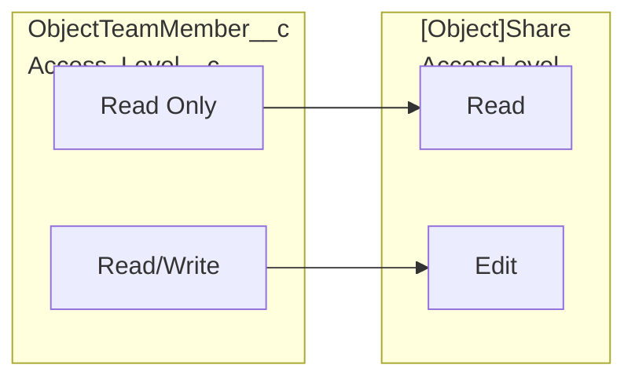
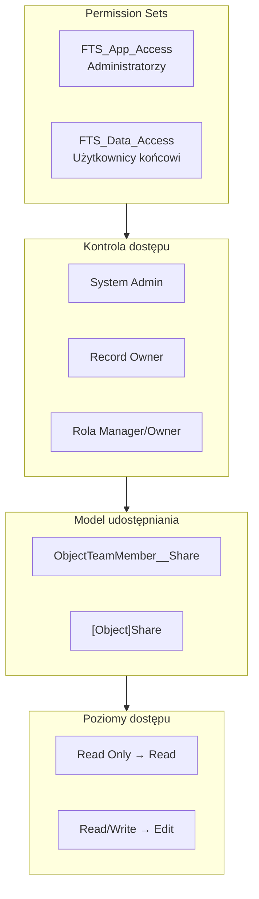

import { Aside } from '@astrojs/starlight/components';

## Model uprawnień

### Permission Sets

| Permission Set | Odbiorcy | Możliwości |
|---------------|----------|-------------|
| **FTS_App_Access** | Administratorzy | Pełny dostęp do aplikacji, wszystkie zakładki, wszystkie klasy Apex, pełne CRUD + Modify All Records na obiektach, CRUD Team_Sharing_Config |
| **FTS_Data_Access** | Użytkownicy końcowi | CRUD ObjectTeamMember__c, odczyt Team_Sharing_Config__c, tylko klasy kontrolerów Apex, brak View/Modify All Records |

## Logika kontroli dostępu

Metoda `isCurrentUserManager()` określa, kto może zarządzać członkami zespołu:

1. **Administratorzy systemu** — zawsze dozwolone
2. **Właściciele rekordów** — zawsze dozwolone
3. **Członkowie zespołu z rolą Manager/Owner** — dozwolone
4. **Wszyscy pozostali** — zabronione

## Egzekwowanie CRUD/FLS

| Operacja | Sprawdzenie bezpieczeństwa | Implementacja |
|-----------|---------------|----------------|
| Utwórz członka zespołu | `Schema.sObjectType.ObjectTeamMember__c.isCreateable()` | Egzekwowane w kontrolerze |
| Aktualizuj członka zespołu | `isUpdateable()` + `isCurrentUserManager()` | Podwyższony dostęp (without sharing) po autoryzacji |
| Usuń członka zespołu | `isDeletable()` + `isCurrentUserManager()` | Podwyższony dostęp (without sharing) po autoryzacji |
| Odczyt członków zespołu | `WITH USER_MODE` / model udostępniania | Respektuje OWD/sharing |

<Aside type="note">
Operacje Update i Delete używają podwyższonego dostępu (`without sharing`), aby umożliwić menedżerom modyfikację dowolnego członka zespołu w rekordzie, nie tylko tych, których sami utworzyli. Autoryzacja jest zawsze sprawdzana najpierw za pomocą `isCurrentUserManager()`.
</Aside>

## Walidacja danych wejściowych

| Dane wejściowe | Walidacja | Lokalizacja |
|-------|-----------|----------|
| `recordId` | Nie puste, prawidłowy format ID Salesforce | Kontroler |
| `userId` | Nie puste, prawidłowe ID użytkownika | Kontroler |
| `accessLevel` | Nie puste, prawidłowa wartość z listy wyboru | Kontroler + Picklist |
| `role` | Nie puste, prawidłowa wartość z listy wyboru | Kontroler + Picklist |
| `endDate` | Musi być datą przyszłą lub null | Kontroler + Validation Rule |
| `objectApiName` | Wyprowadzane z ID Salesforce (nie dane wejściowe użytkownika) | Kontroler |

### Reguły walidacji

| Reguła | Obiekt | Opis |
|------|--------|-------------|
| `End_Date_Cannot_Be_Past` | `ObjectTeamMember__c` | Zapobiega ustawieniu daty końcowej w przeszłości |

## Mapowanie poziomu dostępu

## Pełny przegląd bezpieczeństwa

## Zaimplementowane najlepsze praktyki bezpieczeństwa

| Kontrola | Status | Implementacja |
|---------|--------|---------------|
| Sprawdzenia CRUD w kontrolerach | Zaimplementowane | `isAccessible()`, `isCreateable()`, `isUpdateable()`, `isDeletable()` |
| Egzekwowanie FLS | Zaimplementowane | Permission Sets kontrolują dostęp do pól |
| Zapobieganie wstrzykiwaniu SOQL | Zaimplementowane | Bind variables dla danych wejściowych użytkownika, whitelist dla nazw obiektów |
| Model udostępniania | Zaimplementowane | `with sharing` na kontrolerach, `without sharing` tylko tam, gdzie udokumentowane |
| Walidacja danych wejściowych | Zaimplementowane | Sprawdzenia null, walidacja formatu, reguły biznesowe |
| Zapobieganie XSS | Zaimplementowane | Framework LWC obsługuje kodowanie wyjścia |

## Bezpieczeństwo integracji zewnętrznych

| Sprawdzenie | Wynik |
|-------|--------|
| Wywołania HTTP | Brak — pakiet nie wykonuje wywołań zewnętrznych |
| Named Credentials | Nie używane |
| External Objects | Nie używane |
| Remote Site Settings | Niewymagane |
| Naruszenia CSP | Zaliczone — brak naruszeń Content-Security-Policy |
