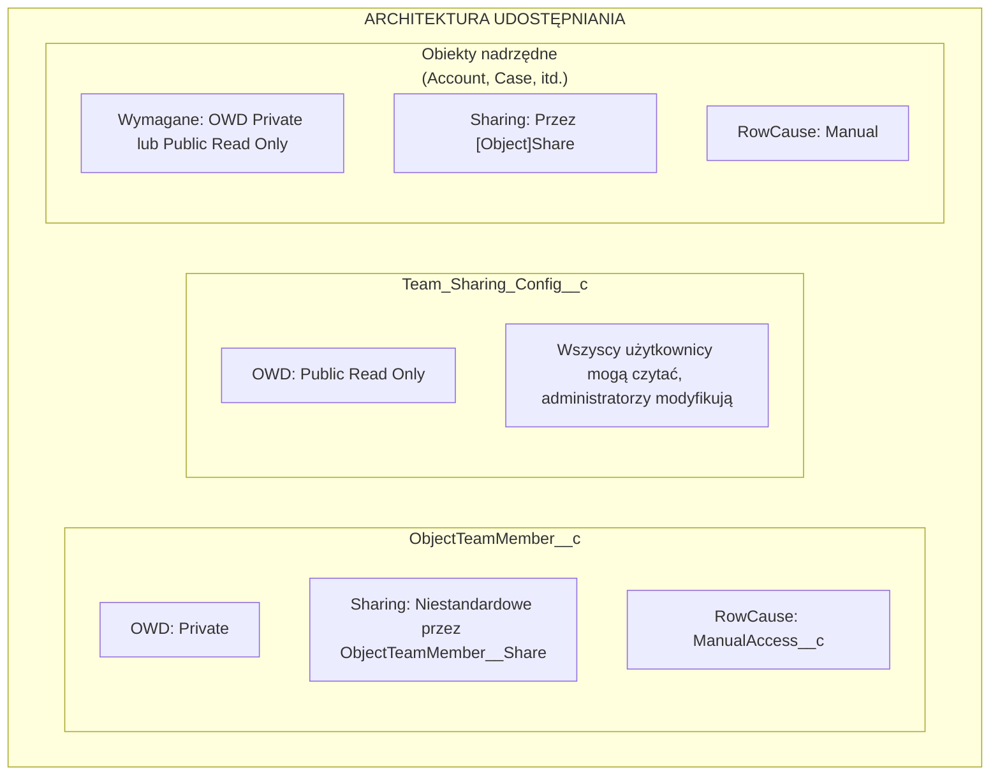

import { Aside } from '@astrojs/starlight/components';

## Architektura udostępniania

## Jak działa udostępnianie

### ObjectTeamMember__c

- **OWD**: Private
- **Mechanizm udostępniania**: Niestandardowe udostępnianie przez `ObjectTeamMember__Share`
- **RowCause**: `ManualAccess__c`

Gdy członek zespołu jest dodawany, system tworzy rekord `ObjectTeamMember__Share`, aby członek zespołu mógł zobaczyć własny rekord członkostwa w zespole.

### Team_Sharing_Config__c

- **OWD**: Public Read Only
- Wszyscy użytkownicy mogą odczytać konfigurację (potrzebne do renderowania komponentu)
- Tylko administratorzy mogą modyfikować konfiguracje

### Obiekty nadrzędne

- **Wymaganie**: Obiekty muszą mieć OWD ustawione na **Private** lub **Public Read Only**
- **Mechanizm udostępniania**: Przez standardowe tabele `[Object]Share` (np. `AccountShare`, `CaseShare`)
- **RowCause**: Manual

<Aside type="caution">
Jeśli OWD obiektu nadrzędnego jest ustawione na **Public Read/Write**, rekordy udostępnień nie mogą przyznać dodatkowego dostępu, ponieważ użytkownicy mają już pełny dostęp. Flexible Team Share wymaga OWD Private lub Public Read Only, aby działać prawidłowo.
</Aside>

## Mapowanie poziomu dostępu

Gdy członek zespołu jest dodawany z poziomem dostępu, jest on mapowany na dostęp rekordu udostępnienia Salesforce:

| ObjectTeamMember__c Access_Level__c | [Object]Share AccessLevel | Opis |
|-------------------------------------|--------------------------|-------------|
| **Read Only** | `Read` | Członek zespołu może przeglądać rekord |
| **Read/Write** | `Edit` | Członek zespołu może przeglądać i edytować rekord |

## Cykl życia rekordu udostępnienia

### Tworzenie udostępnień

Gdy członek zespołu jest dodawany:

1. Wstawiany jest rekord `ObjectTeamMember__c`
2. Wyzwalany jest trigger i kolejkowany `ShareRecordQueueable`
3. Queueable tworzy dwa rekordy udostępnień:
   - **Udostępnienie nadrzędne**: rekord `[Object]Share` przyznający użytkownikowi dostęp do rekordu nadrzędnego
   - **Udostępnienie członka zespołu**: rekord `ObjectTeamMember__Share` przyznający użytkownikowi widoczność jego członkostwa w zespole

### Aktualizacja udostępnień

Gdy zmienia się poziom dostępu członka zespołu:

1. Aktualizowany jest rekord `ObjectTeamMember__c`
2. Wyzwalany jest trigger i kolejkowany `ShareRecordQueueable`
3. Queueable usuwa stare udostępnienie i tworzy nowe z zaktualizowanym poziomem dostępu

### Usuwanie udostępnień

Gdy członek zespołu jest usuwany:

1. Usuwany jest rekord `ObjectTeamMember__c`
2. Wyzwalany jest trigger i kolejkowany `ShareRecordQueueable`
3. Queueable usuwa oba rekordy udostępnień (nadrzędny i członka zespołu)

### Rekalkulacja hurtowa

Gdy konfiguracja udostępniania jest przełączana:

- **Dezaktywowana**: `SharingRecalculationBatch` usuwa wszystkie rekordy udostępnień dla tego obiektu
- **Reaktywowana**: `SharingRecalculationBatch` odtwarza rekordy udostępnień dla wszystkich istniejących członków zespołu

## Obsługiwane obiekty udostępnień

### Obiekty standardowe

| Obiekt | Tabela udostępnień |
|--------|------------|
| Account | `AccountShare` |
| Contact | `ContactShare` |
| Case | `CaseShare` |
| Lead | `LeadShare` |
| Opportunity | `OpportunityShare` |
| Campaign | `CampaignShare` |
| Order | `OrderShare` |

### Obiekty niestandardowe

Obiekty niestandardowe podlegają wzorcowi: `ObjectName__c` → `ObjectName__Share`

System używa zakodowanej listy dozwolonych dla obiektów standardowych i automatycznie wyprowadza nazwę tabeli udostępnień dla obiektów niestandardowych.

## Wymagania wdrożeniowe

### Wymagania organizacji

- Salesforce **Enterprise Edition** lub wyższa (dla obsługi modelu udostępniania)
- Obiekty muszą mieć OWD ustawione na **Private** lub **Public Read Only**, aby skorzystać z udostępniania

### Wymagania użytkownika

- Użytkownicy potrzebują przypisanego odpowiedniego Permission Set
- Użytkownicy potrzebują podstawowego dostępu do obiektu (np. dostęp odczytu Account, aby korzystać z zespołów Account)
