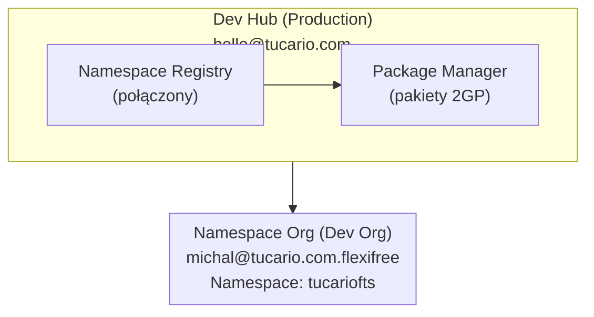

import { Aside } from '@astrojs/starlight/components';

## Architektura



## Wymagania wstępne

### 1. Dev Hub (Production)

- Dev Hub włączony: Setup > Dev Hub > Enable
- Połączony namespace: App Launcher > Namespace Registries > Link Namespace

### 2. Namespace Org (Partner Developer Org)

- Zarejestrowany namespace (jednorazowo, nieodwracalnie)
- Setup > Package Manager > Edit > Namespace Prefix

### 3. Środowisko lokalne

- Zainstalowane Salesforce CLI
- Autoryzacja do obu organizacji

## Szybka referencja (kopiuj-wklej)

```bash
# 1. Sprawdź organizacje
sf org list

# 2. Sprawdź pakiety
sf package list --target-dev-hub DevHub

# 3. Sprawdź wersje
sf package version list --packages FlexibleTeamShare --target-dev-hub DevHub

# 4. Utwórz nową wersję (BETA)
sf package version create --package FlexibleTeamShare --installation-key-bypass --wait 20 --code-coverage --target-dev-hub DevHub --definition-file config/package-scratch-def.json

# 5. Testowa instalacja (zastąp ID i alias org)
sf package install --package 04tXXXXXXXXXXXXXXX --target-org TestOrg --wait 10

# 6. Promuj do RELEASED (NIEODWRACALNE!)
sf package version promote --package 04tXXXXXXXXXXXXXXX --target-dev-hub DevHub
```

## Polecenia

### Autoryzacja organizacji

```bash
# Dev Hub (production)
sf org login web --alias DevHub --set-default-dev-hub

# Namespace Org (dev org z namespace)
sf org login web --alias FlexiFREE
```

### Sprawdzenie połączonych organizacji

```bash
sf org list
```

### Sprawdzenie istniejących pakietów

```bash
sf package list --target-dev-hub DevHub
```

### Sprawdzenie wersji pakietów

```bash
sf package version list --packages FlexibleTeamShare --target-dev-hub DevHub
```

## Tworzenie nowej wersji pakietu

### 1. Aktualizacja wersji w sfdx-project.json (opcjonalnie)

```json
{
  "packageDirectories": [
    {
      "versionName": "ver 0.2",
      "versionNumber": "0.2.0.NEXT",
      "path": "force-app",
      "default": true,
      "package": "FlexibleTeamShare"
    }
  ],
  "namespace": "tucariofts"
}
```

### 2. Utworzenie wersji pakietu (beta)

```bash
sf package version create \
  --package FlexibleTeamShare \
  --installation-key-bypass \
  --wait 20 \
  --code-coverage \
  --target-dev-hub DevHub \
  --definition-file config/package-scratch-def.json
```

<Aside type="caution">
Parametr `--definition-file` jest wymagany dla obsługi tłumaczeń! Plik `config/package-scratch-def.json` zawiera `enableTranslationWorkbench: true`.
</Aside>

### 3. Testowa instalacja

```bash
sf package install \
  --package 04tXXXXXXXXXXXXXXX \
  --target-org TestOrg \
  --wait 10
```

### 4. Promuj do wydanej (Production)

```bash
sf package version promote \
  --package 04tXXXXXXXXXXXXXXX \
  --target-dev-hub DevHub
```

<Aside type="caution">
Po promowaniu wersja jest **NIEODWRACALNIE** wydana i gotowa do AppExchange!
</Aside>

## Publikowanie na AppExchange

1. Zaloguj się do [Partner Community](https://partners.salesforce.com)
2. Publishing > Listings > New Listing
3. Dodaj promowaną wersję pakietu
4. Wypełnij szczegóły oferty
5. Prześlij do przeglądu

## Rozwiązywanie problemów

### "Not available for deploy for this organization" (Tłumaczenia)

Organizacja scratch nie ma włączonego Translation Workbench.

**Rozwiązanie:** Użyj `--definition-file config/package-scratch-def.json`, który zawiera:

```json
{
  "orgName": "Package Build Org",
  "edition": "Enterprise",
  "settings": {
    "languageSettings": {
      "enableTranslationWorkbench": true,
      "enableEndUserLanguages": true,
      "enablePlatformLanguages": true
    }
  }
}
```

### "No such column" (błędy FLS)

Użyj `WITH SYSTEM_MODE` zamiast `WITH USER_MODE` w zapytaniach SOQL.

### "You cannot deploy to a required field"

Usuń wymagane pola z Permission Sets (wymagane pola nie potrzebują FLS).
