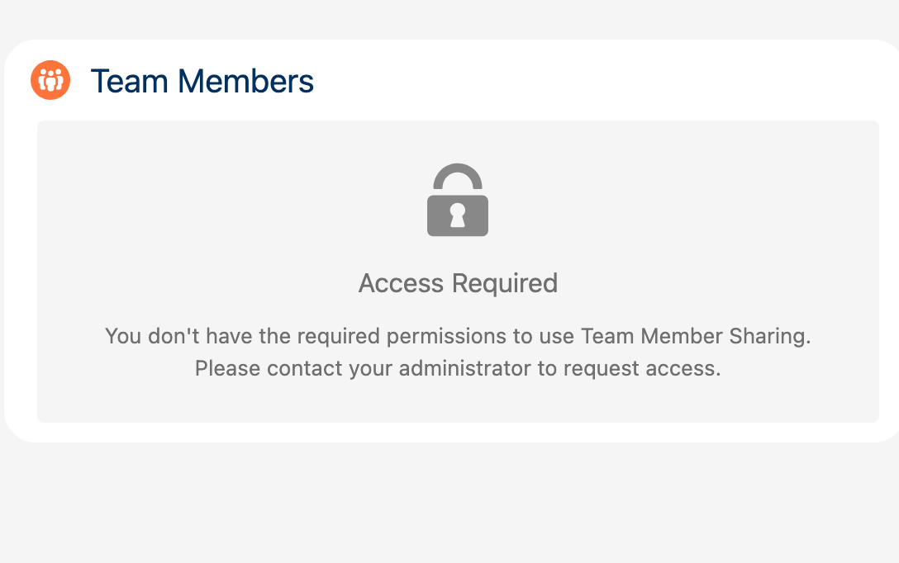

## Przypadek użycia 8: Dostęp bez Permission Set

### Cel

Weryfikacja zachowania, gdy użytkownik nie ma wymaganych uprawnień.

### Wymagania wstępne

- Użytkownik BEZ Permission Set FTS_Data_Access
- Strona rekordu z komponentem Object Team

### Kroki

| Krok | Akcja | Oczekiwany wynik |
|------|--------|----------------|
| 1 | Otwórz stronę rekordu | Strona się ładuje |
| 2 | Wyświetl komponent Object Team | Wyświetlony komunikat błędu |

### Punkty weryfikacji

- [ ] Jasny komunikat błędu o braku dostępu
- [ ] Brak ujawnionych danych
- [ ] Brak błędów/wyjątków systemowych
