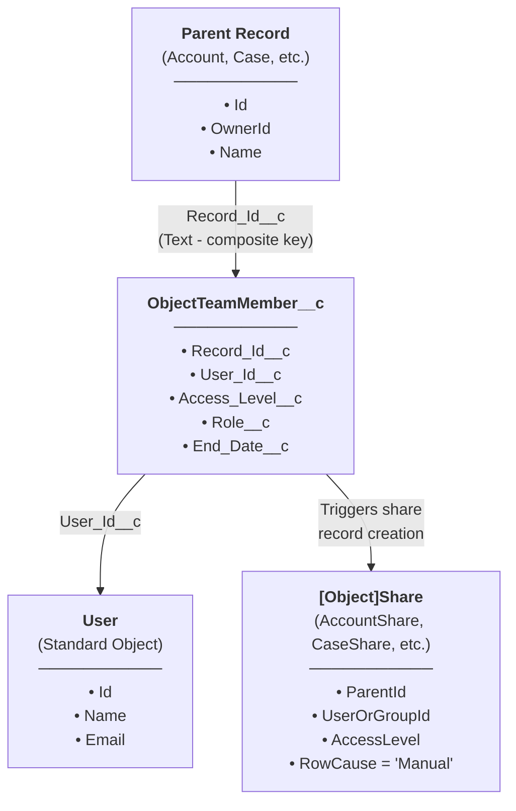
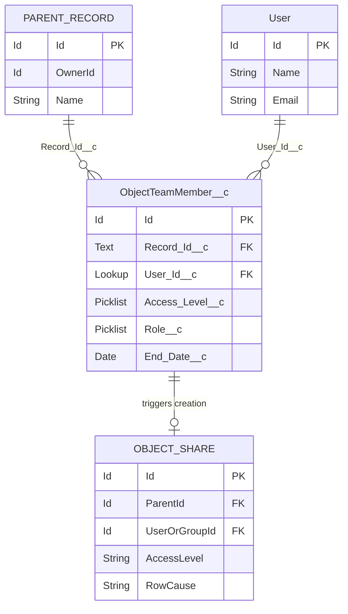
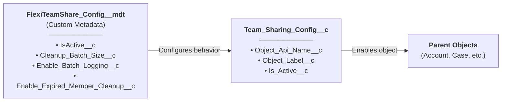
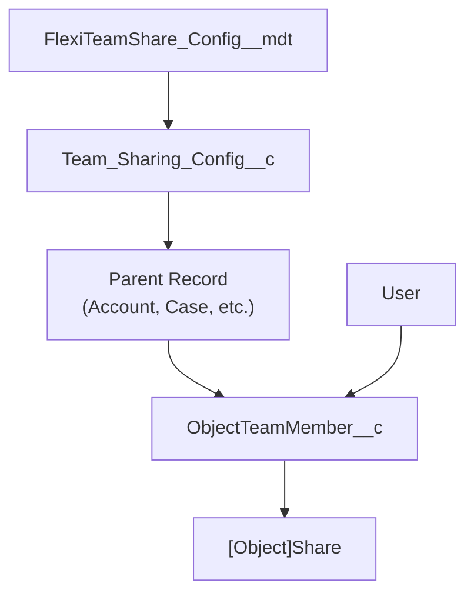

## Modelo de Dados Principal

## Diagrama de Relacionamento de Entidades

## Objetos Personalizados

### ObjectTeamMember__c

Armazena atribuições de membros da equipe vinculando um usuário a um registro pai.

| Campo | Tipo | Descrição |
|-------|------|-------------|
| `Record_Id__c` | Text | Chave composta no formato `ObjectName:RecordId` |
| `User_Id__c` | Lookup(User) | O usuário membro da equipe |
| `Access_Level__c` | Picklist | Read Only, Read/Write |
| `Role__c` | Picklist | Owner, Manager, User |
| `End_Date__c` | Date | Data de expiração opcional para acesso temporário |

### Team_Sharing_Config__c

Configuração por objeto para compartilhamento de equipe.

| Campo | Tipo | Descrição |
|-------|------|-------------|
| `Object_Api_Name__c` | Text | Nome API do objeto configurado |
| `Object_Label__c` | Text | Label de exibição para o objeto |
| `Is_Active__c` | Checkbox | Se o compartilhamento de equipe está ativo para este objeto |

### FlexiTeamShare_Config__mdt

Configuração em nível de aplicativo armazenada como Custom Metadata.

| Campo | Tipo | Descrição |
|-------|------|-------------|
| `IsActive__c` | Checkbox | Alternância mestra para o aplicativo |
| `Cleanup_Batch_Size__c` | Number | Tamanho do batch para jobs de limpeza |
| `Enable_Batch_Logging__c` | Checkbox | Habilitar log de debug em batch jobs |
| `Enable_Expired_Member_Cleanup__c` | Checkbox | Habilitar limpeza automática de membros expirados |

## Objetos de Configuração

## Visão Geral do Modelo Completo

