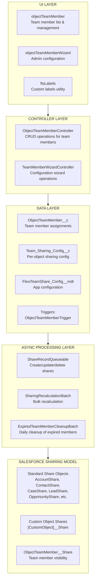
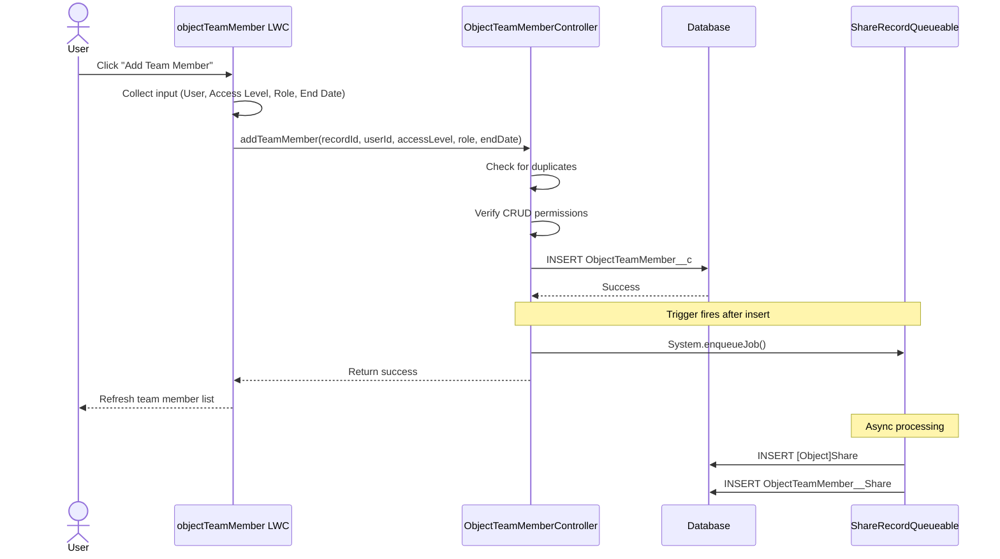
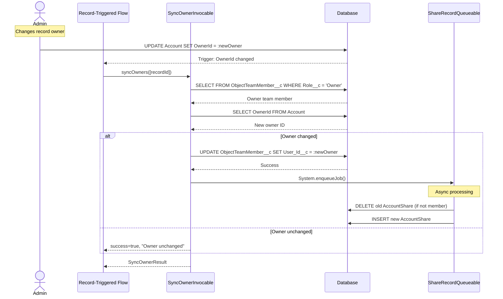
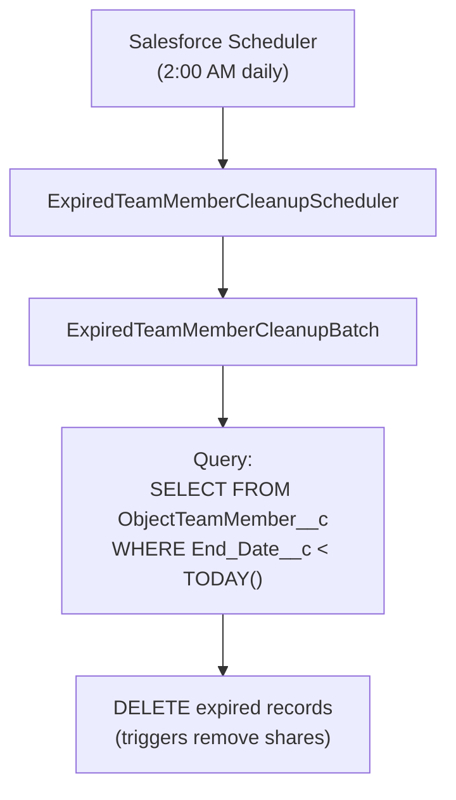

import { Aside } from '@astrojs/starlight/components';

Este documento fornece uma descrição técnica detalhada da solução Flexible Team Share, incluindo arquitetura do sistema, fluxo de dados e camadas de processamento.

## Arquitetura do Sistema

## Camadas

### Camada UI

Três Lightning Web Components:

| Componente | Propósito |
|-----------|---------|
| **objectTeamMember** | Exibe membros da equipe em páginas de registro. Suporta adicionar/editar/excluir, lista colapsável e limite de exibição configurável. |
| **objectTeamMemberWizard** | Interface de administração para configurar objetos, gerenciar configurações e agendar jobs. |
| **ftsLabels** | Componente utilitário fornecendo custom labels para suporte i18n (35 idiomas). |

### Camada Controller

| Controller | Métodos |
|-----------|---------|
| **ObjectTeamMemberController** | `getTeamMembers()`, `addTeamMember()`, `updateTeamMember()`, `removeTeamMember()`, `isCurrentUserManager()`, `isSharingConfigured()`, `getAccessLevelOptions()` |
| **TeamMemberWizardController** | `getExistingConfigs()`, `getAvailableObjects()`, `createConfig()`, `toggleConfigStatus()`, `deleteConfig()`, `getScheduledJobInfo()`, `scheduleCleanupJob()` |
| **SyncOwnerInvocable** | `syncOwners()` — Invocable Action para sincronizar membro da equipe Owner quando o owner pai muda. Chamável de Flow ou Apex, totalmente bulkificado. |

### Camada Data

Objetos personalizados e um trigger que dispara em mudanças de membros da equipe:

- **ObjectTeamMember__c** — armazena atribuições de membros da equipe
- **Team_Sharing_Config__c** — configuração de compartilhamento por objeto
- **FlexiTeamShare_Config__mdt** — configuração em nível de aplicativo (Custom Metadata)
- **ObjectTeamMemberTrigger** → **ObjectTeamMemberTriggerHandler** — trata Before Insert, Before Update, Before Delete

### Camada Async Processing

| Componente | Tipo | Propósito |
|-----------|------|---------|
| **ShareRecordQueueable** | Queueable | Cria, atualiza e exclui registros de compartilhamento para objetos pai e membros da equipe |
| **SharingRecalculationBatch** | Batchable | Recalcula em massa todos os compartilhamentos quando a configuração muda |
| **ExpiredTeamMemberCleanupBatch** | Batchable | Exclui membros da equipe expirados (scheduled job diário) |
| **ExpiredTeamMemberCleanupScheduler** | Schedulable | Agenda o cleanup batch (executa às 2:00 AM diariamente) |

## Fluxo de Dados: Adicionando um Membro da Equipe

## Fluxo de Dados: Sincronização de Mudança de Owner

## Fluxo de Dados: Limpeza de Membros Expirados

## Tratamento de Erros

### Camada Controller

- Todos os métodos públicos envolvidos em try-catch
- Mensagens de erro amigáveis via Custom Labels
- `AuraHandledException` para exibição de erro LWC

### Async Processing

- `Database.insert/update/delete(records, false)` — sucesso parcial
- Erros individuais registrados, não falham o batch inteiro
- Estatísticas de erro rastreadas em batch jobs

### Camada Trigger

- Padrão de trigger handler previne recursão
- Erros surgem para o chamador da operação DML

## Considerações de Performance

### Async Processing

- Operações de registro de compartilhamento usam Queueable (não bloqueante)
- Operações em massa usam Batchable com tamanho de batch configurável
- Sem DML síncrono em registros de compartilhamento em triggers

### Otimização de Query

- Campos indexados usados em cláusulas WHERE
- Formato `Record_Id__c` permite queries LIKE eficientes
- Conjuntos de resultados limitados com cláusulas LIMIT

### Caching

- `@AuraEnabled(cacheable=true)` para operações de leitura
- Configuração de aplicativo em cache na transação

## Arquitetura de Integração

**Sem integrações externas** — este pacote opera inteiramente dentro do Salesforce:

- Sem HTTP callouts
- Sem APIs externas
- Sem Named Credentials
- Sem External Objects
- Sem Connected Apps

### Dependências da Plataforma

| Componente | Uso |
|-----------|-------|
| Apex Sharing | Cria/gerencia registros de compartilhamento |
| Queueable Apex | Operações assíncronas de registro de compartilhamento |
| Batchable Apex | Recálculo em massa de compartilhamento, limpeza |
| Schedulable Apex | Job de limpeza diário |
| Custom Metadata | Configuração do aplicativo |
| Lightning Web Components | Interface do usuário |
| Custom Labels | Internacionalização |
