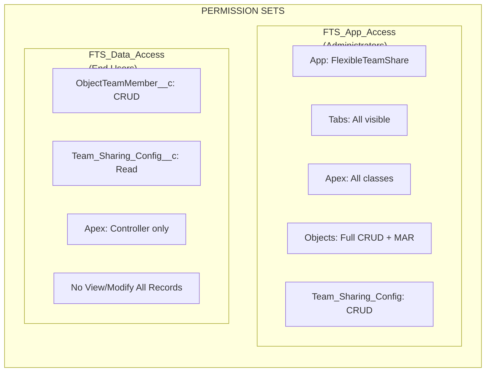
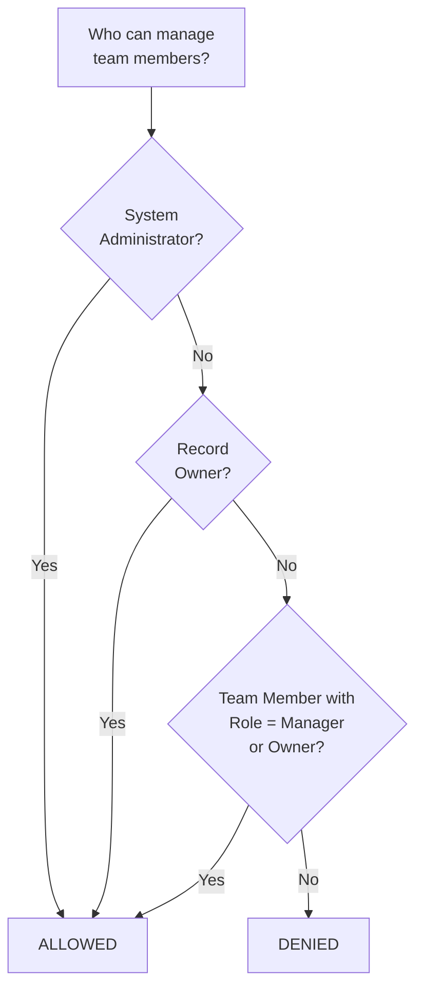
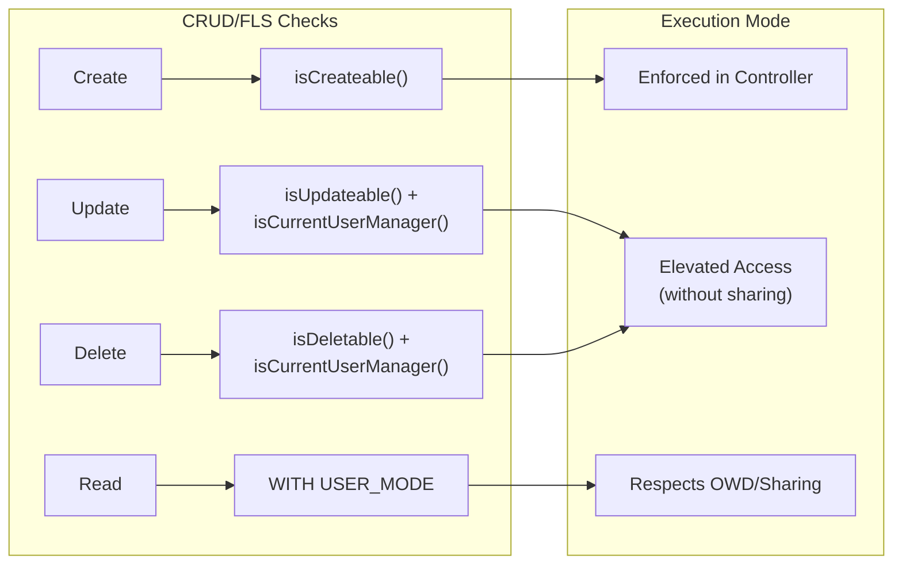
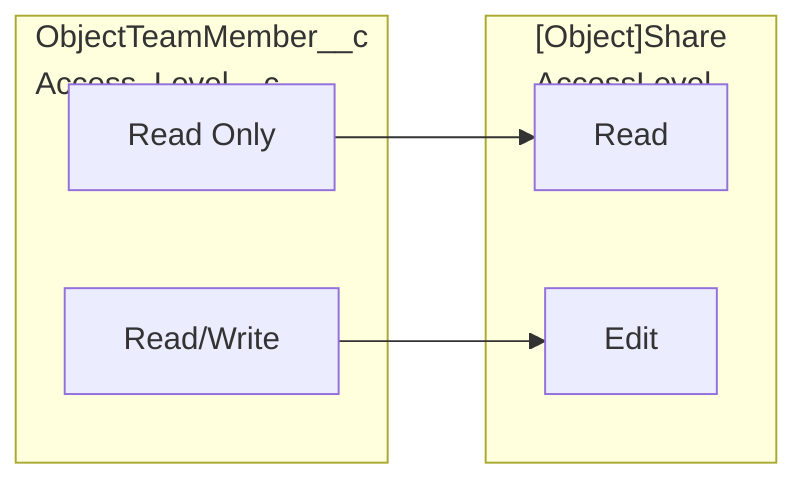
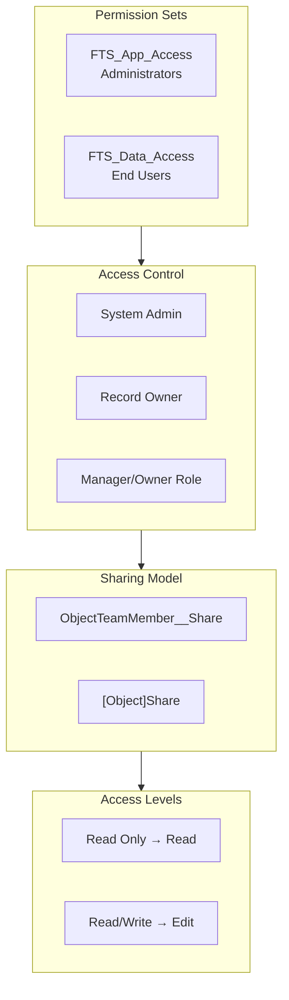

import { Aside } from '@astrojs/starlight/components';

## Modelo de Permissões

### Permission Sets

| Permission Set | Público | Capacidades |
|---------------|----------|-------------|
| **FTS_App_Access** | Administradores | Acesso completo ao aplicativo, todas as abas, todas as classes Apex, CRUD completo + Modify All Records em objetos, Team_Sharing_Config CRUD |
| **FTS_Data_Access** | Usuários Finais | ObjectTeamMember__c CRUD, Team_Sharing_Config__c Read, apenas classes Apex controller, sem View/Modify All Records |

## Lógica de Controle de Acesso

O método `isCurrentUserManager()` determina quem pode gerenciar membros da equipe:

1. **System Administrators** — sempre permitido
2. **Record Owners** — sempre permitido
3. **Membros da equipe com função Manager/Owner** — permitido
4. **Todos os outros** — negado

## Aplicação CRUD/FLS

| Operação | Verificação de Segurança | Implementação |
|-----------|---------------|----------------|
| Create Team Member | `Schema.sObjectType.ObjectTeamMember__c.isCreateable()` | Aplicado no controller |
| Update Team Member | `isUpdateable()` + `isCurrentUserManager()` | Acesso elevado (without sharing) após autorização |
| Delete Team Member | `isDeletable()` + `isCurrentUserManager()` | Acesso elevado (without sharing) após autorização |
| Read Team Members | `WITH USER_MODE` / sharing model | Respeita OWD/sharing |

<Aside type="note">
Operações de Update e Delete usam acesso elevado (`without sharing`) para permitir que managers modifiquem qualquer membro da equipe no registro, não apenas os que criaram. A autorização é sempre verificada primeiro via `isCurrentUserManager()`.
</Aside>

## Validação de Entrada

| Entrada | Validação | Localização |
|-------|-----------|----------|
| `recordId` | Não em branco, formato de ID Salesforce válido | Controller |
| `userId` | Não em branco, ID de User válido | Controller |
| `accessLevel` | Não em branco, valor de picklist válido | Controller + Picklist |
| `role` | Não em branco, valor de picklist válido | Controller + Picklist |
| `endDate` | Deve ser data futura ou null | Controller + Validation Rule |
| `objectApiName` | Derivado do ID Salesforce (não entrada do usuário) | Controller |

### Validation Rules

| Regra | Objeto | Descrição |
|------|--------|-------------|
| `End_Date_Cannot_Be_Past` | `ObjectTeamMember__c` | Impede definir data de término no passado |

## Mapeamento de Nível de Acesso

## Visão Geral Completa de Segurança

## Melhores Práticas de Segurança Implementadas

| Controle | Status | Implementação |
|---------|--------|---------------|
| Verificações CRUD em controllers | Implementado | `isAccessible()`, `isCreateable()`, `isUpdateable()`, `isDeletable()` |
| Aplicação FLS | Implementado | Permission Sets controlam acesso a campos |
| Prevenção de injeção SOQL | Implementado | Bind variables para entrada de usuário, whitelist para nomes de objeto |
| Sharing model | Implementado | `with sharing` em controllers, `without sharing` apenas onde documentado |
| Validação de entrada | Implementado | Verificações null, validação de formato, regras de negócio |
| Prevenção XSS | Implementado | Framework LWC trata codificação de saída |

## Segurança de Integração Externa

| Verificação | Resultado |
|-------|--------|
| HTTP Callouts | Nenhum — pacote não faz chamadas externas |
| Named Credentials | Não usado |
| External Objects | Não usado |
| Remote Site Settings | Não necessário |
| CSP Violations | Pass — sem violações de Content-Security-Policy |
