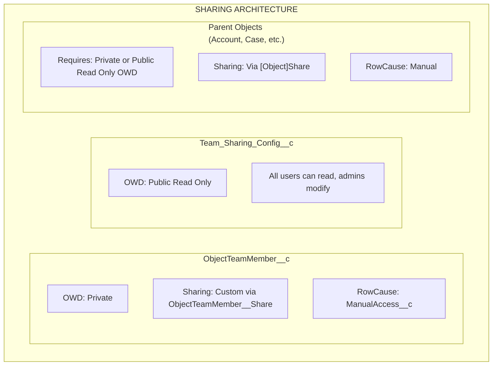

import { Aside } from '@astrojs/starlight/components';

## Arquitetura de Compartilhamento

## Como o Compartilhamento Funciona

### ObjectTeamMember__c

- **OWD**: Private
- **Mecanismo de compartilhamento**: Compartilhamento personalizado via `ObjectTeamMember__Share`
- **RowCause**: `ManualAccess__c`

Quando um membro da equipe é adicionado, o sistema cria um registro `ObjectTeamMember__Share` para que o membro da equipe possa ver seu próprio registro de associação de equipe.

### Team_Sharing_Config__c

- **OWD**: Public Read Only
- Todos os usuários podem ler a configuração (necessário para renderização do componente)
- Apenas administradores podem modificar configurações

### Objetos Pai

- **Requisito**: Objetos devem ter OWD **Private** ou **Public Read Only**
- **Mecanismo de compartilhamento**: Via tabelas `[Object]Share` padrão (ex: `AccountShare`, `CaseShare`)
- **RowCause**: Manual

<Aside type="caution">
Se o OWD do objeto pai estiver definido como **Public Read/Write**, os registros de compartilhamento não podem conceder acesso adicional, pois os usuários já têm acesso total. O Flexible Team Share requer OWD Private ou Public Read Only para funcionar adequadamente.
</Aside>

## Mapeamento de Nível de Acesso

Quando um membro da equipe é adicionado com um nível de acesso, ele mapeia para o acesso do registro de compartilhamento do Salesforce:

| ObjectTeamMember__c Access_Level__c | [Object]Share AccessLevel | Descrição |
|-------------------------------------|--------------------------|-------------|
| **Read Only** | `Read` | Membro da equipe pode visualizar o registro |
| **Read/Write** | `Edit` | Membro da equipe pode visualizar e editar o registro |

## Ciclo de Vida do Registro de Compartilhamento

### Criando Compartilhamentos

Quando um membro da equipe é adicionado:

1. Registro `ObjectTeamMember__c` é inserido
2. Trigger dispara e enfileira `ShareRecordQueueable`
3. Queueable cria dois registros de compartilhamento:
   - **Parent share**: Registro `[Object]Share` dando ao usuário acesso ao registro pai
   - **Team member share**: Registro `ObjectTeamMember__Share` dando ao usuário visibilidade de sua associação de equipe

### Atualizando Compartilhamentos

Quando o nível de acesso de um membro da equipe muda:

1. Registro `ObjectTeamMember__c` é atualizado
2. Trigger dispara e enfileira `ShareRecordQueueable`
3. Queueable exclui o compartilhamento antigo e cria um novo com nível de acesso atualizado

### Excluindo Compartilhamentos

Quando um membro da equipe é removido:

1. Registro `ObjectTeamMember__c` é excluído
2. Trigger dispara e enfileira `ShareRecordQueueable`
3. Queueable exclui ambos os registros de compartilhamento (pai e membro da equipe)

### Recálculo em Massa

Quando uma configuração de compartilhamento é alternada:

- **Desativada**: `SharingRecalculationBatch` remove todos os registros de compartilhamento para esse objeto
- **Reativada**: `SharingRecalculationBatch` recria registros de compartilhamento para todos os membros da equipe existentes

## Objetos Share Suportados

### Objetos Padrão

| Objeto | Tabela Share |
|--------|------------|
| Account | `AccountShare` |
| Contact | `ContactShare` |
| Case | `CaseShare` |
| Lead | `LeadShare` |
| Opportunity | `OpportunityShare` |
| Campaign | `CampaignShare` |
| Order | `OrderShare` |

### Objetos Personalizados

Objetos personalizados seguem o padrão: `ObjectName__c` → `ObjectName__Share`

O sistema usa uma whitelist codificada para objetos padrão e deriva o nome da tabela share para objetos personalizados automaticamente.

## Requisitos de Implantação

### Requisitos da Org

- Salesforce **Enterprise Edition** ou superior (para suporte ao modelo de compartilhamento)
- Objetos devem ter OWD **Private** ou **Public Read Only** para se beneficiar do compartilhamento

### Requisitos do Usuário

- Usuários precisam de permission set apropriado atribuído
- Usuários precisam de acesso ao objeto base (ex: acesso de leitura Account para usar equipes Account)
