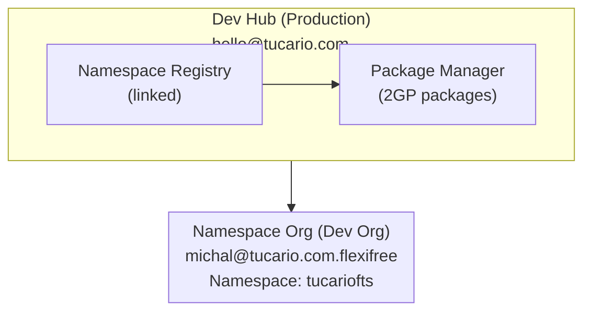

import { Aside } from '@astrojs/starlight/components';

## Arquitetura



## Pré-requisitos

### 1. Dev Hub (Production)

- Dev Hub habilitado: Setup > Dev Hub > Enable
- Namespace conectado: App Launcher > Namespace Registries > Link Namespace

### 2. Namespace Org (Partner Developer Org)

- Namespace registrado (uma vez, irreversível)
- Setup > Package Manager > Edit > Namespace Prefix

### 3. Ambiente Local

- Salesforce CLI instalado
- Autorização para ambas as orgs

## Referência Rápida (Copy-Paste)

```bash
# 1. Check orgs
sf org list

# 2. Check packages
sf package list --target-dev-hub DevHub

# 3. Check versions
sf package version list --packages FlexibleTeamShare --target-dev-hub DevHub

# 4. Create new version (BETA)
sf package version create --package FlexibleTeamShare --installation-key-bypass --wait 20 --code-coverage --target-dev-hub DevHub --definition-file config/package-scratch-def.json

# 5. Test install (replace ID and org alias)
sf package install --package 04tXXXXXXXXXXXXXXX --target-org TestOrg --wait 10

# 6. Promote to RELEASED (IRREVERSIBLE!)
sf package version promote --package 04tXXXXXXXXXXXXXXX --target-dev-hub DevHub
```

## Comandos

### Autorização de Org

```bash
# Dev Hub (production)
sf org login web --alias DevHub --set-default-dev-hub

# Namespace Org (dev org with namespace)
sf org login web --alias FlexiFREE
```

### Verificar Orgs Conectadas

```bash
sf org list
```

### Verificar Pacotes Existentes

```bash
sf package list --target-dev-hub DevHub
```

### Verificar Versões do Pacote

```bash
sf package version list --packages FlexibleTeamShare --target-dev-hub DevHub
```

## Criando Nova Versão do Pacote

### 1. Atualizar Versão em sfdx-project.json (opcional)

```json
{
  "packageDirectories": [
    {
      "versionName": "ver 0.2",
      "versionNumber": "0.2.0.NEXT",
      "path": "force-app",
      "default": true,
      "package": "FlexibleTeamShare"
    }
  ],
  "namespace": "tucariofts"
}
```

### 2. Criar Versão do Pacote (beta)

```bash
sf package version create \
  --package FlexibleTeamShare \
  --installation-key-bypass \
  --wait 20 \
  --code-coverage \
  --target-dev-hub DevHub \
  --definition-file config/package-scratch-def.json
```

<Aside type="caution">
O parâmetro `--definition-file` é necessário para suporte a traduções! O arquivo `config/package-scratch-def.json` contém `enableTranslationWorkbench: true`.
</Aside>

### 3. Testar Instalação

```bash
sf package install \
  --package 04tXXXXXXXXXXXXXXX \
  --target-org TestOrg \
  --wait 10
```

### 4. Promover para Released (Production)

```bash
sf package version promote \
  --package 04tXXXXXXXXXXXXXXX \
  --target-dev-hub DevHub
```

<Aside type="caution">
Após promoção, a versão é **IRREVERSIVELMENTE** released e pronta para AppExchange!
</Aside>

## Publicando no AppExchange

1. Faça login na [Partner Community](https://partners.salesforce.com)
2. Publishing > Listings > New Listing
3. Adicione versão do pacote promovida
4. Preencha detalhes do listing
5. Envie para revisão

## Solução de Problemas

### "Not available for deploy for this organization" (Translations)

Scratch org não tem Translation Workbench habilitado.

**Solução:** Use `--definition-file config/package-scratch-def.json` que inclui:

```json
{
  "orgName": "Package Build Org",
  "edition": "Enterprise",
  "settings": {
    "languageSettings": {
      "enableTranslationWorkbench": true,
      "enableEndUserLanguages": true,
      "enablePlatformLanguages": true
    }
  }
}
```

### "No such column" (FLS errors)

Use `WITH SYSTEM_MODE` em vez de `WITH USER_MODE` em queries SOQL.

### "You cannot deploy to a required field"

Remova campos obrigatórios de permission sets (campos obrigatórios não precisam de FLS).
